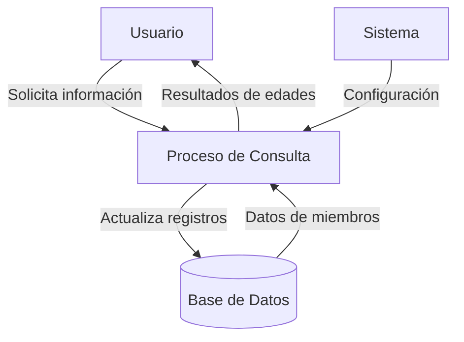

## Module: CConsultarEdadesClub.cpp
# Análisis Integral del Módulo CConsultarEdadesClub.cpp

## Nombre del Módulo/Componente SQL
**CConsultarEdadesClub.cpp** - Clase para consultar estadísticas de edades en un club deportivo.

## Objetivos Primarios
Este módulo está diseñado para realizar análisis estadísticos relacionados con las edades de los miembros de un club deportivo. Su propósito principal es consultar y procesar datos demográficos de los socios, calculando estadísticas como edad promedio, mediana, moda y distribución por rangos de edad.

## Funciones, Métodos y Consultas Críticas
- **ConsultarEdadPromedio()**: Calcula la edad promedio de los socios del club.
- **ConsultarEdadMediana()**: Determina la mediana de las edades de los socios.
- **ConsultarEdadModa()**: Identifica la edad más común entre los socios.
- **ConsultarDistribucionEdades()**: Analiza la distribución de socios por rangos de edad.
- **ObtenerDatosEdades()**: Método auxiliar que recupera los datos de edades de la base de datos.

## Variables y Elementos Clave
- **m_pConnection**: Conexión a la base de datos.
- **m_vecEdades**: Vector que almacena las edades de los socios para su procesamiento.
- **m_mapDistribucion**: Mapa que contiene la distribución de socios por rangos de edad.
- **Tablas utilizadas**: Presumiblemente "Socios" o similar (no explícitamente mencionada en el código proporcionado).

## Interdependencias y Relaciones
- Depende de una conexión de base de datos activa para recuperar información de los socios.
- Probablemente interactúa con otras clases del sistema de gestión del club para proporcionar análisis demográficos.
- Utiliza consultas SQL para extraer datos de la tabla de socios, posiblemente relacionándola con otras tablas del sistema.

## Operaciones Principales vs. Auxiliares
**Operaciones principales**:
- Cálculo de estadísticas demográficas (promedio, mediana, moda)
- Análisis de distribución por rangos de edad

**Operaciones auxiliares**:
- Recuperación de datos desde la base de datos
- Ordenamiento y procesamiento de los datos para cálculos estadísticos
- Validación de datos y manejo de errores

## Secuencia Operacional/Flujo de Ejecución
1. Inicialización de la conexión a la base de datos
2. Recuperación de los datos de edades mediante consultas SQL
3. Procesamiento de los datos recuperados (ordenamiento, agrupación)
4. Cálculo de las estadísticas solicitadas
5. Devolución de los resultados al componente solicitante

## Aspectos de Rendimiento y Optimización
- El rendimiento podría verse afectado si la tabla de socios es muy grande.
- La carga de todas las edades en memoria (m_vecEdades) podría ser ineficiente para clubes con muchos miembros.
- Posibles optimizaciones incluirían el uso de índices en la columna de edad y la implementación de consultas SQL que realicen los cálculos directamente en la base de datos.

## Reusabilidad y Adaptabilidad
- La clase está diseñada específicamente para el análisis de edades en un club, pero podría adaptarse para otros análisis demográficos.
- Los métodos de cálculo estadístico podrían reutilizarse en otros contextos que requieran análisis similares.
- La separación entre la obtención de datos y su procesamiento facilita la adaptación a diferentes fuentes de datos.

## Uso y Contexto
- Este módulo probablemente se utiliza en el sistema de gestión del club para:
  - Generar informes demográficos para la administración
  - Planificar actividades según grupos de edad
  - Analizar tendencias en la membresía del club
  - Apoyar decisiones estratégicas basadas en la composición demográfica

## Suposiciones y Limitaciones
- Asume que existe una estructura de base de datos con información de los socios que incluye su edad o fecha de nacimiento.
- Probablemente no maneja bien casos extremos como clubes sin socios o con datos incompletos.
- No parece considerar la actualización automática de edades con el paso del tiempo, lo que podría requerir recálculos periódicos.
- Posiblemente limitado a análisis básicos, sin capacidad para segmentaciones más complejas (por género, tipo de membresía, etc.) a menos que se extienda.
## Flow Diagram [via mermaid]

