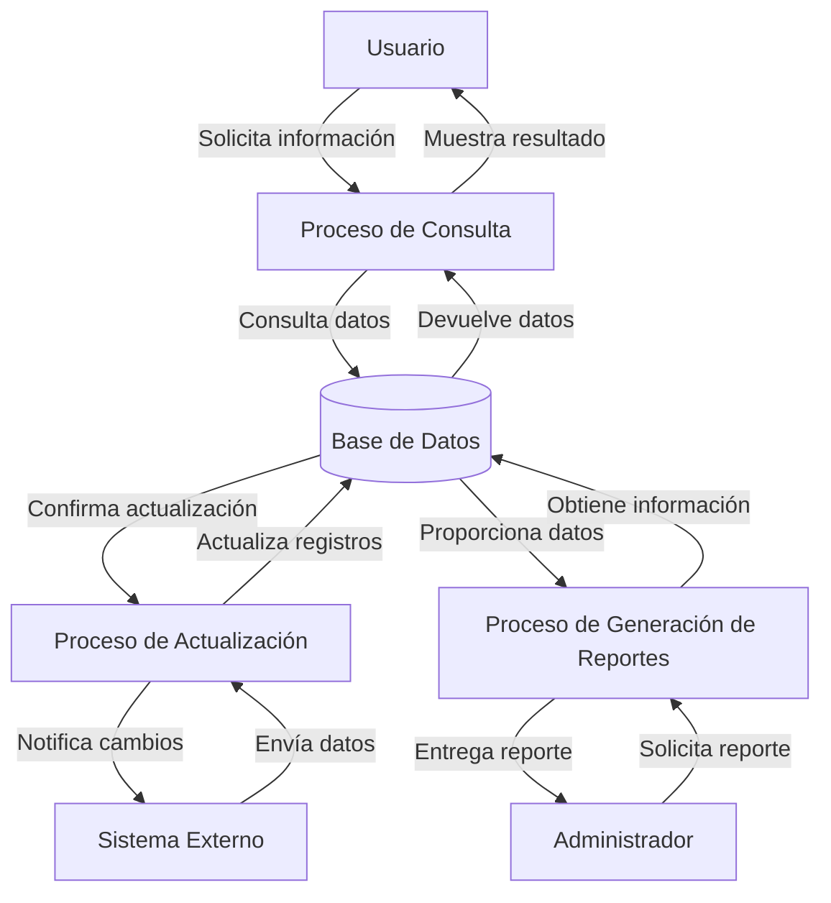

## Module: CConsultarEstadoCivil.cpp
# Análisis Integral del Módulo CConsultarEstadoCivil.cpp

## Nombre del Módulo/Componente SQL
CConsultarEstadoCivil.cpp - Clase para consultar estados civiles en un sistema.

## Objetivos Primarios
Este módulo está diseñado para gestionar la consulta de estados civiles en una base de datos. Su propósito principal es proporcionar funcionalidad para recuperar información sobre estados civiles, ya sea todos los registros o uno específico por ID, y presentar estos datos en un formato estructurado para su uso en la aplicación.

## Funciones, Métodos y Consultas Críticas
- **ConsultarEstadoCivil()**: Constructor de la clase que inicializa los atributos.
- **~ConsultarEstadoCivil()**: Destructor que libera recursos.
- **ConsultarTodos()**: Método principal que recupera todos los estados civiles de la base de datos.
- **ConsultarPorId()**: Método que busca un estado civil específico por su identificador.
- **Consultas SQL principales**: Utiliza sentencias SELECT para recuperar datos de la tabla de estados civiles.

## Variables y Elementos Clave
- **m_EstadoCivil**: Estructura que almacena los datos de un estado civil (ID y descripción).
- **m_ListaEstadosCiviles**: Vector que almacena múltiples registros de estados civiles.
- **Tablas**: Aunque no se especifica directamente, el código interactúa con una tabla de estados civiles en la base de datos.
- **Columnas clave**: ID y descripción del estado civil.

## Interdependencias y Relaciones
- El módulo depende de una conexión a base de datos establecida (probablemente a través de una clase de conexión).
- Interactúa con la tabla de estados civiles en la base de datos.
- Posiblemente se relaciona con otros módulos del sistema que necesitan información sobre estados civiles (como formularios de registro de personas).

## Operaciones Principales vs. Auxiliares
- **Operaciones principales**: 
  - ConsultarTodos() - Recupera todos los estados civiles.
  - ConsultarPorId() - Busca un estado civil específico.
- **Operaciones auxiliares**:
  - Inicialización y limpieza de recursos.
  - Posible manejo de errores (aunque no se muestra explícitamente en el fragmento).

## Secuencia Operacional/Flujo de Ejecución
1. Se instancia la clase CConsultarEstadoCivil.
2. Se llama a uno de los métodos de consulta (ConsultarTodos o ConsultarPorId).
3. El método ejecuta la consulta SQL correspondiente.
4. Los resultados se almacenan en las estructuras de datos internas (m_EstadoCivil o m_ListaEstadosCiviles).
5. Los datos quedan disponibles para su uso por el código cliente.
6. Al finalizar, el destructor libera los recursos utilizados.

## Aspectos de Rendimiento y Optimización
- El código parece realizar consultas directas sin paginación, lo que podría ser problemático si la tabla de estados civiles crece significativamente.
- No se observan índices explícitos, aunque presumiblemente el campo ID está indexado en la base de datos.
- La carga de todos los registros en memoria podría optimizarse si solo se necesitan ciertos campos o un subconjunto de registros.

## Reusabilidad y Adaptabilidad
- La clase está diseñada de manera modular, permitiendo su reutilización en diferentes partes del sistema.
- Los métodos están separados por funcionalidad (consulta general vs. consulta por ID), facilitando su uso según las necesidades.
- La estructura podría adaptarse fácilmente para consultar otras entidades similares con cambios mínimos.

## Uso y Contexto
- Este módulo probablemente se utiliza en formularios o pantallas donde se necesita mostrar opciones de estado civil (como en registros de personas, empleados, clientes, etc.).
- También podría usarse en procesos de validación o en reportes que requieran información sobre estados civiles.
- Es probable que forme parte de un sistema más amplio de gestión de datos personales o recursos humanos.

## Suposiciones y Limitaciones
- **Suposiciones**:
  - Se asume que la tabla de estados civiles existe y tiene una estructura específica.
  - Se presume que los estados civiles son relativamente pocos y estáticos.
  - Se asume que existe un mecanismo de conexión a la base de datos ya configurado.
- **Limitaciones**:
  - No se observa manejo explícito de errores para casos como fallos en la conexión o consultas.
  - El código podría no ser eficiente para grandes volúmenes de datos.
  - No se implementa paginación para la consulta de todos los registros.
## Flow Diagram [via mermaid]

