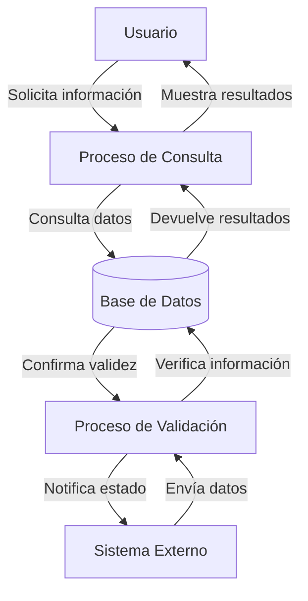

## Module: CConsultarFoliosSeguro.cpp
# Análisis Integral del Módulo CConsultarFoliosSeguro.cpp

## Módulo/Componente SQL
**Nombre del Módulo**: CConsultarFoliosSeguro.cpp

## Objetivos Primarios
Este módulo implementa una clase para consultar folios de seguro en un sistema de gestión. Su propósito principal es realizar consultas a la base de datos para obtener información sobre folios de seguro, aplicando diversos filtros y criterios de búsqueda según los parámetros proporcionados.

## Funciones, Métodos y Consultas Críticas
- **CConsultarFoliosSeguro::ConsultarFoliosSeguro()**: Método principal que construye y ejecuta consultas SQL para recuperar información de folios de seguro.
- **CConsultarFoliosSeguro::ConsultarFoliosSeguroCount()**: Método que cuenta el número de registros que cumplen con los criterios de búsqueda.
- **Consultas SQL principales**: Utiliza principalmente consultas SELECT complejas con múltiples JOIN para recuperar datos de diversas tablas relacionadas con folios de seguro.

## Variables y Elementos Clave
- **Tablas principales**: 
  - FOLIOS_SEGURO
  - FOLIOS_SEGURO_DETALLE
  - FOLIOS_SEGURO_DETALLE_HIST
  - FOLIOS_SEGURO_HIST
  - CLIENTES
  - USUARIOS
  - SUCURSALES
  - TIPOS_SEGURO
  - ASEGURADORAS

- **Columnas clave**:
  - ID_FOLIO_SEGURO
  - FOLIO
  - ID_CLIENTE
  - ID_TIPO_SEGURO
  - ID_ASEGURADORA
  - FECHA_INICIO_VIGENCIA
  - FECHA_FIN_VIGENCIA
  - ESTATUS

- **Parámetros importantes**:
  - m_nIdCliente
  - m_nIdTipoSeguro
  - m_nIdAseguradora
  - m_nIdSucursal
  - m_nEstatus
  - m_strFolio
  - m_strPoliza

## Interdependencias y Relaciones
- El módulo interactúa con múltiples tablas relacionadas mediante JOIN.
- Utiliza la clase CConexionBD para establecer conexión con la base de datos.
- Depende de la clase CRecordsetBD para manejar los resultados de las consultas.
- Se relaciona con el sistema de gestión de clientes, usuarios, sucursales y seguros.

## Operaciones Core vs. Auxiliares
- **Operaciones Core**:
  - Construcción y ejecución de consultas SQL para recuperar información de folios de seguro.
  - Aplicación de filtros según los parámetros proporcionados.
  
- **Operaciones Auxiliares**:
  - Validación de parámetros.
  - Formateo de fechas para consultas.
  - Manejo de errores y excepciones.
  - Construcción dinámica de condiciones WHERE según los filtros aplicados.

## Secuencia Operacional/Flujo de Ejecución
1. Inicialización de variables y parámetros.
2. Construcción de la consulta SQL base.
3. Adición de condiciones WHERE según los filtros aplicados.
4. Ejecución de la consulta mediante CConexionBD.
5. Procesamiento de resultados a través de CRecordsetBD.
6. Devolución de los datos obtenidos al llamador.

## Aspectos de Rendimiento y Optimización
- Las consultas utilizan múltiples JOIN que podrían afectar el rendimiento con grandes volúmenes de datos.
- No se observa uso explícito de índices en las consultas.
- La construcción dinámica de consultas SQL podría beneficiarse de preparación de sentencias para mejorar el rendimiento.
- El uso de ORDER BY en consultas grandes podría ser costoso en términos de rendimiento.

## Reusabilidad y Adaptabilidad
- La clase está diseñada para ser reutilizable con diferentes criterios de búsqueda.
- Los parámetros de filtrado permiten adaptabilidad a diferentes escenarios de consulta.
- La separación entre consulta de datos y conteo facilita su uso en diferentes contextos (listados paginados, reportes, etc.).

## Uso y Contexto
- Este módulo se utiliza probablemente en un sistema de gestión de seguros para consultar y filtrar folios de seguro.
- Se aplicaría en interfaces de usuario que requieran listar, buscar o filtrar folios de seguro.
- Podría ser utilizado en reportes, pantallas de búsqueda o procesos de validación de folios.

## Suposiciones y Limitaciones
- **Suposiciones**:
  - Se asume la existencia y estructura específica de las tablas mencionadas.
  - Se presupone un modelo de datos relacional con claves foráneas entre las tablas.
  - Se asume que los tipos de datos en la base de datos coinciden con los tipos utilizados en el código.

- **Limitaciones**:
  - No maneja paginación de resultados directamente.
  - La construcción dinámica de SQL podría ser vulnerable a inyección SQL si no se validan adecuadamente los parámetros.
  - No se observa manejo de transacciones, lo que podría ser necesario en operaciones más complejas.
## Flow Diagram [via mermaid]

