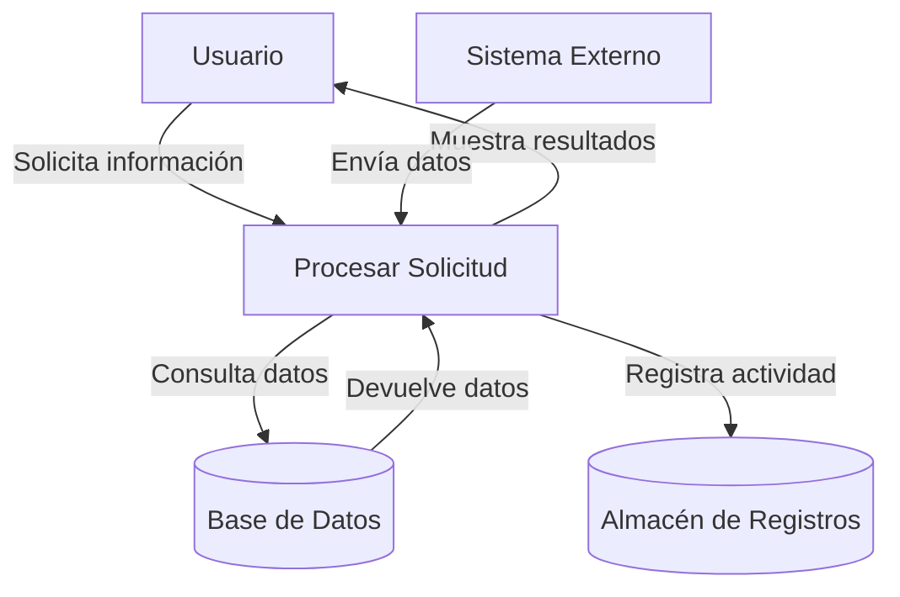

## Module: CConsultarGnVigenciaPromocion.cpp
# Análisis Integral del Módulo CConsultarGnVigenciaPromocion.cpp

## Módulo/Componente SQL
**CConsultarGnVigenciaPromocion** - Clase C++ que implementa una interfaz para consultar la vigencia de promociones en un sistema.

## Objetivos Primarios
Este módulo está diseñado para consultar la vigencia de promociones en un sistema de gestión, verificando si una promoción específica está activa en una fecha determinada. Proporciona una interfaz para realizar esta consulta a través de una base de datos, procesando los resultados y devolviendo información sobre el estado de la promoción.

## Funciones, Métodos y Consultas Críticas
- **CConsultarGnVigenciaPromocion::Ejecutar()**: Método principal que ejecuta la consulta de vigencia de promoción.
- **CConsultarGnVigenciaPromocion::ConsultarVigenciaPromocion()**: Método que realiza la consulta SQL para verificar la vigencia de una promoción.
- **Consulta SQL principal**: Utiliza una sentencia SELECT para verificar si existe una promoción vigente para una fecha específica, comparando con las fechas de inicio y fin de la promoción.

## Variables y Elementos Clave
- **m_strCodigoPromocion**: Código identificador de la promoción a consultar.
- **m_strFechaConsulta**: Fecha para la cual se verifica la vigencia de la promoción.
- **m_bVigente**: Variable booleana que almacena el resultado de la consulta (si la promoción está vigente o no).
- **Tablas**: Aunque no se especifica directamente, el código interactúa con tablas que contienen información sobre promociones, incluyendo sus fechas de inicio y fin.

## Interdependencias y Relaciones
- El módulo depende de la clase base **CConsulta** para la funcionalidad de consulta a la base de datos.
- Utiliza la biblioteca **CSql** para ejecutar consultas SQL.
- Interactúa con tablas de base de datos que almacenan información sobre promociones.
- Depende de la clase **CParametros** para manejar parámetros de entrada y salida.

## Operaciones Principales vs. Auxiliares
- **Operación principal**: La consulta SQL que verifica la vigencia de la promoción comparando la fecha de consulta con las fechas de inicio y fin.
- **Operaciones auxiliares**: 
  - Validación de parámetros de entrada
  - Configuración de la consulta SQL
  - Procesamiento de resultados
  - Manejo de errores

## Secuencia Operacional/Flujo de Ejecución
1. Se inicializa el objeto con los parámetros necesarios (código de promoción y fecha de consulta).
2. El método **Ejecutar()** valida los parámetros de entrada.
3. Se llama a **ConsultarVigenciaPromocion()** para ejecutar la consulta SQL.
4. La consulta verifica si existe una promoción con el código especificado que esté vigente en la fecha indicada.
5. Se procesa el resultado y se establece el valor de **m_bVigente**.
6. Se devuelve el resultado al llamador.

## Aspectos de Rendimiento y Optimización
- La consulta SQL podría beneficiarse de índices en las columnas de código de promoción y fechas de vigencia.
- El código maneja correctamente la liberación de recursos después de la consulta.
- No se observan bucles o operaciones que puedan causar problemas de rendimiento significativos.

## Reutilización y Adaptabilidad
- La clase está diseñada siguiendo un patrón orientado a objetos que facilita su reutilización.
- Los parámetros de entrada están bien definidos, lo que permite adaptar la consulta para diferentes promociones y fechas.
- La separación de la lógica de consulta en métodos específicos facilita la modificación o extensión de la funcionalidad.

## Uso y Contexto
- Este módulo se utiliza en un sistema de gestión de promociones para verificar si una promoción específica está activa en una fecha determinada.
- Probablemente forma parte de un sistema más amplio de gestión comercial o de marketing.
- Se utiliza en escenarios donde es necesario validar la aplicabilidad de promociones antes de procesar transacciones o calcular precios.

## Suposiciones y Limitaciones
- **Suposiciones**:
  - Se asume que existe una estructura de base de datos con tablas que contienen información sobre promociones.
  - Se espera que el código de promoción y la fecha de consulta sean proporcionados correctamente.
  - Se asume un formato específico para las fechas en la base de datos.
  
- **Limitaciones**:
  - El código no maneja múltiples promociones simultáneas o conflictos entre promociones.
  - No se observa lógica para manejar zonas horarias, lo que podría ser relevante para promociones internacionales.
  - La consulta está limitada a verificar la vigencia por fecha, sin considerar otros posibles criterios de aplicabilidad de promociones.
## Flow Diagram [via mermaid]

