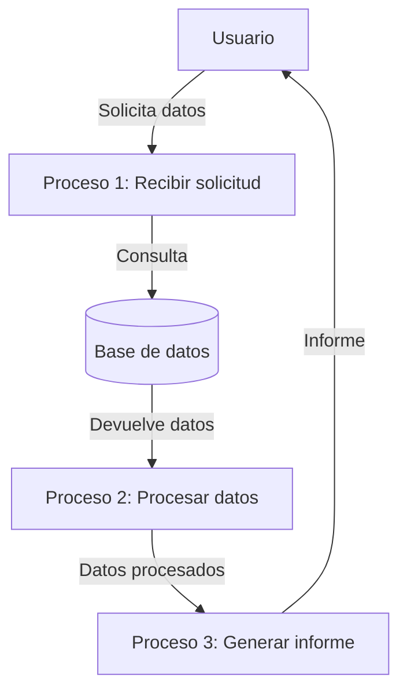

## Module: CConsultarImpresionGnTira.cpp
# Análisis Integral del Módulo CConsultarImpresionGnTira.cpp

## Nombre del Módulo/Componente SQL
**CConsultarImpresionGnTira.cpp** - Clase de consulta para la impresión de tiras genéricas.

## Objetivos Primarios
Este módulo está diseñado para gestionar la consulta e impresión de tiras genéricas en un sistema de punto de venta (POS). Su propósito principal es recuperar información específica de la base de datos para generar impresiones de tiras con datos personalizados según los parámetros proporcionados.

## Funciones, Métodos y Consultas Críticas
- **CConsultarImpresionGnTira::CConsultarImpresionGnTira()**: Constructor que inicializa la clase.
- **CConsultarImpresionGnTira::~CConsultarImpresionGnTira()**: Destructor que libera recursos.
- **CConsultarImpresionGnTira::ConsultarImpresionGnTira()**: Método principal que ejecuta la consulta para obtener datos de impresión.
- **Consulta SQL principal**: Utiliza una consulta SELECT para recuperar información de tiras genéricas basada en parámetros como ID de tira, ID de transacción y tipo de tira.

## Variables y Elementos Clave
- **m_pDb**: Puntero a la conexión de base de datos.
- **m_pLog**: Puntero al sistema de registro (logging).
- **Parámetros importantes**:
  - `idTira`: Identificador de la tira a imprimir.
  - `idTransaccion`: Identificador de la transacción asociada.
  - `tipoTira`: Tipo de tira a generar.
- **Tablas relevantes**: Aunque no se especifican directamente en el fragmento, el módulo probablemente interactúa con tablas relacionadas con tiras de impresión y transacciones.

## Interdependencias y Relaciones
- Depende de un sistema de base de datos para recuperar información.
- Interactúa con un sistema de registro para documentar operaciones y errores.
- Probablemente se relaciona con otros módulos del sistema POS para la gestión de transacciones e impresiones.

## Operaciones Principales vs. Auxiliares
- **Operaciones principales**: La consulta y recuperación de datos para la impresión de tiras.
- **Operaciones auxiliares**: Inicialización de variables, manejo de errores, registro de actividades y limpieza de recursos.

## Secuencia Operacional/Flujo de Ejecución
1. Inicialización de variables y parámetros.
2. Preparación de la consulta SQL con los parámetros proporcionados.
3. Ejecución de la consulta a la base de datos.
4. Procesamiento de los resultados obtenidos.
5. Generación de datos para la impresión de la tira.
6. Registro de la operación y manejo de posibles errores.
7. Retorno de los resultados o códigos de estado.

## Aspectos de Rendimiento y Optimización
- La eficiencia de la consulta SQL es crucial para el rendimiento del módulo.
- Podría beneficiarse de índices adecuados en las tablas consultadas.
- El manejo de memoria parece ser cuidadoso, pero podría optimizarse según el volumen de datos procesados.

## Reusabilidad y Adaptabilidad
- La clase está diseñada con un enfoque modular, lo que facilita su reutilización.
- Los parámetros permiten adaptarla a diferentes tipos de tiras y contextos de impresión.
- Podría mejorarse la adaptabilidad mediante una mayor parametrización o configuración externa.

## Uso y Contexto
- Se utiliza en un entorno de punto de venta para generar impresiones personalizadas.
- Probablemente forma parte de un sistema más amplio de gestión de transacciones comerciales.
- Se invoca cuando se necesita imprimir información específica relacionada con una transacción.

## Suposiciones y Limitaciones
- Asume la existencia de una conexión de base de datos funcional.
- Requiere un sistema de registro configurado correctamente.
- Depende de la estructura específica de las tablas de la base de datos.
- Puede tener limitaciones en cuanto a los tipos de tiras que puede manejar o el formato de los datos que puede procesar.
- Probablemente está diseñado para un sistema específico y podría requerir adaptaciones para funcionar en otros entornos.
## Flow Diagram [via mermaid]

