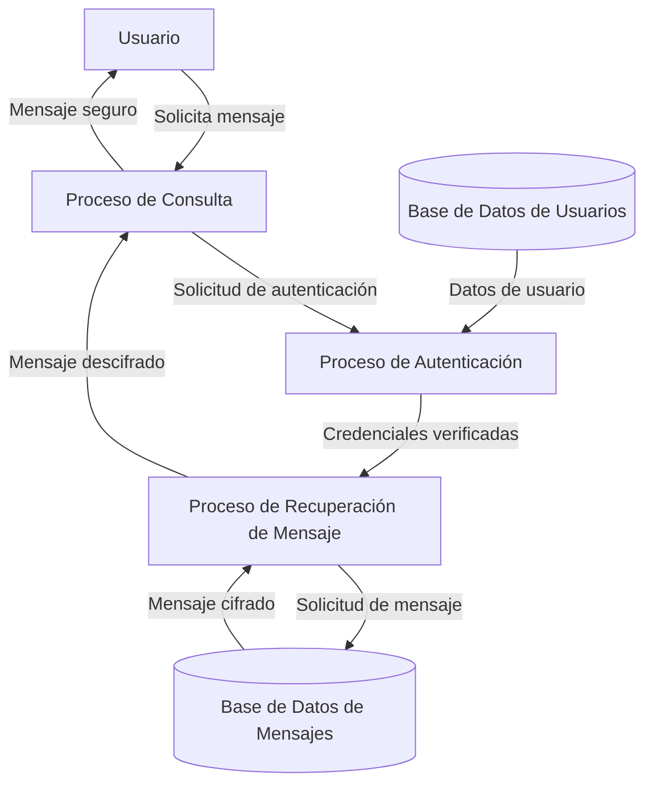

## Module: CConsultarMensajeSeguro.cpp
# Análisis Integral del Módulo CConsultarMensajeSeguro.cpp

## Nombre del Módulo/Componente SQL
CConsultarMensajeSeguro.cpp - Clase para consulta de mensajes seguros en un sistema de comunicación.

## Objetivos Primarios
Este módulo está diseñado para gestionar la consulta de mensajes seguros en un sistema de comunicación, permitiendo la recuperación, desencriptación y presentación de mensajes almacenados en una base de datos. Su propósito principal es proporcionar una interfaz para acceder a mensajes protegidos mientras mantiene los protocolos de seguridad.

## Funciones, Métodos y Consultas Críticas
- **CConsultarMensajeSeguro::Consultar()**: Método principal que coordina el proceso de consulta de mensajes.
- **CConsultarMensajeSeguro::ConsultarMensaje()**: Ejecuta la consulta SQL para recuperar mensajes según criterios específicos.
- **CConsultarMensajeSeguro::DesencriptarMensaje()**: Desencripta el contenido de los mensajes recuperados.
- **Consultas SQL principales**: Utiliza sentencias SELECT para recuperar mensajes de la base de datos basados en parámetros como ID de mensaje, remitente, destinatario y fechas.

## Variables y Elementos Clave
- **m_pConexion**: Conexión a la base de datos.
- **m_pMensaje**: Objeto que almacena la información del mensaje.
- **m_pDestinatario**: Información del destinatario del mensaje.
- **m_pRemitente**: Información del remitente del mensaje.
- **Tablas principales**: Tablas relacionadas con mensajes, usuarios y posiblemente configuraciones de seguridad.
- **Columnas críticas**: ID de mensaje, contenido encriptado, fechas, identificadores de remitente y destinatario.

## Interdependencias y Relaciones
- Interactúa con el sistema de base de datos a través de la conexión m_pConexion.
- Depende de clases o módulos de encriptación/desencriptación para procesar mensajes seguros.
- Relaciones con tablas de usuarios para validar remitentes y destinatarios.
- Posible integración con un sistema de notificaciones o registro de actividades.

## Operaciones Principales vs. Auxiliares
- **Operaciones principales**: Consulta de mensajes en la base de datos y desencriptación de contenido.
- **Operaciones auxiliares**: Validación de parámetros, manejo de errores, formateo de resultados y posible registro de actividad de consulta.

## Secuencia Operacional/Flujo de Ejecución
1. Inicialización de parámetros y validación de entrada.
2. Conexión a la base de datos.
3. Ejecución de consulta SQL para recuperar mensajes encriptados.
4. Procesamiento de resultados y desencriptación de mensajes.
5. Formateo y presentación de la información recuperada.
6. Gestión de errores y limpieza de recursos.

## Aspectos de Rendimiento y Optimización
- Potencial cuello de botella en la desencriptación de mensajes, especialmente con grandes volúmenes.
- Optimización necesaria en las consultas SQL mediante índices adecuados en las tablas de mensajes.
- Consideraciones sobre el manejo de memoria para mensajes grandes o múltiples consultas simultáneas.

## Reusabilidad y Adaptabilidad
- La clase parece estar diseñada con un enfoque modular, permitiendo su reutilización en diferentes contextos del sistema.
- La parametrización de las consultas facilita su adaptación a diferentes criterios de búsqueda.
- Posible extensión para soportar diferentes algoritmos de encriptación o formatos de mensaje.

## Uso y Contexto
- Utilizado en un sistema de comunicación segura donde la privacidad de los mensajes es crítica.
- Aplicable en entornos como sistemas de mensajería corporativa, plataformas de comunicación médica o aplicaciones financieras.
- Probablemente integrado en una interfaz de usuario que permite a los usuarios buscar y ver mensajes seguros.

## Suposiciones y Limitaciones
- Asume la existencia de un esquema de base de datos específico con tablas y relaciones predefinidas.
- Requiere un sistema de encriptación/desencriptación compatible.
- Posibles limitaciones en el manejo de diferentes formatos de mensaje o algoritmos de encriptación.
- Dependencia de la estructura y disponibilidad de la base de datos subyacente.
## Flow Diagram [via mermaid]

