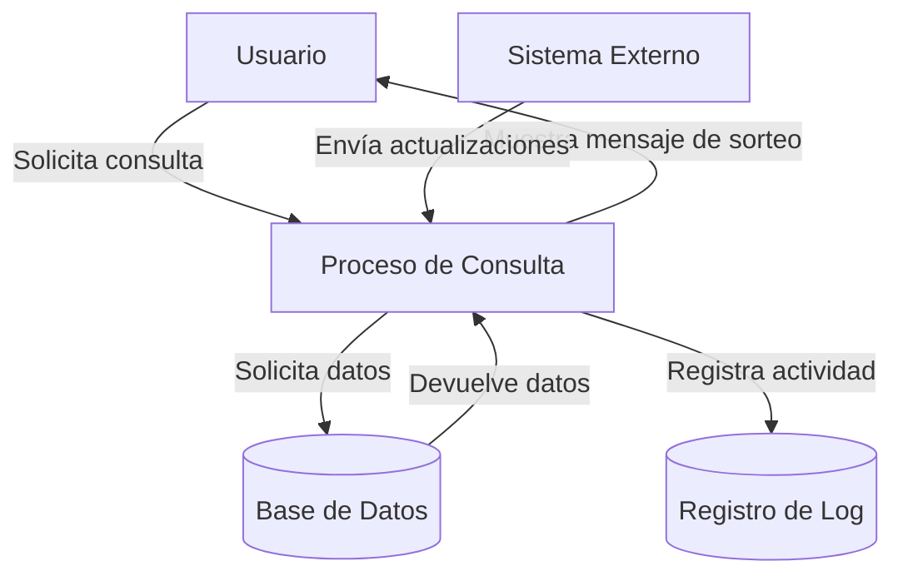

## Module: CConsultarMensajeSorteo.cpp
# Análisis Integral del Módulo CConsultarMensajeSorteo.cpp

## Nombre del Módulo/Componente SQL
**CConsultarMensajeSorteo.cpp** - Clase para consultar mensajes relacionados con sorteos en un sistema.

## Objetivos Primarios
Este módulo está diseñado para recuperar y gestionar mensajes asociados a sorteos específicos en un sistema de lotería o juegos de azar. Su propósito principal es consultar la base de datos para obtener mensajes configurados para un sorteo particular, permitiendo la personalización de la comunicación según el tipo de sorteo.

## Funciones, Métodos y Consultas Críticas
- **CConsultarMensajeSorteo::CConsultarMensajeSorteo()**: Constructor que inicializa la conexión a la base de datos.
- **CConsultarMensajeSorteo::~CConsultarMensajeSorteo()**: Destructor que libera recursos.
- **CConsultarMensajeSorteo::ConsultarMensajeSorteo()**: Método principal que ejecuta la consulta SQL para obtener el mensaje asociado a un sorteo específico.
- **Consulta SQL principal**: SELECT que recupera mensajes de la tabla MENSAJE_SORTEO basándose en el código de sorteo proporcionado.

## Variables y Elementos Clave
- **m_pDBConn**: Conexión a la base de datos.
- **m_pStmt**: Objeto para preparar y ejecutar sentencias SQL.
- **m_pRes**: Almacena los resultados de la consulta.
- **Tabla MENSAJE_SORTEO**: Tabla principal que contiene los mensajes configurados para cada sorteo.
- **Columnas clave**: COD_SORTEO (identificador del sorteo), MENSAJE (texto del mensaje).

## Interdependencias y Relaciones
- Depende de la biblioteca MySQL para la conexión y consultas a la base de datos.
- Interactúa con la tabla MENSAJE_SORTEO que presumiblemente está relacionada con una tabla de sorteos (no visible en el código).
- Utiliza la clase CDBConnection para gestionar la conexión a la base de datos.

## Operaciones Principales vs. Auxiliares
- **Operación principal**: Consulta y recuperación del mensaje asociado a un sorteo específico.
- **Operaciones auxiliares**: 
  - Inicialización y gestión de la conexión a la base de datos.
  - Manejo de errores y excepciones durante la consulta.
  - Limpieza de recursos después de la operación.

## Secuencia Operativa/Flujo de Ejecución
1. Se inicializa la conexión a la base de datos en el constructor.
2. Al llamar a ConsultarMensajeSorteo(), se prepara una consulta SQL parametrizada.
3. Se vincula el parámetro del código de sorteo a la consulta.
4. Se ejecuta la consulta y se recuperan los resultados.
5. Si hay resultados, se extrae el mensaje del sorteo.
6. Se liberan los recursos utilizados.
7. Se devuelve el mensaje encontrado o una cadena vacía si no se encuentra.

## Aspectos de Rendimiento y Optimización
- La consulta es simple y directa, lo que debería resultar en un buen rendimiento.
- Se utiliza una consulta parametrizada, lo que previene inyecciones SQL y mejora la seguridad.
- No se observan índices explícitos, pero se asume que COD_SORTEO está indexado para búsquedas eficientes.
- La gestión de recursos parece adecuada, liberando objetos después de su uso.

## Reusabilidad y Adaptabilidad
- La clase está diseñada de manera modular, facilitando su reutilización en diferentes partes del sistema.
- El método principal acepta un parámetro de código de sorteo, lo que permite consultar mensajes para cualquier sorteo.
- La implementación es específica para MySQL, lo que podría limitar su portabilidad a otros sistemas de bases de datos.

## Uso y Contexto
- Este módulo probablemente se utiliza en un sistema de gestión de loterías o juegos de azar.
- Se emplea para recuperar mensajes personalizados que se muestran a los usuarios o se utilizan en comunicaciones relacionadas con sorteos específicos.
- Podría ser parte de un sistema más amplio que gestiona diferentes aspectos de los sorteos, como configuración, resultados y comunicaciones.

## Suposiciones y Limitaciones
- **Suposiciones**:
  - Se asume que la tabla MENSAJE_SORTEO existe y contiene los campos necesarios.
  - Se espera que cada código de sorteo tenga un único mensaje asociado.
  - Se presupone que la conexión a la base de datos está correctamente configurada.
  
- **Limitaciones**:
  - El código no maneja múltiples mensajes para un mismo sorteo.
  - No hay validación explícita del código de sorteo antes de la consulta.
  - La gestión de errores es básica y podría mejorarse para proporcionar información más detallada sobre fallos.
## Flow Diagram [via mermaid]

