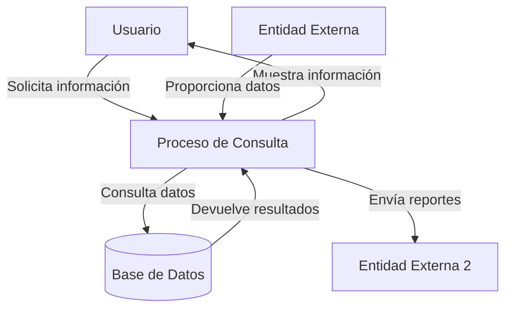

## Module: CConsultarNomPuntFechaCrCliente.cpp
# Análisis Integral del Módulo CConsultarNomPuntFechaCrCliente.cpp

## Módulo/Componente SQL
**CConsultarNomPuntFechaCrCliente.cpp** - Este es un módulo de clase C++ que implementa una interfaz para consultar información de clientes en un sistema.

## Objetivos Primarios
El propósito principal de este módulo es proporcionar funcionalidad para consultar y recuperar información específica de clientes desde una base de datos, incluyendo nombres, puntos, fechas y números de crédito. Actúa como una capa de acceso a datos que encapsula las operaciones de consulta SQL.

## Funciones, Métodos y Consultas Críticas
- **CConsultarNomPuntFechaCrCliente()** - Constructor que inicializa la conexión a la base de datos.
- **~CConsultarNomPuntFechaCrCliente()** - Destructor que libera recursos.
- **ConsultarNomPuntFechaCrCliente()** - Método principal que ejecuta una consulta SQL para obtener información del cliente basada en un ID proporcionado.
- **La consulta SQL SELECT** es fundamental, recuperando datos de múltiples tablas relacionadas con clientes.

## Variables y Elementos Clave
- **m_pDB** - Puntero a la conexión de base de datos.
- **m_pRS** - Puntero al conjunto de resultados.
- **Tablas principales**: CLIENTES, PUNTOS, CREDITOS
- **Columnas clave**: ID_CLIENTE, NOMBRE, APELLIDO_PATERNO, APELLIDO_MATERNO, PUNTOS_DISPONIBLES, FECHA_REGISTRO, NUM_CREDITO

## Interdependencias y Relaciones
- El módulo depende de la biblioteca ADO para acceso a bases de datos.
- Interactúa con múltiples tablas relacionadas mediante JOINs:
  - CLIENTES se une con PUNTOS a través de ID_CLIENTE
  - CLIENTES se une con CREDITOS a través de ID_CLIENTE
- Depende de la clase CDB para la gestión de conexiones a la base de datos.

## Operaciones Principales vs. Auxiliares
- **Operación principal**: La consulta SQL que recupera información del cliente.
- **Operaciones auxiliares**:
  - Inicialización de la conexión a la base de datos
  - Manejo de errores y excepciones
  - Liberación de recursos

## Secuencia Operacional/Flujo de Ejecución
1. Se inicializa la conexión a la base de datos en el constructor.
2. El método ConsultarNomPuntFechaCrCliente recibe un ID de cliente.
3. Se prepara y ejecuta una consulta SQL para recuperar datos del cliente.
4. Se procesan los resultados y se devuelven al llamador.
5. Se liberan los recursos al finalizar.

## Aspectos de Rendimiento y Optimización
- La consulta utiliza JOINs entre múltiples tablas, lo que podría afectar el rendimiento con grandes volúmenes de datos.
- No se observa el uso explícito de índices en la consulta.
- La consulta filtra por ID_CLIENTE, que probablemente sea una clave primaria indexada.
- El manejo de memoria podría optimizarse para evitar posibles fugas.

## Reusabilidad y Adaptabilidad
- La clase está diseñada específicamente para consultar información de clientes, lo que limita su reusabilidad directa.
- La funcionalidad podría adaptarse para consultas similares con modificaciones menores.
- La separación de la lógica de acceso a datos en una clase dedicada facilita el mantenimiento.

## Uso y Contexto
- Este módulo se utiliza probablemente en un sistema de gestión de clientes o un programa de fidelización.
- Se invoca cuando se necesita recuperar información detallada de un cliente específico.
- Forma parte de una arquitectura más amplia que maneja datos de clientes, puntos y créditos.

## Suposiciones y Limitaciones
- Asume que existe una estructura de base de datos específica con tablas CLIENTES, PUNTOS y CREDITOS.
- Requiere que la biblioteca ADO esté disponible y configurada correctamente.
- Está limitado a consultar información por ID de cliente, sin ofrecer búsquedas por otros criterios.
- No incluye validación de entrada para el ID de cliente proporcionado.
- Depende de una implementación específica de la clase CDB para la gestión de conexiones.
## Flow Diagram [via mermaid]

