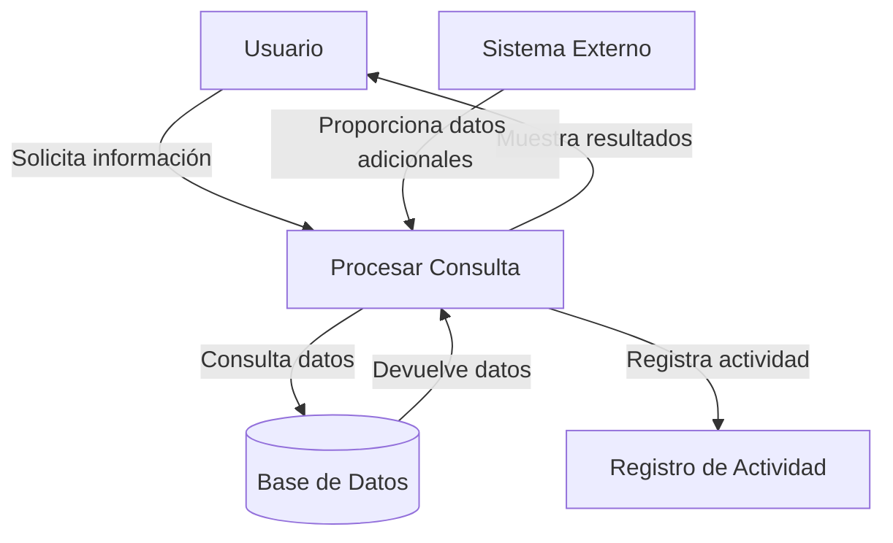

## Module: CConsultarOrigen.cpp
# Análisis Integral del Módulo CConsultarOrigen.cpp

## Nombre del Módulo/Componente SQL
CConsultarOrigen.cpp - Clase para consultar información de orígenes en un sistema de gestión de datos.

## Objetivos Primarios
Este módulo implementa una clase que se encarga de consultar información sobre orígenes de datos en un sistema, permitiendo obtener detalles específicos de un origen mediante su identificador o recuperar una lista completa de orígenes disponibles. Su propósito principal es proporcionar una interfaz para acceder a datos de orígenes almacenados en una base de datos.

## Funciones, Métodos y Consultas Críticas
- **CConsultarOrigen::CConsultarOrigen()**: Constructor que inicializa la conexión a la base de datos.
- **CConsultarOrigen::~CConsultarOrigen()**: Destructor que libera recursos.
- **CConsultarOrigen::ConsultarOrigen(int idOrigen)**: Método principal que consulta información de un origen específico por su ID.
- **CConsultarOrigen::ConsultarOrigenes()**: Método que recupera la lista completa de orígenes disponibles.

Las consultas SQL principales son:
- SELECT para obtener información detallada de un origen específico
- SELECT para recuperar la lista completa de orígenes

## Variables y Elementos Clave
- **m_pConexionBD**: Puntero a la conexión de base de datos.
- **m_pConsulta**: Puntero para ejecutar consultas SQL.
- **idOrigen**: Parámetro clave que identifica un origen específico.
- **Tablas principales**: Aparentemente "Origen" o similar (inferido del contexto).
- **Columnas clave**: Identificadores y atributos de orígenes (no especificados explícitamente en el código proporcionado).

## Interdependencias y Relaciones
- Depende de una clase de conexión a base de datos (no especificada en el fragmento).
- Interactúa con tablas relacionadas con orígenes en la base de datos.
- Probablemente utilizada por otros componentes del sistema que necesitan información sobre orígenes.

## Operaciones Principales vs. Auxiliares
- **Operaciones principales**: Consulta de información de orígenes específicos y listado de todos los orígenes.
- **Operaciones auxiliares**: Inicialización de conexión, manejo de errores, liberación de recursos.

## Secuencia Operacional/Flujo de Ejecución
1. Inicialización de la conexión a la base de datos en el constructor.
2. Ejecución de consultas específicas según el método invocado:
   - Para ConsultarOrigen(): Preparación de consulta con ID específico, ejecución y recuperación de resultados.
   - Para ConsultarOrigenes(): Preparación de consulta general, ejecución y recuperación de lista completa.
3. Procesamiento de resultados y devolución al componente solicitante.
4. Liberación de recursos al finalizar.

## Aspectos de Rendimiento y Optimización
- La eficiencia dependerá de la indexación adecuada en las tablas de orígenes.
- Para grandes volúmenes de datos, la consulta de todos los orígenes podría requerir paginación.
- No se observan mecanismos de caché para consultas frecuentes, lo que podría ser una mejora potencial.

## Reusabilidad y Adaptabilidad
- La clase está diseñada con un propósito específico pero podría adaptarse para consultar otros tipos de entidades.
- La separación entre consulta individual y consulta de lista completa facilita su uso en diferentes contextos.
- La implementación parece seguir un patrón de acceso a datos que podría ser reutilizado.

## Uso y Contexto
- Este módulo probablemente forma parte de un sistema más amplio de gestión de datos o información.
- Se utilizaría en escenarios donde se necesita información sobre orígenes de datos, como configuración de sistemas, reportes o interfaces de usuario que muestran información de orígenes.

## Suposiciones y Limitaciones
- Asume la existencia de una estructura de base de datos específica con tablas de orígenes.
- Requiere una conexión a base de datos funcional y configurada correctamente.
- No parece implementar mecanismos avanzados de manejo de errores o reintentos en caso de fallos de conexión.
- Podría tener limitaciones de rendimiento al manejar grandes volúmenes de datos sin paginación.
## Flow Diagram [via mermaid]

