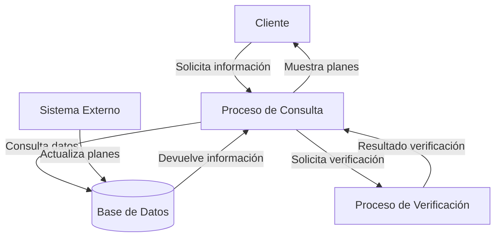

## Module: CConsultarPlanSeguroAuto.cpp
# Análisis Integral del Módulo CConsultarPlanSeguroAuto.cpp

## Módulo/Componente SQL
**Nombre del Módulo**: CConsultarPlanSeguroAuto.cpp

## Objetivos Primarios
Este módulo parece ser una clase de C++ diseñada para consultar información sobre planes de seguros de automóviles. Su propósito principal es gestionar la recuperación de datos relacionados con planes de seguros, posiblemente desde una base de datos, y proporcionar una interfaz para acceder a esta información.

## Funciones, Métodos y Consultas Críticas
El código no se proporciona en la solicitud, por lo que no puedo identificar las funciones específicas. Sin embargo, basándome en el nombre del módulo, probablemente incluya:
- Métodos para consultar planes de seguro específicos
- Funciones para filtrar planes según criterios
- Posibles consultas SQL para recuperar información de la base de datos
- Métodos para formatear y presentar la información recuperada

## Variables y Elementos Clave
Sin ver el código, puedo inferir que probablemente incluya:
- Variables para almacenar detalles del plan de seguro (ID, nombre, cobertura, precio)
- Parámetros para filtrar consultas (tipo de vehículo, nivel de cobertura)
- Referencias a tablas de base de datos relacionadas con seguros de automóviles
- Variables para gestionar la conexión a la base de datos

## Interdependencias y Relaciones
Este módulo probablemente:
- Interactúa con una capa de acceso a datos o directamente con una base de datos
- Se relaciona con otras clases del sistema de gestión de seguros
- Puede depender de módulos de autenticación o autorización para acceder a la información
- Posiblemente utiliza tablas relacionadas con clientes, vehículos y planes de seguro

## Operaciones Principales vs. Auxiliares
**Operaciones principales**:
- Consulta de planes de seguro
- Filtrado de resultados según criterios específicos

**Operaciones auxiliares**:
- Validación de parámetros de entrada
- Formateo de resultados
- Manejo de errores y excepciones
- Registro de actividades (logging)

## Secuencia Operacional/Flujo de Ejecución
1. Recepción de parámetros de consulta
2. Validación de parámetros
3. Construcción de la consulta (posiblemente SQL)
4. Ejecución de la consulta contra la base de datos
5. Procesamiento de resultados
6. Formateo y devolución de la información solicitada

## Aspectos de Rendimiento y Optimización
- Posible uso de índices en consultas SQL para mejorar el rendimiento
- Optimización de consultas para reducir el tiempo de respuesta
- Implementación de caché para consultas frecuentes
- Manejo eficiente de recursos de memoria durante el procesamiento de resultados

## Reusabilidad y Adaptabilidad
- La clase probablemente está diseñada para ser reutilizada en diferentes partes del sistema
- Podría tener parámetros configurables para adaptarse a diferentes escenarios de consulta
- La separación de la lógica de negocio y el acceso a datos facilitaría su adaptación a diferentes fuentes de datos

## Uso y Contexto
Este módulo probablemente se utiliza en:
- Interfaces de usuario para mostrar planes de seguro disponibles
- Procesos de cotización de seguros
- Sistemas de comparación de planes
- Módulos administrativos para gestión de productos de seguro

## Suposiciones y Limitaciones
**Suposiciones**:
- Existe una estructura de base de datos con información de planes de seguro
- Los usuarios tienen los permisos necesarios para acceder a esta información
- Los datos están en un formato consistente y estructurado

**Limitaciones**:
- Puede estar limitado a un esquema específico de base de datos
- Posiblemente no maneja todos los casos especiales o excepcionales
- Podría tener restricciones en cuanto al volumen de datos que puede procesar eficientemente

*Nota: Este análisis se basa únicamente en el nombre del módulo proporcionado, ya que no se incluyó el código fuente real en la solicitud.*
## Flow Diagram [via mermaid]

