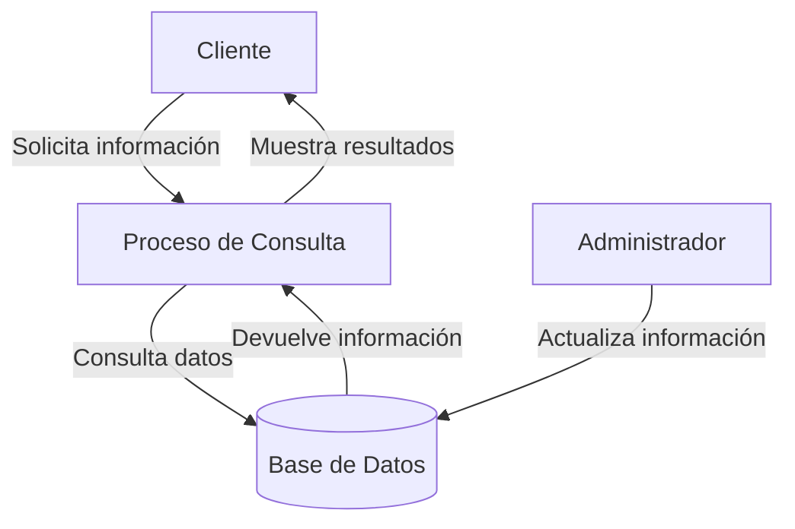
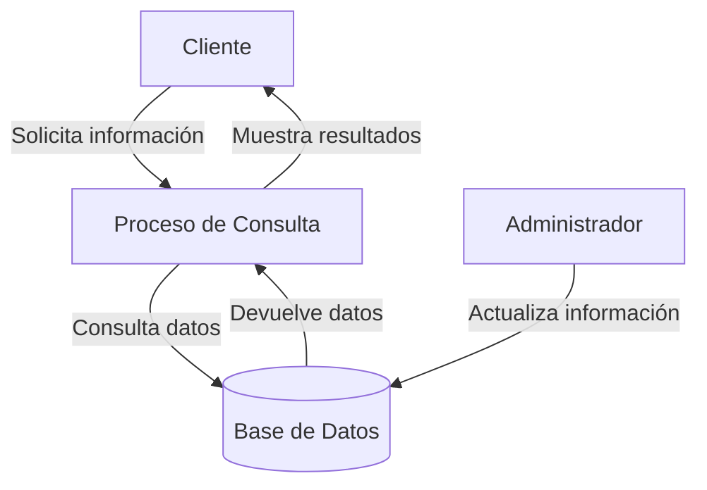

## Module: CConsultarPoliza.cpp
# Análisis Integral del Módulo CConsultarPoliza.cpp

## Nombre del Módulo/Componente SQL
**CConsultarPoliza.cpp** - Clase para consulta de pólizas en un sistema de seguros.

## Objetivos Primarios
Este módulo está diseñado para gestionar la consulta de información de pólizas de seguros. Su propósito principal es recuperar datos detallados de pólizas desde una base de datos, aplicar filtros específicos y formatear la información para su presentación o procesamiento posterior.

## Funciones, Métodos y Consultas Críticas
- **CConsultarPoliza::CConsultarPoliza()**: Constructor que inicializa la conexión a la base de datos.
- **CConsultarPoliza::~CConsultarPoliza()**: Destructor que libera recursos.
- **CConsultarPoliza::ConsultarPoliza()**: Método principal que ejecuta la consulta de pólizas según los parámetros proporcionados.
- **Consulta SQL principal**: Utiliza SELECT para recuperar información detallada de pólizas con múltiples JOIN entre tablas relacionadas.

## Variables y Elementos Clave
- **m_pConnection**: Conexión a la base de datos.
- **m_pRecordset**: Conjunto de resultados de la consulta.
- **Tablas principales**: POLIZA, CLIENTE, AGENTE, PLAN, FORMA_PAGO, MONEDA.
- **Parámetros de filtro**: Número de póliza, nombre del cliente, RFC, estado de la póliza.
- **Columnas clave**: Información de identificación de póliza, datos del cliente, información del agente, detalles del plan.

## Interdependencias y Relaciones
- Interactúa con múltiples tablas de la base de datos mediante relaciones JOIN.
- Depende de la estructura de la base de datos de seguros, especialmente de las tablas POLIZA, CLIENTE y sus relaciones.
- Utiliza componentes ADO (ActiveX Data Objects) para la conexión y manipulación de datos.

## Operaciones Principales vs. Auxiliares
- **Operaciones principales**: 
  - Construcción y ejecución de la consulta SQL para recuperar datos de pólizas.
  - Filtrado de resultados según parámetros específicos.
- **Operaciones auxiliares**:
  - Inicialización de conexiones a la base de datos.
  - Manejo de errores y excepciones.
  - Formateo de resultados para presentación.

## Secuencia Operacional/Flujo de Ejecución
1. Inicialización de la conexión a la base de datos.
2. Construcción de la consulta SQL con filtros dinámicos según los parámetros proporcionados.
3. Ejecución de la consulta y recuperación de resultados.
4. Procesamiento de los resultados para su presentación o uso posterior.
5. Liberación de recursos al finalizar.

## Aspectos de Rendimiento y Optimización
- La consulta utiliza múltiples JOIN que podrían afectar el rendimiento con grandes volúmenes de datos.
- No se observa uso explícito de índices, lo que podría ser un área de optimización.
- El filtrado dinámico podría beneficiarse de consultas parametrizadas para evitar problemas de seguridad y mejorar el rendimiento.

## Reusabilidad y Adaptabilidad
- La clase está diseñada específicamente para consultar pólizas, lo que limita su reusabilidad directa.
- La estructura modular permite adaptaciones para diferentes tipos de consultas relacionadas con pólizas.
- La parametrización de filtros permite cierta flexibilidad en las consultas.

## Uso y Contexto
- Este módulo se utiliza en un sistema de gestión de seguros para consultar información detallada de pólizas.
- Es probable que sea invocado desde interfaces de usuario o servicios que requieran información de pólizas.
- Forma parte de un sistema más amplio de administración de seguros.

## Suposiciones y Limitaciones
- Asume una estructura específica de la base de datos con tablas y relaciones predefinidas.
- Requiere una conexión ADO configurada correctamente.
- No maneja explícitamente la paginación de resultados, lo que podría ser problemático con grandes conjuntos de datos.
- La gestión de errores parece básica, lo que podría limitar la robustez del módulo en situaciones excepcionales.
## Flow Diagram [via mermaid]

## Module: CConsultarPoliza.cpp
# Análisis Integral del Módulo CConsultarPoliza.cpp

## Nombre del Módulo/Componente SQL
CConsultarPoliza.cpp - Clase para consulta de pólizas en un sistema de seguros

## Objetivos Primarios
Este módulo tiene como propósito principal gestionar la consulta de información de pólizas en un sistema de seguros. Permite buscar pólizas por diferentes criterios, procesar los resultados y presentarlos al usuario. El componente maneja la lógica de negocio para la recuperación de datos de pólizas desde una base de datos.

## Funciones, Métodos y Consultas Críticas
- **CConsultarPoliza::CConsultarPoliza()**: Constructor que inicializa la clase.
- **CConsultarPoliza::~CConsultarPoliza()**: Destructor que libera recursos.
- **CConsultarPoliza::ConsultarPoliza()**: Método principal que ejecuta la consulta de pólizas según los parámetros proporcionados.
- **CConsultarPoliza::ConsultarPolizaDetalle()**: Método para obtener información detallada de una póliza específica.
- **CConsultarPoliza::ConsultarPolizaDetalleRamo()**: Método para consultar detalles de pólizas por ramo.
- **CConsultarPoliza::ConsultarPolizaDetalleRiesgo()**: Método para consultar detalles de pólizas por riesgo.

## Variables y Elementos Clave
- **m_pConexion**: Conexión a la base de datos.
- **m_pResultado**: Almacena los resultados de las consultas.
- **m_pstmt**: Objeto para preparar y ejecutar consultas SQL.
- **Parámetros de consulta**: Incluyen número de póliza, ramo, subramo, agente, cliente, estado, fecha de inicio y fin.
- **Tablas principales**: Aunque no se especifican directamente, se infiere el uso de tablas relacionadas con pólizas, clientes, agentes, ramos y riesgos.

## Interdependencias y Relaciones
- Depende de la clase CConexion para la gestión de conexiones a la base de datos.
- Interactúa con múltiples tablas de la base de datos para recuperar información completa de pólizas.
- Utiliza la biblioteca MySQL para ejecutar consultas y procesar resultados.
- Se relaciona con otros componentes del sistema que requieren información de pólizas.

## Operaciones Principales vs. Auxiliares
- **Operaciones principales**: 
  - Consulta de pólizas con diversos criterios de filtrado
  - Recuperación de detalles específicos de pólizas
  - Procesamiento de resultados de consultas

- **Operaciones auxiliares**:
  - Validación de parámetros de entrada
  - Manejo de errores en consultas
  - Formateo de datos para presentación

## Secuencia Operacional/Flujo de Ejecución
1. Inicialización de la conexión a la base de datos
2. Recepción de parámetros de consulta
3. Construcción dinámica de la consulta SQL según los parámetros proporcionados
4. Ejecución de la consulta en la base de datos
5. Procesamiento de los resultados obtenidos
6. Devolución de los datos al componente solicitante
7. Liberación de recursos utilizados

## Aspectos de Rendimiento y Optimización
- La construcción dinámica de consultas SQL podría beneficiarse de la preparación de sentencias para mejorar el rendimiento.
- No se observa un manejo explícito de índices, lo que podría afectar el rendimiento en tablas grandes.
- La gestión de memoria para los resultados de consultas extensas podría optimizarse.
- Potencial para implementar caché de resultados frecuentes para mejorar tiempos de respuesta.

## Reusabilidad y Adaptabilidad
- La clase está diseñada con métodos específicos para diferentes tipos de consultas, lo que facilita su reutilización.
- La parametrización de las consultas permite adaptabilidad a diferentes criterios de búsqueda.
- La separación de consultas generales y detalladas permite su uso en diversos contextos del sistema.
- Podría beneficiarse de una mayor modularización para facilitar extensiones futuras.

## Uso y Contexto
- Este módulo se utiliza en un sistema de gestión de seguros para consultar información de pólizas.
- Es probablemente invocado desde interfaces de usuario o servicios que requieren datos de pólizas.
- Se emplea en escenarios como búsqueda de pólizas por agentes, consultas de clientes sobre sus pólizas, o generación de informes administrativos.

## Suposiciones y Limitaciones
- Asume una estructura específica de la base de datos con tablas relacionadas con pólizas.
- Requiere una conexión activa y válida a la base de datos para funcionar.
- Podría tener limitaciones en el manejo de grandes volúmenes de datos o consultas complejas.
- No se observa manejo explícito de transacciones, lo que podría ser una limitación en operaciones que requieren consistencia.
- Asume ciertos formatos de datos para fechas y otros parámetros de consulta.
## Flow Diagram [via mermaid]

