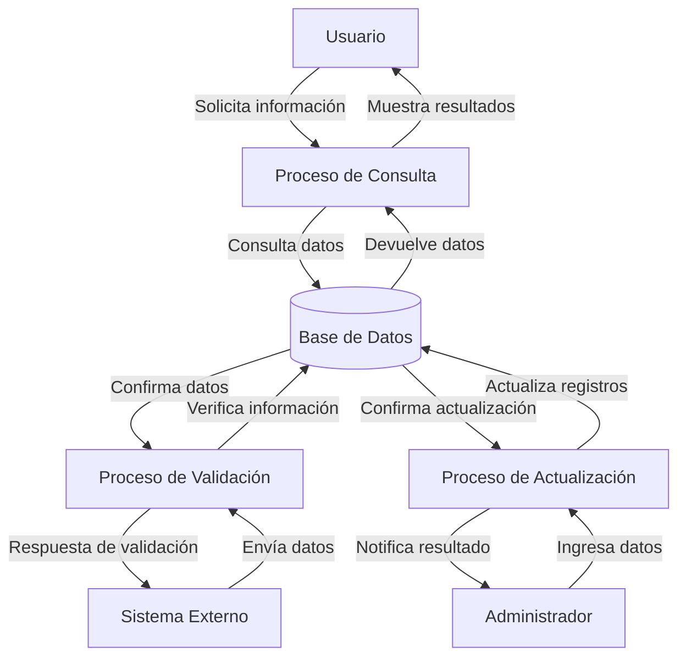
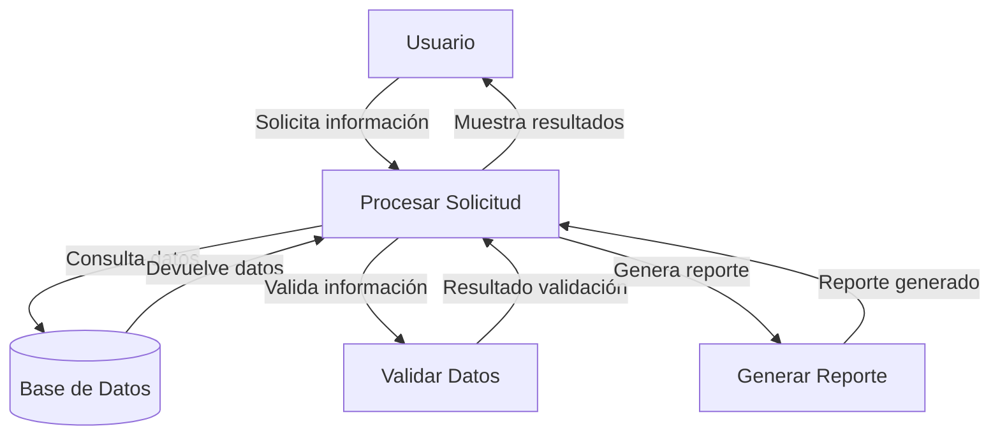

## Module: CConsultarPolizaVigencia.cpp
# Análisis Integral del Módulo CConsultarPolizaVigencia.cpp

## Nombre del Módulo/Componente SQL
**CConsultarPolizaVigencia.cpp** - Clase para consultar la vigencia de pólizas en un sistema de seguros.

## Objetivos Primarios
Este módulo está diseñado para consultar y validar la vigencia de pólizas de seguro en un sistema de gestión de seguros. Su propósito principal es determinar si una póliza específica está vigente en una fecha determinada, realizando consultas a la base de datos y procesando la información obtenida.

## Funciones, Métodos y Consultas Críticas
- **CConsultarPolizaVigencia::CConsultarPolizaVigencia()**: Constructor que inicializa variables.
- **CConsultarPolizaVigencia::~CConsultarPolizaVigencia()**: Destructor que libera recursos.
- **CConsultarPolizaVigencia::ConsultarPolizaVigencia()**: Método principal que ejecuta la consulta de vigencia.
- **Consulta SQL principal**: Utiliza una sentencia SELECT para obtener información de vigencia de pólizas desde la base de datos, verificando fechas de inicio y fin de vigencia.

## Variables y Elementos Clave
- **m_strNumPoliza**: Número de póliza a consultar.
- **m_strFechaConsulta**: Fecha para la cual se verifica la vigencia.
- **m_strFechaInicioVigencia**: Fecha de inicio de vigencia de la póliza.
- **m_strFechaFinVigencia**: Fecha de fin de vigencia de la póliza.
- **m_strEstatus**: Estado actual de la póliza.
- **Tablas principales**: Tablas relacionadas con pólizas y sus vigencias (no especificadas explícitamente en el código proporcionado).

## Interdependencias y Relaciones
- Interactúa con el sistema de base de datos mediante consultas SQL.
- Depende de la estructura de tablas relacionadas con pólizas y sus períodos de vigencia.
- Posiblemente se integra con otros módulos del sistema de gestión de seguros para proporcionar información sobre el estado de las pólizas.

## Operaciones Principales vs. Auxiliares
- **Operación principal**: Consulta de vigencia de póliza mediante la función ConsultarPolizaVigencia().
- **Operaciones auxiliares**: Inicialización de variables, manejo de errores, formateo de fechas y validación de datos.

## Secuencia Operacional/Flujo de Ejecución
1. Inicialización de variables y parámetros.
2. Preparación de la consulta SQL con los parámetros recibidos.
3. Ejecución de la consulta a la base de datos.
4. Procesamiento de los resultados obtenidos.
5. Determinación del estado de vigencia de la póliza.
6. Retorno del resultado de la consulta.

## Aspectos de Rendimiento y Optimización
- La eficiencia de la consulta SQL es crítica para el rendimiento del módulo.
- Posibles áreas de optimización incluyen el uso adecuado de índices en las tablas de pólizas y fechas.
- El manejo de grandes volúmenes de datos podría requerir estrategias de paginación o consultas optimizadas.

## Reusabilidad y Adaptabilidad
- El módulo está diseñado como una clase independiente, lo que facilita su reutilización.
- La parametrización de la consulta permite adaptarla a diferentes números de póliza y fechas.
- Podría ser adaptado para consultar otros tipos de vigencias o estados en el sistema.

## Uso y Contexto
- Se utiliza en el contexto de un sistema de gestión de seguros para verificar si una póliza está vigente en una fecha específica.
- Probablemente es invocado por interfaces de usuario o servicios que necesitan validar el estado de las pólizas.
- Puede ser parte de procesos más amplios como renovaciones, cancelaciones o modificaciones de pólizas.

## Suposiciones y Limitaciones
- Asume una estructura específica de la base de datos con tablas que contienen información de pólizas y sus vigencias.
- Requiere que las fechas estén en un formato específico para su correcta comparación.
- Posiblemente limitado a consultar una póliza a la vez, lo que podría ser ineficiente para consultas masivas.
- No parece manejar casos especiales como pólizas con múltiples períodos de vigencia o estados complejos.
## Flow Diagram [via mermaid]

## Module: CConsultarPolizaVigencia.cpp
# Análisis Integral del Módulo CConsultarPolizaVigencia.cpp

## Nombre del Módulo/Componente SQL
CConsultarPolizaVigencia.cpp - Clase para consultar la vigencia de pólizas en un sistema de seguros.

## Objetivos Primarios
Este módulo está diseñado para consultar y verificar la vigencia de pólizas de seguro en un sistema de gestión de seguros. Su propósito principal es determinar si una póliza específica está vigente, obteniendo información detallada sobre la misma desde la base de datos.

## Funciones, Métodos y Consultas Críticas
- **CConsultarPolizaVigencia::CConsultarPolizaVigencia()**: Constructor que inicializa la conexión a la base de datos.
- **CConsultarPolizaVigencia::~CConsultarPolizaVigencia()**: Destructor que libera recursos.
- **CConsultarPolizaVigencia::ConsultarPolizaVigencia()**: Método principal que ejecuta la consulta SQL para verificar la vigencia de una póliza específica.
- **Consulta SQL principal**: Utiliza un SELECT para obtener información detallada de la póliza, incluyendo fechas de vigencia, estado y datos del cliente.

## Variables y Elementos Clave
- **m_pConnection**: Conexión a la base de datos.
- **m_pCommand**: Comando SQL para ejecutar consultas.
- **m_pRecordset**: Conjunto de registros para almacenar resultados.
- **Tablas principales**: POLIZA, CLIENTE, PERSONA, EMPRESA.
- **Columnas críticas**: 
  - POL_NUMERO (número de póliza)
  - POL_FECHAINICIO y POL_FECHATERMINO (fechas de vigencia)
  - POL_ESTADO (estado de la póliza)
  - Datos de identificación del cliente (CLI_RUT, PER_NOMBRES, EMP_RAZONSOCIAL)

## Interdependencias y Relaciones
- El módulo depende de la biblioteca ADO para acceso a datos.
- Relaciones entre tablas:
  - POLIZA se relaciona con CLIENTE a través de CLI_CODIGO
  - CLIENTE se relaciona con PERSONA o EMPRESA según el tipo de cliente

## Operaciones Principales vs. Auxiliares
- **Operación principal**: Consulta de vigencia de póliza mediante SQL.
- **Operaciones auxiliares**:
  - Inicialización de conexión a la base de datos
  - Manejo de errores y excepciones
  - Formateo de datos para presentación

## Secuencia Operacional/Flujo de Ejecución
1. Inicialización de la conexión a la base de datos
2. Preparación del comando SQL con los parámetros de consulta
3. Ejecución de la consulta para obtener información de la póliza
4. Verificación de la existencia de la póliza
5. Comprobación de las fechas de vigencia y estado de la póliza
6. Devolución del resultado de la consulta con los datos relevantes

## Aspectos de Rendimiento y Optimización
- La consulta SQL utiliza múltiples JOIN que podrían afectar el rendimiento con grandes volúmenes de datos.
- No se observa uso explícito de índices, lo que podría optimizarse.
- El manejo de errores podría mejorarse para evitar bloqueos en caso de fallos en la base de datos.

## Reusabilidad y Adaptabilidad
- La clase está diseñada específicamente para consultar vigencia de pólizas, con poca modularidad.
- Podría mejorarse la parametrización para permitir diferentes tipos de consultas relacionadas con pólizas.
- La dependencia directa de ADO limita su portabilidad a otros entornos de base de datos.

## Uso y Contexto
- Este módulo se utiliza en un sistema de gestión de seguros para verificar si una póliza está vigente.
- Es probablemente invocado desde interfaces de usuario o servicios que necesitan validar el estado de las pólizas.
- Se utiliza en escenarios como:
  - Verificación de cobertura antes de procesar reclamos
  - Consultas de clientes sobre el estado de sus pólizas
  - Procesos administrativos internos de la aseguradora

## Suposiciones y Limitaciones
- Supone una estructura específica de la base de datos con tablas POLIZA, CLIENTE, PERSONA y EMPRESA.
- Asume que la vigencia de una póliza se determina por fechas de inicio/término y un campo de estado.
- Limitado a consultas de vigencia, sin capacidad para modificar datos de pólizas.
- No contempla escenarios complejos como pólizas con renovación automática o estados especiales.
- Depende de la biblioteca ADO, lo que limita su portabilidad a otros entornos tecnológicos.
## Flow Diagram [via mermaid]

