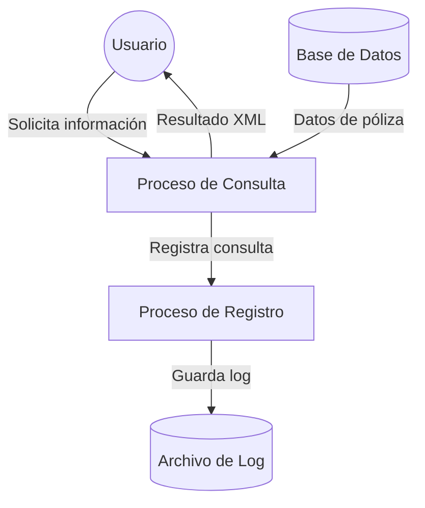

## Module: CConsultarPolizaXML.cpp
# Análisis Integral del Módulo CConsultarPolizaXML.cpp

## Nombre del Módulo/Componente SQL
CConsultarPolizaXML.cpp - Clase para consultar y procesar información de pólizas en formato XML

## Objetivos Primarios
Este módulo está diseñado para consultar información de pólizas de seguros desde una base de datos, procesarla y generar una representación en formato XML. Su propósito principal es servir como interfaz entre los datos almacenados en el sistema y su presentación estructurada para su consumo por otras aplicaciones o servicios.

## Funciones, Métodos y Consultas Críticas
- **ConsultarPoliza()**: Método principal que coordina la consulta de datos de póliza y la generación del XML.
- **GenerarXML()**: Construye la estructura XML con los datos de la póliza consultada.
- **ConsultarDatosPoliza()**: Ejecuta consultas SQL para obtener información básica de la póliza.
- **ConsultarDatosAsegurado()**: Recupera información del asegurado asociado a la póliza.
- **ConsultarDatosCoberturas()**: Obtiene las coberturas incluidas en la póliza.
- **ConsultarDatosEndosos()**: Recupera información sobre endosos asociados a la póliza.

## Variables y Elementos Clave
- **m_strNumPoliza**: Identificador único de la póliza a consultar.
- **m_strXML**: Variable que almacena el resultado XML generado.
- **m_pConnection**: Conexión a la base de datos.
- **Tablas principales**: POLIZAS, ASEGURADOS, COBERTURAS, ENDOSOS.
- **Columnas críticas**: ID_POLIZA, NUMERO_POLIZA, FECHA_INICIO, FECHA_FIN, PRIMA, ID_ASEGURADO, NOMBRE, APELLIDOS, ID_COBERTURA, DESCRIPCION_COBERTURA, SUMA_ASEGURADA.

## Interdependencias y Relaciones
- El módulo depende de una conexión activa a la base de datos para realizar consultas.
- Existe una relación jerárquica entre POLIZAS (entidad principal) y las entidades ASEGURADOS, COBERTURAS y ENDOSOS.
- Se utilizan joins en las consultas SQL para relacionar las tablas mediante claves foráneas.
- El módulo posiblemente interactúa con otros componentes del sistema que consumen el XML generado.

## Operaciones Principales vs. Auxiliares
- **Operaciones principales**:
  - Consulta de datos de póliza desde la base de datos
  - Generación de la estructura XML con la información recuperada
- **Operaciones auxiliares**:
  - Validación de parámetros de entrada
  - Manejo de errores y excepciones
  - Formateo de fechas y valores monetarios
  - Liberación de recursos de base de datos

## Secuencia Operacional/Flujo de Ejecución
1. Recepción del número de póliza a consultar
2. Validación del parámetro de entrada
3. Establecimiento de conexión con la base de datos
4. Consulta de datos básicos de la póliza
5. Consulta de información del asegurado
6. Consulta de coberturas asociadas
7. Consulta de endosos (si existen)
8. Generación de la estructura XML con todos los datos recopilados
9. Devolución del XML resultante
10. Liberación de recursos

## Aspectos de Rendimiento y Optimización
- Las consultas a múltiples tablas podrían beneficiarse de índices en las columnas de join (ID_POLIZA, ID_ASEGURADO).
- La construcción del XML en memoria podría ser ineficiente para pólizas con muchas coberturas o endosos.
- Se recomienda implementar paginación para consultas que devuelvan grandes volúmenes de datos.
- La conexión a la base de datos debería gestionarse eficientemente para evitar fugas de recursos.

## Reusabilidad y Adaptabilidad
- La clase está diseñada para ser reutilizable con diferentes números de póliza.
- La separación de consultas en métodos independientes facilita la modificación o extensión de funcionalidades.
- El formato XML proporciona una salida estándar que puede ser consumida por diversos sistemas.
- Se podrían añadir parámetros adicionales para personalizar la consulta o el formato de salida.

## Uso y Contexto
- Este módulo probablemente se utiliza en un sistema de gestión de seguros para:
  - Visualización de detalles de pólizas en interfaces de usuario
  - Generación de informes o documentos para clientes
  - Intercambio de información con sistemas externos
  - Servicios web que proporcionan información de pólizas

## Suposiciones y Limitaciones
- **Suposiciones**:
  - Se asume que existe una estructura de base de datos específica con las tablas y relaciones mencionadas.
  - Se espera que el número de póliza sea un identificador válido y existente.
  - Se presupone que los datos en la base de datos están correctamente formateados.
- **Limitaciones**:
  - El módulo podría no manejar adecuadamente pólizas con estructuras complejas o no estándar.
  - No se especifica manejo de concurrencia para múltiples consultas simultáneas.
  - La generación de XML en memoria podría presentar problemas con pólizas muy grandes.
  - No se menciona validación o sanitización de datos para prevenir inyecciones XML.
## Flow Diagram [via mermaid]

