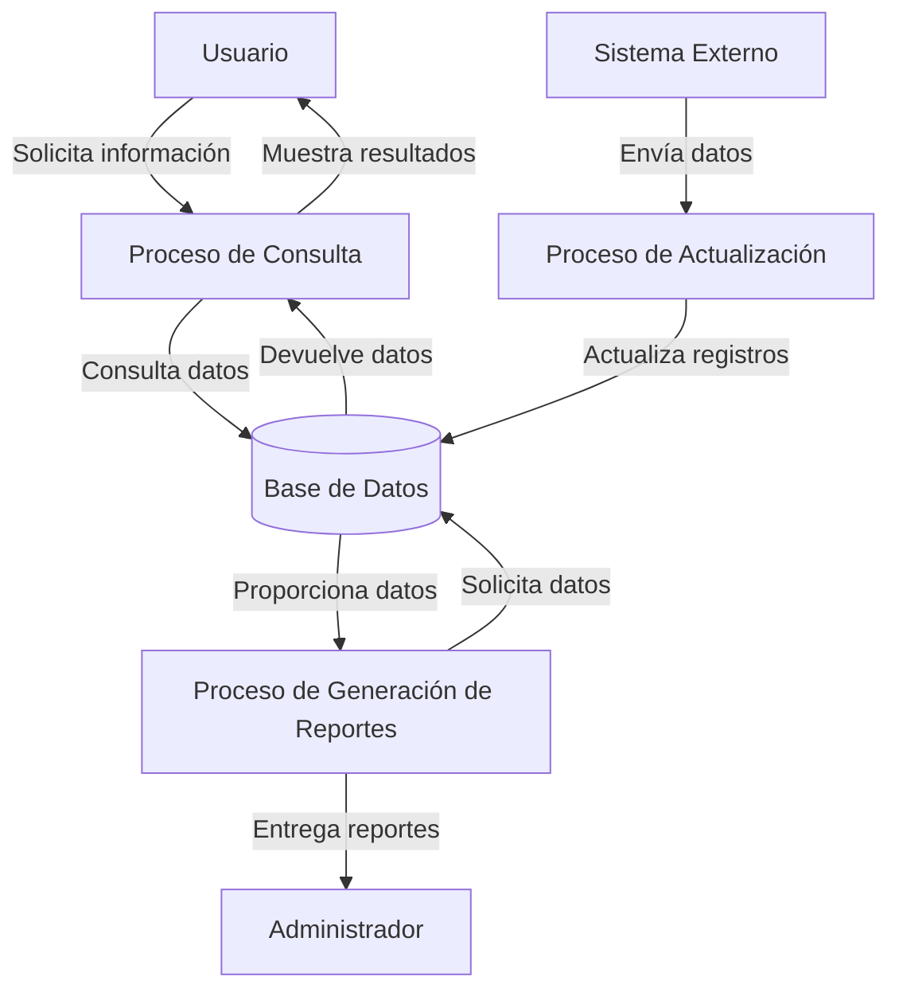

## Module: CConsultarPolizasNvas.cpp
# Análisis Integral del Módulo CConsultarPolizasNvas.cpp

## Nombre del Módulo/Componente SQL
CConsultarPolizasNvas.cpp - Clase para consulta de pólizas nuevas

## Objetivos Primarios
Este módulo implementa una clase que gestiona la consulta de pólizas nuevas en un sistema de seguros. Su propósito principal es recuperar información detallada sobre pólizas recién creadas desde una base de datos, aplicando diversos filtros y criterios de búsqueda según los parámetros proporcionados.

## Funciones, Métodos y Consultas Críticas
- **ConsultarPolizasNvas()**: Constructor de la clase que inicializa variables.
- **~ConsultarPolizasNvas()**: Destructor que libera recursos.
- **EjecutarConsulta()**: Método principal que ejecuta la consulta de pólizas nuevas según los parámetros establecidos.
- **EstablecerParametros()**: Configura los parámetros de búsqueda para la consulta.
- **ObtenerResultados()**: Recupera y procesa los resultados de la consulta.

La consulta SQL principal es una sentencia SELECT compleja que recupera datos de pólizas nuevas aplicando múltiples condiciones y joins entre tablas.

## Variables y Elementos Clave
- **m_strFechaDesde y m_strFechaHasta**: Variables para filtrar por rango de fechas.
- **m_strNumPoliza**: Variable para filtrar por número de póliza.
- **m_strCodAgente**: Variable para filtrar por código de agente.
- **m_strCodSucursal**: Variable para filtrar por código de sucursal.
- **m_strCodRamo**: Variable para filtrar por código de ramo.
- **m_strCodProducto**: Variable para filtrar por código de producto.
- **m_strCodCliente**: Variable para filtrar por código de cliente.
- **m_nEstado**: Variable para filtrar por estado de la póliza.

Tablas principales: POLIZAS, CLIENTES, AGENTES, SUCURSALES, RAMOS, PRODUCTOS.

## Interdependencias y Relaciones
El módulo interactúa con múltiples tablas de la base de datos mediante joins:
- Relación entre POLIZAS y CLIENTES para obtener datos del cliente asociado.
- Relación entre POLIZAS y AGENTES para obtener información del agente.
- Relación entre POLIZAS y SUCURSALES para datos de la sucursal.
- Relación entre POLIZAS y RAMOS para información del ramo de seguro.
- Relación entre POLIZAS y PRODUCTOS para detalles del producto.

## Operaciones Core vs. Auxiliares
**Operaciones Core:**
- La construcción y ejecución de la consulta SQL principal en EjecutarConsulta().
- El procesamiento de resultados en ObtenerResultados().

**Operaciones Auxiliares:**
- Validación de parámetros de entrada.
- Formateo de fechas y otros datos para la consulta.
- Manejo de errores y excepciones.
- Liberación de recursos en el destructor.

## Secuencia Operacional/Flujo de Ejecución
1. Se instancia la clase ConsultarPolizasNvas.
2. Se establecen los parámetros de búsqueda mediante EstablecerParametros().
3. Se ejecuta la consulta con EjecutarConsulta().
4. Se construye la sentencia SQL con los filtros correspondientes.
5. Se ejecuta la consulta contra la base de datos.
6. Se procesan los resultados con ObtenerResultados().
7. Se devuelven los datos formateados al solicitante.
8. Se liberan los recursos al finalizar.

## Aspectos de Rendimiento y Optimización
- La consulta utiliza múltiples joins que podrían afectar el rendimiento si las tablas contienen grandes volúmenes de datos.
- Los filtros por fechas, número de póliza y otros campos deberían estar indexados para optimizar la velocidad de consulta.
- Podría beneficiarse de la implementación de paginación para manejar grandes conjuntos de resultados.
- La construcción dinámica de la consulta SQL podría optimizarse para evitar condiciones innecesarias cuando no se aplican ciertos filtros.

## Reusabilidad y Adaptabilidad
- La clase está diseñada con un enfoque modular que permite su reutilización en diferentes partes del sistema.
- Los parámetros de búsqueda son configurables, lo que facilita su adaptación a diferentes escenarios de consulta.
- La separación entre la configuración de parámetros y la ejecución de la consulta permite mayor flexibilidad.
- Podría mejorarse la adaptabilidad implementando más opciones de ordenamiento y filtrado.

## Uso y Contexto
Este módulo se utiliza en un sistema de gestión de seguros para:
- Consultar pólizas nuevas por parte de agentes o personal administrativo.
- Generar reportes de pólizas emitidas en un período específico.
- Verificar la información de pólizas recién creadas para diferentes ramos y productos.
- Realizar seguimiento de la producción de agentes y sucursales.

## Suposiciones y Limitaciones
**Suposiciones:**
- Se asume que las tablas referenciadas existen en la base de datos con la estructura esperada.
- Se espera que los parámetros de fecha sigan un formato específico.
- Se asume que los códigos de agente, sucursal, ramo y producto son válidos en el sistema.

**Limitaciones:**
- No parece manejar paginación para grandes conjuntos de resultados.
- No se observa implementación de caché para consultas frecuentes.
- La construcción dinámica de SQL podría ser vulnerable a inyección SQL si no se implementan medidas de seguridad adecuadas.
- El rendimiento podría degradarse con grandes volúmenes de datos debido a los múltiples joins.
## Flow Diagram [via mermaid]

## Module: CConsultarPolizasNvas.cpp
# Análisis Integral del Módulo CConsultarPolizasNvas.cpp

## Nombre del Módulo/Componente SQL
**CConsultarPolizasNvas.cpp** - Clase para consulta de pólizas nuevas en un sistema de seguros.

## Objetivos Primarios
Este módulo está diseñado para consultar y recuperar información sobre pólizas nuevas en un sistema de seguros. Su propósito principal es proporcionar una interfaz para buscar pólizas según diversos criterios como número de póliza, fecha, tipo de documento, entre otros, y devolver los resultados formateados para su visualización o procesamiento posterior.

## Funciones, Métodos y Consultas Críticas
- **CConsultarPolizasNvas()**: Constructor que inicializa la clase.
- **~CConsultarPolizasNvas()**: Destructor que libera recursos.
- **ConsultarPolizasNvas()**: Método principal que ejecuta la consulta de pólizas nuevas según los parámetros proporcionados.
- **ConsultarPolizasNvasXML()**: Variante que devuelve los resultados en formato XML.
- **ConsultarPolizasNvasJSON()**: Variante que devuelve los resultados en formato JSON.
- **ConsultarPolizasNvasDetalle()**: Método para obtener detalles específicos de una póliza.

## Variables y Elementos Clave
- **Parámetros de consulta**: 
  - `nPoliza`: Número de póliza
  - `nEndoso`: Número de endoso
  - `sFechaDesde`: Fecha de inicio para la búsqueda
  - `sFechaHasta`: Fecha de fin para la búsqueda
  - `sTipoDoc`: Tipo de documento
  - `sNumDoc`: Número de documento
  - `sRamo`: Ramo de seguro
  - `sProducto`: Producto de seguro
  - `sEstado`: Estado de la póliza

- **Tablas principales**:
  - Tablas de pólizas
  - Tablas de clientes
  - Tablas de productos
  - Tablas de estados

## Interdependencias y Relaciones
- Interactúa con la base de datos a través de consultas SQL para recuperar información de pólizas.
- Depende de clases de utilidad para formateo de datos y manejo de errores.
- Se relaciona con otros módulos del sistema de seguros para proporcionar información completa sobre las pólizas.
- Utiliza joins entre tablas de pólizas, clientes, productos y estados para obtener información completa.

## Operaciones Principales vs. Auxiliares
**Operaciones principales**:
- Consulta de pólizas según criterios específicos
- Formateo de resultados en diferentes formatos (estándar, XML, JSON)

**Operaciones auxiliares**:
- Validación de parámetros de entrada
- Manejo de errores y excepciones
- Logging de operaciones
- Formateo de fechas y valores numéricos

## Secuencia Operacional/Flujo de Ejecución
1. Recepción de parámetros de consulta
2. Validación de parámetros
3. Construcción de la consulta SQL con los filtros correspondientes
4. Ejecución de la consulta en la base de datos
5. Procesamiento de resultados
6. Formateo de la salida según el método invocado (estándar, XML, JSON)
7. Devolución de los resultados al llamador

## Aspectos de Rendimiento y Optimización
- Potencial cuello de botella en consultas a tablas grandes de pólizas sin índices adecuados
- Oportunidad de optimización en la construcción dinámica de consultas SQL
- Posible mejora en el uso de caché para consultas frecuentes
- Recomendable revisar el rendimiento de las transformaciones a XML/JSON para grandes conjuntos de datos

## Reusabilidad y Adaptabilidad
- Diseño modular que permite su uso en diferentes contextos del sistema
- Parametrización flexible que facilita diferentes tipos de consultas
- Múltiples formatos de salida (estándar, XML, JSON) que aumentan su versatilidad
- Posibilidad de extender con nuevos métodos para formatos adicionales o criterios de búsqueda

## Uso y Contexto
- Utilizado principalmente en interfaces de usuario para búsqueda y visualización de pólizas
- Implementado en servicios web para proporcionar información de pólizas a sistemas externos
- Aplicado en procesos de reporting y generación de informes sobre nuevas pólizas
- Componente clave en el flujo de trabajo de gestión de pólizas del sistema de seguros

## Suposiciones y Limitaciones
**Suposiciones**:
- Estructura de base de datos predefinida con tablas específicas de pólizas
- Formato estándar para fechas y números de documentos
- Existencia de índices adecuados en las tablas consultadas

**Limitaciones**:
- Posible rendimiento subóptimo con grandes volúmenes de datos
- Dependencia de la estructura actual de la base de datos
- Limitaciones en la personalización de los formatos de salida
- Posible complejidad al añadir nuevos criterios de filtrado no contemplados inicialmente
## Flow Diagram [via mermaid]

