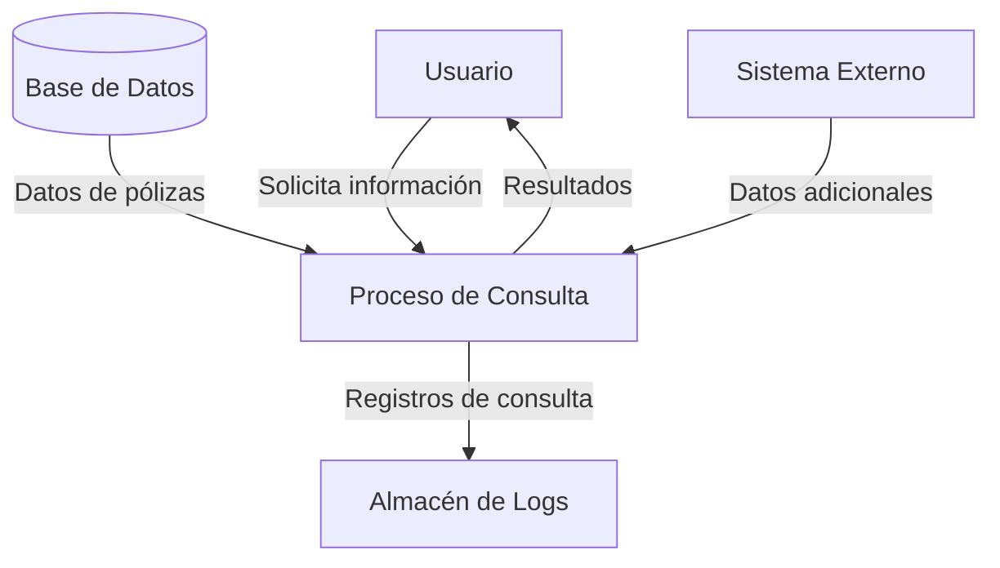

## Module: CConsultarPolizasNvas01.cpp
# Análisis Integral del Módulo CConsultarPolizasNvas01.cpp

## Nombre del Módulo/Componente SQL
CConsultarPolizasNvas01.cpp - Clase para consulta de pólizas nuevas

## Objetivos Primarios
Este módulo implementa una clase que se encarga de consultar pólizas nuevas en un sistema de seguros. Su propósito principal es recuperar información detallada sobre pólizas recién creadas desde una base de datos, aplicando diversos filtros y criterios de búsqueda según los parámetros proporcionados.

## Funciones, Métodos y Consultas Críticas
- **CConsultarPolizasNvas01()**: Constructor que inicializa la clase.
- **~CConsultarPolizasNvas01()**: Destructor que libera recursos.
- **Consultar()**: Método principal que ejecuta la consulta de pólizas nuevas.
- **ConsultarPolizasNvas()**: Método que construye y ejecuta la consulta SQL principal.
- **ConsultarPolizasNvasDetalle()**: Método para obtener detalles adicionales de las pólizas.
- **ConsultarPolizasNvasDetalleRamo()**: Método específico para consultar detalles por ramo.

La consulta SQL principal es un SELECT complejo que recupera información de pólizas con múltiples joins entre tablas relacionadas con pólizas, clientes y productos de seguros.

## Variables y Elementos Clave
- **Tablas principales**: POLIZAS, CLIENTES, PRODUCTOS, RAMOS
- **Columnas clave**: ID_POLIZA, FECHA_EMISION, ESTADO, PRIMA_TOTAL
- **Parámetros importantes**: 
  - m_strFechaIni y m_strFechaFin (filtros de fecha)
  - m_nIdRamo (identificador de ramo)
  - m_nIdProducto (identificador de producto)
  - m_nIdAgente (identificador de agente)

## Interdependencias y Relaciones
El módulo interactúa con múltiples tablas de la base de datos que están relacionadas entre sí:
- Relación entre POLIZAS y CLIENTES (cliente asociado a la póliza)
- Relación entre POLIZAS y PRODUCTOS (producto de seguro asociado)
- Relación entre PRODUCTOS y RAMOS (categorización de productos)
- Dependencia de la clase CConexionBD para la conexión a la base de datos

## Operaciones Principales vs. Auxiliares
- **Operaciones principales**: 
  - ConsultarPolizasNvas() - Consulta principal de pólizas
  - ConsultarPolizasNvasDetalle() - Obtención de detalles

- **Operaciones auxiliares**:
  - Validación de parámetros
  - Formateo de fechas
  - Construcción dinámica de condiciones SQL
  - Manejo de errores

## Secuencia Operacional/Flujo de Ejecución
1. Se inicializa la clase con parámetros de filtrado
2. Se validan los parámetros de entrada
3. Se construye la consulta SQL con las condiciones apropiadas
4. Se ejecuta la consulta principal para obtener las pólizas
5. Para cada póliza encontrada, se consultan detalles adicionales
6. Se procesan los resultados y se devuelven al solicitante

## Aspectos de Rendimiento y Optimización
- La construcción dinámica de consultas SQL podría beneficiarse de índices en las columnas de filtrado (FECHA_EMISION, ID_RAMO, ID_PRODUCTO)
- Las múltiples consultas anidadas para obtener detalles podrían optimizarse mediante consultas batch
- Potencial cuello de botella en la consulta de detalles si se procesan muchas pólizas simultáneamente

## Reusabilidad y Adaptabilidad
- La clase está diseñada para ser reutilizable con diferentes criterios de filtrado
- La parametrización de las consultas permite adaptarlas a diferentes necesidades
- La separación entre consulta principal y consultas de detalle facilita la modificación independiente

## Uso y Contexto
Este módulo se utiliza probablemente en un sistema de gestión de seguros para:
- Reportes de pólizas nuevas en un período específico
- Seguimiento de producción por agente, ramo o producto
- Análisis de ventas de nuevas pólizas
- Integración con interfaces de usuario que muestran listados de pólizas nuevas

## Suposiciones y Limitaciones
- Supone la existencia de una estructura específica de base de datos con tablas y relaciones predefinidas
- Asume que los identificadores de ramo, producto y agente son válidos
- Limitado a la consulta de pólizas nuevas, no maneja actualizaciones o modificaciones
- Posible limitación de rendimiento con grandes volúmenes de datos si no hay índices adecuados
- No parece implementar paginación, lo que podría ser problemático para conjuntos grandes de resultados
## Flow Diagram [via mermaid]

