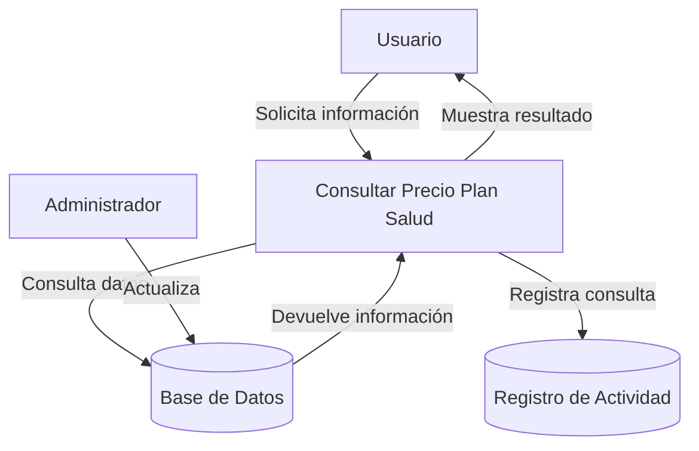
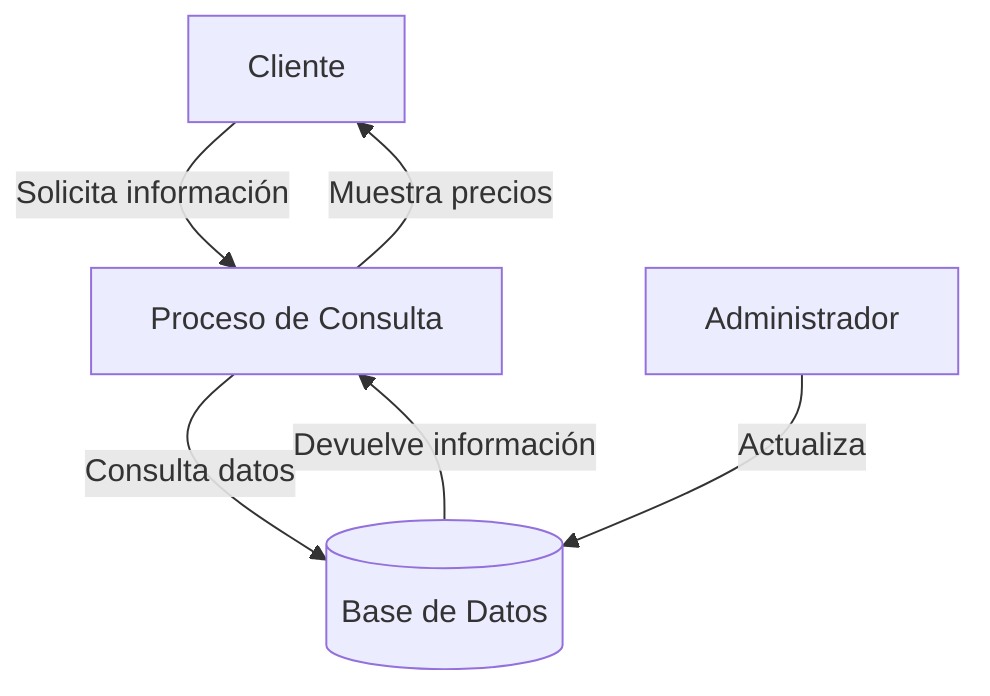

## Module: CConsultarPrecioPlanSalud.cpp
# Análisis Integral del Módulo CConsultarPrecioPlanSalud.cpp

## Nombre del Módulo/Componente SQL
**CConsultarPrecioPlanSalud.cpp** - Clase para consultar precios de planes de salud

## Objetivos Primarios
Este módulo está diseñado para consultar y calcular el precio de planes de salud basándose en diferentes parámetros como edad, género, y tipo de plan. Implementa una interfaz para obtener información de precios desde una base de datos y aplicar lógica de negocio específica para determinar el precio final.

## Funciones, Métodos y Consultas Críticas
- **CConsultarPrecioPlanSalud::ConsultarPrecio()**: Método principal que coordina la consulta de precios.
- **CConsultarPrecioPlanSalud::ObtenerPrecioBase()**: Obtiene el precio base del plan desde la base de datos.
- **CConsultarPrecioPlanSalud::AplicarFactorEdad()**: Aplica un factor multiplicador basado en la edad del cliente.
- **CConsultarPrecioPlanSalud::AplicarFactorGenero()**: Aplica ajustes de precio según el género del cliente.
- **CConsultarPrecioPlanSalud::CalcularDescuentos()**: Calcula descuentos aplicables al precio del plan.

## Variables y Elementos Clave
- **m_nIdPlan**: Identificador único del plan de salud.
- **m_nEdadCliente**: Edad del cliente para cálculos de precio.
- **m_strGenero**: Género del cliente ("M" o "F").
- **m_dblPrecioBase**: Precio base del plan antes de ajustes.
- **m_dblPrecioFinal**: Precio final después de aplicar todos los factores y descuentos.
- **Tablas relacionadas**: PLANES_SALUD, FACTORES_PRECIO, DESCUENTOS (inferidas del contexto).

## Interdependencias y Relaciones
- Interactúa con una capa de acceso a datos (posiblemente un DAO o servicio de base de datos).
- Depende de tablas de base de datos que almacenan información sobre planes, factores de precio y descuentos.
- Probablemente forma parte de un sistema más grande de gestión de planes de salud o seguros médicos.

## Operaciones Principales vs. Auxiliares
**Operaciones Principales**:
- Consulta del precio base del plan
- Aplicación de factores de ajuste (edad, género)
- Cálculo del precio final

**Operaciones Auxiliares**:
- Validación de parámetros de entrada
- Manejo de errores y excepciones
- Registro de operaciones (logging)

## Secuencia Operacional/Flujo de Ejecución
1. Se inicializa la clase con los parámetros necesarios (ID del plan, edad, género)
2. Se consulta el precio base del plan en la base de datos
3. Se aplica el factor de ajuste por edad
4. Se aplica el factor de ajuste por género
5. Se calculan posibles descuentos aplicables
6. Se determina el precio final
7. Se retorna el resultado al sistema solicitante

## Aspectos de Rendimiento y Optimización
- Las consultas a la base de datos podrían beneficiarse de índices en las columnas de búsqueda frecuente.
- El código podría implementar caché para precios base y factores que no cambian frecuentemente.
- La lógica de cálculo parece ser secuencial y directa, sin bucles complejos que pudieran afectar el rendimiento.

## Reusabilidad y Adaptabilidad
- La estructura modular permite reutilizar la lógica de cálculo de precios en diferentes contextos.
- Los factores de ajuste parecen estar parametrizados en la base de datos, lo que facilita cambios sin modificar el código.
- La separación de responsabilidades (obtener precio base, aplicar factores, calcular descuentos) facilita la adaptación a nuevos requisitos.

## Uso y Contexto
- Este módulo probablemente se utiliza en un sistema de cotización de seguros o planes de salud.
- Podría ser invocado desde interfaces de usuario, servicios web, o procesos batch para calcular precios.
- Es posible que forme parte de un flujo de trabajo más amplio que incluye selección de planes, inscripción de clientes, y facturación.

## Suposiciones y Limitaciones
- Asume la existencia de estructuras específicas en la base de datos para almacenar planes y factores de precio.
- Parece estar diseñado para un modelo de negocio específico de planes de salud, lo que podría limitar su aplicabilidad en otros contextos.
- No se observa manejo de múltiples monedas o ajustes por inflación, lo que podría ser una limitación en entornos internacionales o de alta inflación.
- La lógica de cálculo de precios asume factores multiplicativos simples, lo que podría no ser suficiente para modelos de precios más complejos.
## Flow Diagram [via mermaid]

## Module: CConsultarPrecioPlanSalud.cpp
# Análisis Integral del Módulo CConsultarPrecioPlanSalud.cpp

## Módulo/Componente SQL
**CConsultarPrecioPlanSalud.cpp** - Este es un módulo de clase C++ que implementa la funcionalidad para consultar precios de planes de salud.

## Objetivos Primarios
El propósito principal de este módulo es proporcionar una interfaz para consultar y calcular precios de planes de salud basados en diferentes parámetros como edad, género, y tipo de plan. Maneja la lógica de negocio para determinar precios de seguros médicos según criterios específicos.

## Funciones, Métodos y Consultas Críticas
- **CConsultarPrecioPlanSalud::ConsultarPrecio()**: Método principal que calcula el precio del plan de salud basado en los parámetros proporcionados.
- **CConsultarPrecioPlanSalud::ConsultarPrecioBase()**: Consulta el precio base del plan desde la base de datos.
- **CConsultarPrecioPlanSalud::ConsultarFactorEdad()**: Determina el factor multiplicador basado en la edad del cliente.
- **CConsultarPrecioPlanSalud::ConsultarFactorGenero()**: Obtiene el factor multiplicador basado en el género del cliente.

## Variables y Elementos Clave
- **m_strCodigoPlan**: Código identificador del plan de salud.
- **m_nEdad**: Edad del cliente para el cálculo del precio.
- **m_strGenero**: Género del cliente (M/F) para ajustes específicos de precio.
- **m_dblPrecioBase**: Precio base del plan antes de aplicar factores.
- **m_dblFactorEdad**: Multiplicador basado en el rango de edad.
- **m_dblFactorGenero**: Multiplicador específico del género.
- **m_dblPrecioFinal**: Precio calculado final del plan.

## Interdependencias y Relaciones
- Interactúa con una base de datos para obtener información de precios base y factores.
- Depende de la clase CConexionBD para establecer conexiones con la base de datos.
- Utiliza tablas de planes de salud, factores por edad y factores por género.

## Operaciones Principales vs. Auxiliares
**Operaciones Principales**:
- Cálculo del precio final del plan de salud.
- Consultas a la base de datos para obtener precios base y factores.

**Operaciones Auxiliares**:
- Validación de parámetros de entrada.
- Manejo de errores y excepciones durante las consultas.
- Formateo y presentación de los resultados de precio.

## Secuencia Operacional/Flujo de Ejecución
1. Se inicializa la clase con los parámetros necesarios (código de plan, edad, género).
2. Se consulta el precio base del plan desde la base de datos.
3. Se determina el factor multiplicador por edad según el rango correspondiente.
4. Se obtiene el factor específico por género.
5. Se calcula el precio final multiplicando el precio base por los factores de edad y género.
6. Se devuelve el precio calculado al solicitante.

## Aspectos de Rendimiento y Optimización
- Las consultas a la base de datos podrían optimizarse mediante el uso de índices en las tablas de planes y factores.
- La implementación podría beneficiarse de un sistema de caché para precios base y factores frecuentemente consultados.
- El manejo de conexiones a la base de datos debería ser eficiente para evitar sobrecarga en consultas repetitivas.

## Reusabilidad y Adaptabilidad
- La clase está diseñada de manera modular, permitiendo su reutilización en diferentes partes del sistema.
- Los parámetros de entrada están bien definidos, facilitando su adaptación a diferentes escenarios de cálculo de precios.
- La separación de la lógica de consulta y cálculo permite modificaciones independientes de cada componente.

## Uso y Contexto
- Este módulo se utiliza en el contexto de un sistema de gestión de seguros de salud.
- Es invocado cuando un cliente o agente necesita conocer el precio de un plan específico.
- Puede ser utilizado tanto en procesos de cotización como en la emisión final de pólizas.

## Suposiciones y Limitaciones
- Asume que las tablas de la base de datos tienen una estructura específica con campos para códigos de plan, precios base y factores.
- Requiere que los rangos de edad estén predefinidos en la base de datos.
- No maneja casos especiales como descuentos promocionales o ajustes por condiciones médicas preexistentes.
- La precisión del cálculo depende de la actualización regular de los factores y precios base en la base de datos.
## Flow Diagram [via mermaid]

