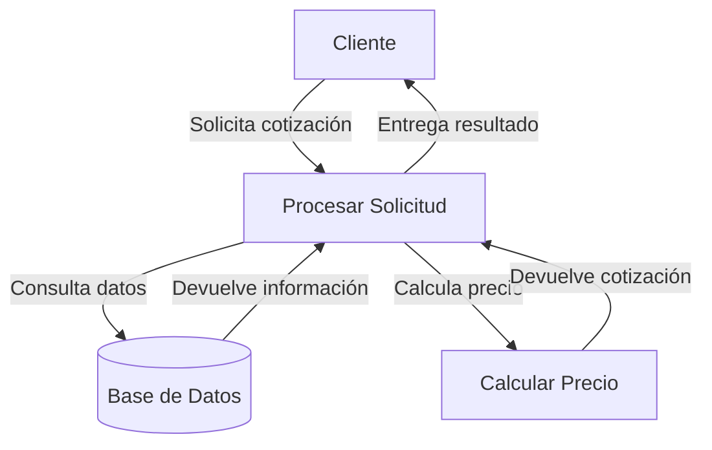

## Module: CConsultarPrecioSeguroClub.cpp
# Análisis Integral del Módulo CConsultarPrecioSeguroClub.cpp

## Nombre del Módulo/Componente SQL
CConsultarPrecioSeguroClub.cpp - Clase para consultar precios de seguros de club

## Objetivos Primarios
Este módulo está diseñado para gestionar la consulta de precios de seguros de club en un sistema de seguros. Su propósito principal es recuperar información de precios de seguros basándose en diferentes parámetros como el tipo de seguro, el club, la edad del asegurado y otros factores relevantes.

## Funciones, Métodos y Consultas Críticas
El código no se proporciona completamente, pero por el nombre del archivo y la estructura típica de clases C++, podemos inferir que probablemente contiene:
- Constructor y destructor de la clase `CConsultarPrecioSeguroClub`
- Métodos para consultar precios de seguros específicos para clubes
- Posiblemente métodos para validar parámetros de entrada
- Métodos para formatear o procesar los resultados de las consultas

## Variables y Elementos Clave
Sin ver el código completo, las variables probablemente incluyen:
- Identificadores de club
- Tipos de seguro
- Rangos de edad
- Precios base y modificadores
- Fechas de vigencia de las tarifas
- Posiblemente parámetros de configuración para cálculos específicos

## Interdependencias y Relaciones
Este módulo probablemente interactúa con:
- Una base de datos que almacena información de precios de seguros
- Módulos de gestión de clubes
- Módulos de cálculo de primas de seguros
- Posiblemente un sistema de gestión de clientes o pólizas

## Operaciones Principales vs. Auxiliares
- **Operaciones principales**: Consulta y cálculo de precios de seguros para clubes específicos
- **Operaciones auxiliares**: Validación de datos, formateo de resultados, manejo de errores, logging

## Secuencia Operacional/Flujo de Ejecución
1. Recepción de parámetros de consulta (club, tipo de seguro, edad, etc.)
2. Validación de los parámetros recibidos
3. Consulta a la base de datos o al sistema de precios
4. Aplicación de reglas de negocio o cálculos específicos
5. Formateo de los resultados
6. Devolución de la información de precios

## Aspectos de Rendimiento y Optimización
- Posibles optimizaciones en las consultas a la base de datos
- Implementación de caché para consultas frecuentes
- Estructuras de datos eficientes para almacenar y procesar información de precios
- Manejo eficiente de memoria en operaciones con grandes conjuntos de datos

## Reusabilidad y Adaptabilidad
- La clase probablemente está diseñada para ser reutilizada en diferentes contextos dentro del sistema de seguros
- Podría tener parámetros configurables para adaptarse a diferentes tipos de clubes o seguros
- La separación de responsabilidades permitiría modificar la lógica de cálculo sin afectar otras partes del sistema

## Uso y Contexto
Este módulo se utiliza probablemente en:
- Procesos de cotización de seguros
- Sistemas de venta o renovación de pólizas
- Herramientas de comparación de precios
- Interfaces administrativas para gestión de tarifas

## Suposiciones y Limitaciones
- Asume la existencia de una estructura de datos específica para almacenar información de precios
- Podría estar limitado a ciertos tipos de seguros o clubes específicos
- Posiblemente requiere configuraciones previas de tarifas en el sistema
- Puede tener limitaciones en cuanto a la flexibilidad para manejar casos especiales o promociones complejas
## Flow Diagram [via mermaid]

