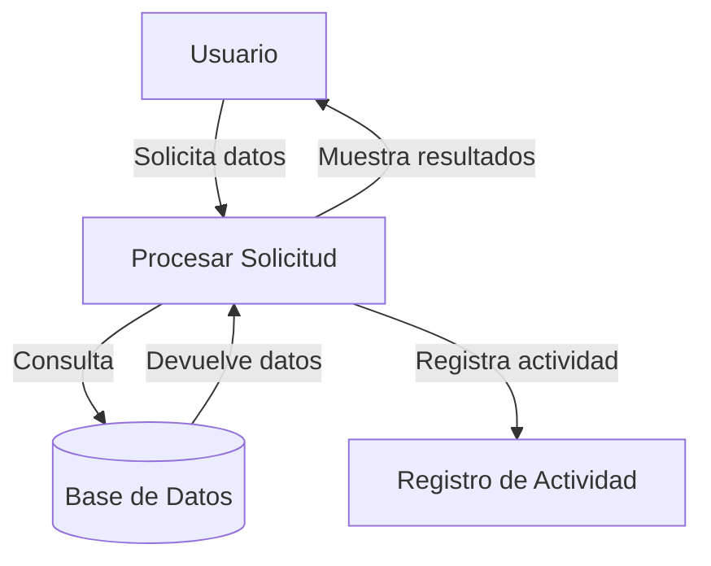

## Module: CConsultarRegion.cpp
# Análisis Integral del Módulo CConsultarRegion.cpp

## Nombre del Módulo/Componente SQL
**CConsultarRegion.cpp** - Clase para consultar información de regiones en un sistema.

## Objetivos Primarios
Este módulo implementa una clase que gestiona la consulta de información relacionada con regiones en una base de datos. Su propósito principal es proporcionar métodos para recuperar datos de regiones, incluyendo la obtención de listas de regiones y la validación de su existencia.

## Funciones, Métodos y Consultas Críticas
- **CConsultarRegion()**: Constructor que inicializa la conexión a la base de datos.
- **~CConsultarRegion()**: Destructor que libera recursos.
- **ConsultarRegion()**: Método principal que consulta información de regiones según parámetros específicos.
- **ValidarExisteRegion()**: Verifica si una región específica existe en la base de datos.
- **ObtenerListaRegiones()**: Recupera una lista completa de regiones disponibles.

Las consultas SQL principales son de tipo SELECT, enfocadas en recuperar datos de regiones desde tablas específicas.

## Variables y Elementos Clave
- **m_pConexionBD**: Puntero a la conexión de base de datos.
- **m_pConsultaBD**: Puntero para ejecutar consultas SQL.
- **Tablas clave**: Aparentemente "REGION" o tablas relacionadas con información geográfica.
- **Parámetros importantes**: Códigos de región, nombres, y posiblemente otros atributos regionales.

## Interdependencias y Relaciones
- Dependencia de un sistema de gestión de base de datos para ejecutar consultas.
- Relación con otras clases del sistema que necesitan información de regiones.
- Posible interacción con tablas relacionadas como países, ciudades o divisiones administrativas.

## Operaciones Core vs. Auxiliares
- **Core**: La consulta y recuperación de datos de regiones mediante ConsultarRegion() y ObtenerListaRegiones().
- **Auxiliares**: Validación de existencia de regiones (ValidarExisteRegion()), manejo de errores y gestión de conexiones a la base de datos.

## Secuencia Operacional/Flujo de Ejecución
1. Inicialización de la conexión a la base de datos mediante el constructor.
2. Ejecución de consultas específicas según el método invocado.
3. Procesamiento de resultados de las consultas.
4. Devolución de datos o indicadores de éxito/fracaso.
5. Liberación de recursos al finalizar mediante el destructor.

## Aspectos de Rendimiento y Optimización
- Potencial para optimizar consultas SQL mediante índices adecuados en las tablas de regiones.
- Posibilidad de implementar caché para consultas frecuentes de regiones.
- Manejo eficiente de la conexión a la base de datos para evitar abrir/cerrar conexiones innecesariamente.

## Reusabilidad y Adaptabilidad
- La clase está diseñada para ser reutilizable en diferentes partes del sistema que requieran información de regiones.
- La parametrización de los métodos permite adaptarse a diferentes criterios de consulta.
- Podría extenderse para incluir más funcionalidades relacionadas con regiones.

## Uso y Contexto
- Utilizado en sistemas que requieren información geográfica o administrativa por regiones.
- Aplicable en módulos de dirección, logística, estadísticas regionales o configuraciones específicas por región.
- Probablemente parte de un sistema más amplio de gestión de datos geográficos o administrativos.

## Suposiciones y Limitaciones
- Asume la existencia de una estructura de base de datos con tablas de regiones correctamente configuradas.
- Posiblemente limitado a un formato específico de códigos o nombres de región.
- Dependiente de la disponibilidad y rendimiento del sistema de base de datos subyacente.
- No se observa manejo de concurrencia para múltiples accesos simultáneos.
## Flow Diagram [via mermaid]

