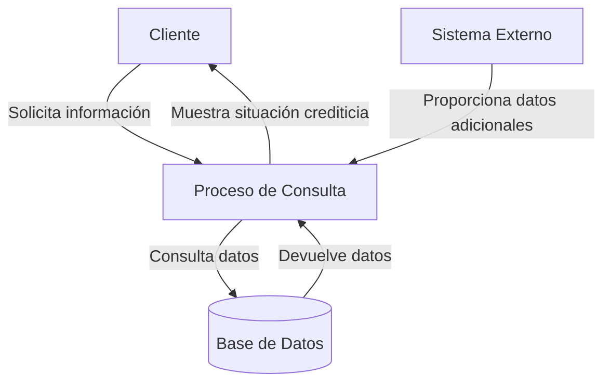

## Module: CConsultarSituacionCrCliente.cpp
# Análisis Integral del Módulo CConsultarSituacionCrCliente.cpp

## Nombre del Módulo/Componente SQL
**CConsultarSituacionCrCliente.cpp** - Clase para consultar la situación crediticia de clientes.

## Objetivos Primarios
Este módulo está diseñado para recuperar y procesar información sobre la situación crediticia de los clientes en un sistema bancario o financiero. Su propósito principal es consultar datos de crédito de clientes específicos, incluyendo información sobre préstamos, líneas de crédito y otros productos financieros asociados.

## Funciones, Métodos y Consultas Críticas
- **CConsultarSituacionCrCliente()**: Constructor de la clase.
- **~CConsultarSituacionCrCliente()**: Destructor de la clase.
- **ConsultarSituacionCrCliente()**: Método principal que ejecuta la consulta de situación crediticia.
- **ConsultarSituacionCrClienteConsolidado()**: Consulta la situación crediticia consolidada del cliente.
- **ConsultarSituacionCrClienteDetalle()**: Obtiene el detalle de la situación crediticia.
- **ConsultarSituacionCrClienteDetalleProducto()**: Consulta detalles específicos de productos crediticios.

## Variables y Elementos Clave
- **m_pConn**: Conexión a la base de datos.
- **m_pstmt**: Objeto para ejecutar sentencias SQL.
- **m_rs**: Conjunto de resultados de consultas.
- **Tablas principales**: Probablemente incluyen tablas de clientes, productos crediticios, préstamos y transacciones.
- **Parámetros clave**: Identificadores de cliente, códigos de producto, fechas de transacción.

## Interdependencias y Relaciones
- El módulo interactúa con el sistema de base de datos a través de objetos de conexión y consulta.
- Depende de tablas relacionadas con clientes, productos financieros y transacciones.
- Probablemente se integra con otros módulos del sistema para proporcionar una visión completa de la situación financiera del cliente.

## Operaciones Principales vs. Auxiliares
**Operaciones principales**:
- Consulta de datos crediticios del cliente
- Procesamiento de información de préstamos y líneas de crédito
- Generación de informes de situación crediticia

**Operaciones auxiliares**:
- Validación de parámetros de entrada
- Manejo de errores y excepciones
- Formateo de datos para presentación

## Secuencia Operacional/Flujo de Ejecución
1. Inicialización de la conexión a la base de datos
2. Validación de parámetros de entrada (ID de cliente, etc.)
3. Ejecución de consultas para obtener datos crediticios
4. Procesamiento de resultados y cálculos financieros
5. Organización de datos en estructuras apropiadas
6. Devolución de resultados al sistema solicitante
7. Cierre de recursos y manejo de posibles excepciones

## Aspectos de Rendimiento y Optimización
- Las consultas a múltiples tablas podrían beneficiarse de índices optimizados.
- El procesamiento de grandes volúmenes de datos de transacciones podría ser un cuello de botella.
- La implementación de caché para clientes frecuentemente consultados podría mejorar el rendimiento.
- Las consultas complejas podrían requerir optimización para reducir el tiempo de respuesta.

## Reusabilidad y Adaptabilidad
- La estructura de clase permite la reutilización en diferentes partes del sistema.
- Los métodos específicos para diferentes tipos de consultas facilitan la adaptación a diversos requisitos.
- La separación de consultas consolidadas y detalladas permite flexibilidad en la presentación de información.

## Uso y Contexto
- Este módulo probablemente se utiliza en aplicaciones de gestión bancaria, sistemas de aprobación de créditos, o interfaces de atención al cliente.
- Podría ser invocado durante procesos de evaluación crediticia, generación de informes financieros, o cuando los clientes solicitan información sobre su situación crediticia.
- Es probable que forme parte de un sistema más amplio de gestión financiera o CRM bancario.

## Suposiciones y Limitaciones
- Asume la existencia de una estructura de base de datos específica con tablas de clientes y productos crediticios.
- Requiere permisos adecuados para acceder a información financiera sensible.
- Podría tener limitaciones en cuanto al volumen de datos que puede procesar eficientemente.
- Probablemente está diseñado para un entorno específico y podría requerir adaptaciones para funcionar en diferentes plataformas o con diferentes sistemas de gestión de bases de datos.
## Flow Diagram [via mermaid]

