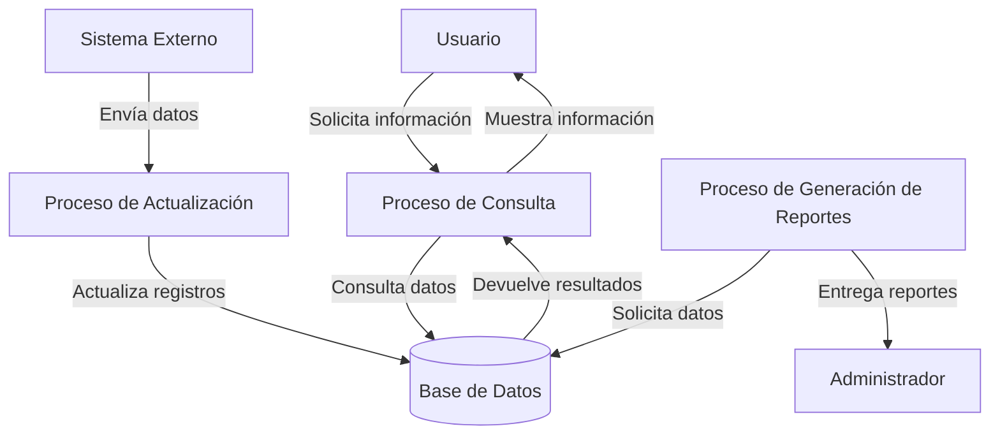
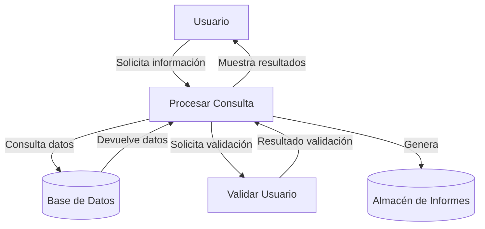

## Module: CConsultarTipoSeguroCrSeguros.cpp
# Análisis Integral del Módulo CConsultarTipoSeguroCrSeguros.cpp

## Módulo/Componente SQL
**Nombre del Módulo**: CConsultarTipoSeguroCrSeguros.cpp

## Objetivos Primarios
Este módulo implementa una clase para consultar y gestionar tipos de seguros en un sistema de seguros. Su propósito principal es proporcionar funcionalidad para recuperar información sobre tipos de seguros desde una base de datos, aplicando diversos filtros y criterios de búsqueda.

## Funciones, Métodos y Consultas Críticas
- **CConsultarTipoSeguroCrSeguros::CConsultarTipoSeguroCrSeguros()**: Constructor que inicializa la clase.
- **CConsultarTipoSeguroCrSeguros::~CConsultarTipoSeguroCrSeguros()**: Destructor que libera recursos.
- **CConsultarTipoSeguroCrSeguros::ConsultarTipoSeguro()**: Método principal que ejecuta la consulta de tipos de seguros según los parámetros proporcionados.
- **CConsultarTipoSeguroCrSeguros::ConsultarTipoSeguroXCodigo()**: Consulta específica por código de tipo de seguro.
- **CConsultarTipoSeguroCrSeguros::ConsultarTipoSeguroXDescripcion()**: Consulta por descripción del tipo de seguro.

## Variables y Elementos Clave
- **m_pConexion**: Puntero a la conexión de base de datos.
- **m_pResultado**: Puntero al resultado de la consulta.
- **m_pstmt**: Puntero a la declaración SQL preparada.
- **m_sCodigoTipoSeguro**: Código del tipo de seguro.
- **m_sDescripcionTipoSeguro**: Descripción del tipo de seguro.
- **m_sEstadoTipoSeguro**: Estado del tipo de seguro.
- **m_sFechaCreacion**: Fecha de creación del registro.
- **m_sUsuarioCreacion**: Usuario que creó el registro.
- **m_sFechaModificacion**: Fecha de última modificación.
- **m_sUsuarioModificacion**: Usuario que realizó la última modificación.

## Interdependencias y Relaciones
- Depende de la clase `CConexion` para la gestión de conexiones a la base de datos.
- Interactúa con la tabla `TIPO_SEGURO` en la base de datos.
- Utiliza la biblioteca MySQL para ejecutar consultas SQL.
- Se integra con un sistema más amplio de gestión de seguros.

## Operaciones Principales vs. Auxiliares
**Operaciones Principales**:
- Consulta de tipos de seguros con diferentes criterios de filtrado.
- Recuperación de datos específicos de tipos de seguros.

**Operaciones Auxiliares**:
- Inicialización y liberación de recursos de base de datos.
- Manejo de errores y excepciones.
- Formateo y preparación de parámetros de consulta.

## Secuencia Operacional/Flujo de Ejecución
1. Se inicializa la conexión a la base de datos.
2. Se preparan los parámetros de consulta según los criterios especificados.
3. Se construye y ejecuta la consulta SQL apropiada.
4. Se procesan los resultados de la consulta.
5. Se devuelven los datos recuperados o se indica un error si corresponde.
6. Se liberan los recursos utilizados.

## Aspectos de Rendimiento y Optimización
- Las consultas utilizan parámetros preparados para prevenir inyecciones SQL.
- Podría optimizarse el manejo de memoria con una gestión más eficiente de los resultados.
- La construcción dinámica de consultas SQL podría beneficiarse de índices adecuados en la tabla TIPO_SEGURO.
- El código maneja explícitamente la liberación de recursos para evitar fugas de memoria.

## Reusabilidad y Adaptabilidad
- La clase está diseñada con métodos específicos para diferentes tipos de consultas, lo que facilita su reutilización.
- La parametrización de las consultas permite adaptarlas a diferentes criterios de búsqueda.
- El diseño modular permite extender la funcionalidad para incluir nuevos tipos de consultas o criterios.

## Uso y Contexto
- Este módulo se utiliza en un sistema de gestión de seguros para recuperar información sobre los tipos de seguros disponibles.
- Proporciona funcionalidad para búsquedas por código, descripción o para listar todos los tipos de seguros.
- Es probable que sea utilizado por interfaces de usuario o servicios que necesiten presentar o procesar información sobre tipos de seguros.

## Suposiciones y Limitaciones
- Asume la existencia de una tabla TIPO_SEGURO con una estructura específica.
- Requiere una conexión a base de datos MySQL funcional.
- No implementa paginación para grandes conjuntos de resultados, lo que podría afectar el rendimiento con grandes volúmenes de datos.
- El manejo de errores podría ser más robusto, especialmente en situaciones de fallo de conexión o consultas inválidas.
- Está diseñado específicamente para el esquema de base de datos actual y requeriría modificaciones si cambia la estructura de la tabla.
## Flow Diagram [via mermaid]

## Module: CConsultarTipoSeguroCrSeguros.cpp
# Análisis Integral del Módulo CConsultarTipoSeguroCrSeguros.cpp

## Módulo/Componente SQL
**Nombre del Módulo**: CConsultarTipoSeguroCrSeguros.cpp

## Objetivos Primarios
Este módulo implementa una clase para consultar y gestionar tipos de seguros en un sistema de seguros. Su propósito principal es proporcionar funcionalidad para recuperar información sobre tipos de seguros desde una base de datos, aplicando diversos filtros y criterios de búsqueda.

## Funciones, Métodos y Consultas Críticas
- **CConsultarTipoSeguroCrSeguros::Consultar()**: Método principal que ejecuta la consulta de tipos de seguros aplicando filtros.
- **CConsultarTipoSeguroCrSeguros::ConsultarTipoSeguro()**: Método específico para consultar un tipo de seguro por su ID.
- **CConsultarTipoSeguroCrSeguros::ConsultarTipoSeguroXCodigo()**: Consulta un tipo de seguro por su código.
- **CConsultarTipoSeguroCrSeguros::ConsultarTipoSeguroXNombre()**: Consulta un tipo de seguro por su nombre.

Las consultas SQL principales son de tipo SELECT, enfocadas en recuperar datos de tipos de seguros con diversos criterios de filtrado.

## Variables y Elementos Clave
- **Tablas**: TIPO_SEGURO, TIPO_SEGURO_IDIOMA
- **Columnas clave**: ID_TIPO_SEGURO, CODIGO, NOMBRE, DESCRIPCION, ESTADO
- **Parámetros importantes**: 
  - m_nIdTipoSeguro
  - m_strCodigo
  - m_strNombre
  - m_nEstado
  - m_nIdIdioma

## Interdependencias y Relaciones
- Relación entre las tablas TIPO_SEGURO y TIPO_SEGURO_IDIOMA para manejar la internacionalización.
- Dependencia de la clase base CConsultarBase para funcionalidad de consulta genérica.
- Interacción con el sistema de base de datos a través de la clase CDataBase.

## Operaciones Core vs. Auxiliares
- **Core**: La consulta y recuperación de datos de tipos de seguros.
- **Auxiliares**: 
  - Validación de parámetros
  - Construcción dinámica de consultas SQL
  - Manejo de errores
  - Formateo de resultados

## Secuencia Operacional/Flujo de Ejecución
1. Inicialización de parámetros de consulta
2. Construcción de la consulta SQL con filtros aplicables
3. Ejecución de la consulta contra la base de datos
4. Procesamiento de resultados
5. Retorno de datos al llamador

## Aspectos de Rendimiento y Optimización
- Uso de índices implícitos en ID_TIPO_SEGURO, CODIGO y NOMBRE para optimizar búsquedas.
- Construcción dinámica de consultas para incluir solo los filtros necesarios, evitando procesamiento innecesario.
- Potencial área de mejora: La construcción de consultas mediante concatenación de strings podría optimizarse.

## Reusabilidad y Adaptabilidad
- Alta reusabilidad gracias a la parametrización de consultas.
- Adaptable a diferentes contextos de búsqueda mediante diversos métodos especializados.
- Diseño orientado a objetos que facilita la extensión para nuevos tipos de consultas.

## Uso y Contexto
- Utilizado en un sistema de gestión de seguros para recuperar información sobre tipos de seguros.
- Aplicable en interfaces de usuario para mostrar listas de tipos de seguros, formularios de selección, y procesos de negocio relacionados con la clasificación de seguros.

## Suposiciones y Limitaciones
- Supone la existencia de una estructura específica de base de datos con tablas TIPO_SEGURO y TIPO_SEGURO_IDIOMA.
- Limitado a la funcionalidad de consulta; no incluye operaciones de modificación de datos.
- Asume un modelo de internacionalización basado en tablas separadas por idioma.
- Posible limitación en el manejo de grandes volúmenes de datos si no se implementan paginación o límites en las consultas.
## Flow Diagram [via mermaid]

