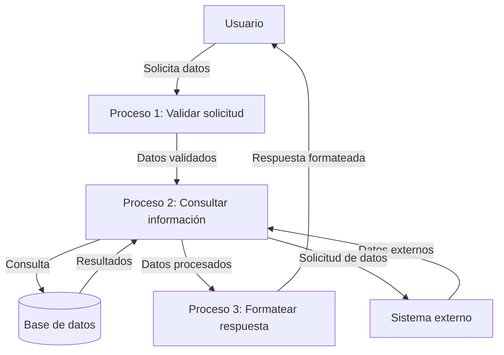

## Module: CConsultarWS.cpp
# Análisis Integral del Módulo CConsultarWS.cpp

## Nombre del Módulo/Componente SQL
CConsultarWS.cpp - Módulo de clase para consulta de servicios web

## Objetivos Primarios
Este módulo implementa una clase para realizar consultas a servicios web externos, específicamente diseñada para interactuar con servicios SOAP. Su propósito principal es gestionar la comunicación con servicios web, procesar las respuestas XML y manejar los errores de conexión y procesamiento.

## Funciones, Métodos y Consultas Críticas
- **CConsultarWS::CConsultarWS()**: Constructor que inicializa los parámetros de conexión.
- **CConsultarWS::~CConsultarWS()**: Destructor que libera recursos.
- **CConsultarWS::ConsultarWS()**: Método principal que realiza la consulta al servicio web.
- **CConsultarWS::ProcesarRespuesta()**: Procesa la respuesta XML recibida del servicio.
- **CConsultarWS::ObtenerValorNodo()**: Extrae valores específicos de nodos XML.
- **CConsultarWS::GenerarSoapRequest()**: Genera la solicitud SOAP para el servicio web.

## Variables y Elementos Clave
- **m_strURL**: URL del servicio web a consultar.
- **m_strSoapAction**: Acción SOAP para la cabecera HTTP.
- **m_strNameSpace**: Espacio de nombres XML para la solicitud SOAP.
- **m_strMetodo**: Método del servicio web a invocar.
- **m_strParametros**: Parámetros para la solicitud al servicio web.
- **m_strRespuesta**: Almacena la respuesta recibida del servicio.
- **m_strError**: Almacena mensajes de error durante el proceso.

## Interdependencias y Relaciones
- Depende de bibliotecas de red para comunicación HTTP (posiblemente WinInet o libcurl).
- Utiliza bibliotecas de procesamiento XML (posiblemente MSXML, libxml2 o similar).
- Interactúa con servicios web externos definidos por las URLs configuradas.
- Posiblemente se integra con un sistema más amplio que utiliza los datos obtenidos.

## Operaciones Principales vs. Auxiliares
**Operaciones Principales:**
- Generación de solicitudes SOAP.
- Envío de solicitudes HTTP.
- Procesamiento de respuestas XML.

**Operaciones Auxiliares:**
- Manejo de errores y excepciones.
- Registro de actividades (logging).
- Validación de parámetros de entrada.
- Extracción de valores específicos de nodos XML.

## Secuencia Operacional/Flujo de Ejecución
1. Inicialización de parámetros de conexión.
2. Generación de la solicitud SOAP mediante GenerarSoapRequest().
3. Establecimiento de conexión HTTP con el servicio web.
4. Envío de la solicitud y espera de respuesta.
5. Recepción de la respuesta del servicio web.
6. Procesamiento de la respuesta XML mediante ProcesarRespuesta().
7. Extracción de datos relevantes con ObtenerValorNodo().
8. Manejo de errores en caso de fallos.
9. Retorno de resultados al sistema llamante.

## Aspectos de Rendimiento y Optimización
- La gestión de conexiones HTTP podría optimizarse para reutilizar conexiones.
- El procesamiento XML podría ser un cuello de botella para respuestas grandes.
- Posible implementación de caché para respuestas frecuentes.
- La gestión de tiempos de espera (timeouts) es crucial para evitar bloqueos.
- Manejo eficiente de memoria para evitar fugas durante el procesamiento XML.

## Reusabilidad y Adaptabilidad
- La clase está diseñada para ser reutilizable con diferentes servicios web SOAP.
- Los parámetros configurables (URL, acción SOAP, espacio de nombres) permiten adaptarla a distintos servicios.
- Podría mejorarse la modularidad separando la lógica de conexión HTTP del procesamiento XML.
- La implementación de interfaces más genéricas facilitaría su uso con diferentes tipos de servicios web.

## Uso y Contexto
- Se utiliza para integrar sistemas que requieren datos de servicios web externos.
- Aplicable en escenarios de integración empresarial, consulta de datos externos o comunicación entre sistemas distribuidos.
- Probablemente forma parte de una capa de servicios o integración dentro de una arquitectura más amplia.

## Suposiciones y Limitaciones
- Asume que los servicios web siguen el protocolo SOAP.
- Requiere conexión a Internet o acceso a la red donde se encuentran los servicios.
- Posiblemente limitado a ciertos formatos de respuesta XML.
- No parece manejar autenticación compleja (podría requerir extensiones).
- Dependiente de las bibliotecas subyacentes para HTTP y XML.
- El manejo de errores podría no ser exhaustivo para todos los escenarios de fallo posibles.
## Flow Diagram [via mermaid]

