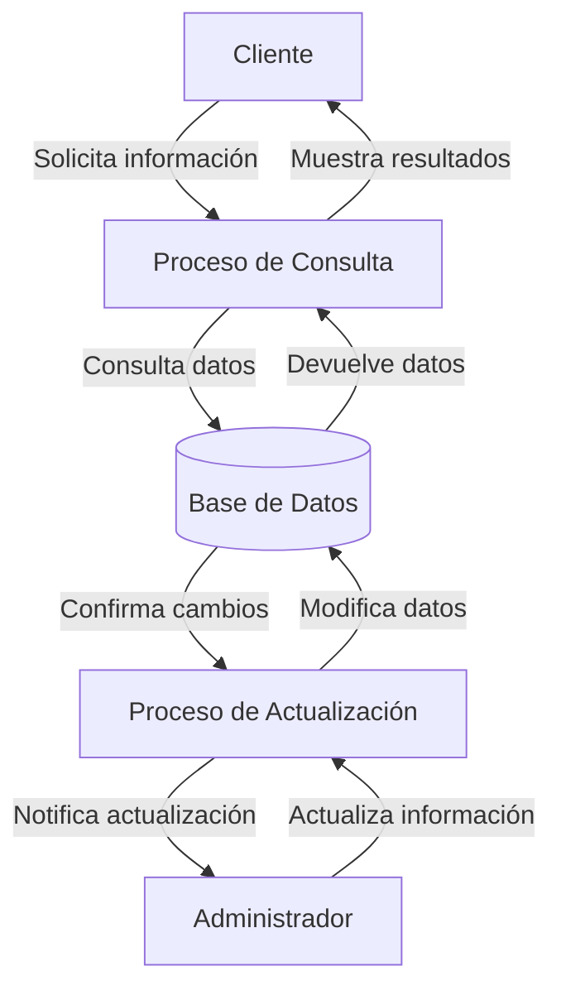

## Module: CConsultarZonaCliente.cpp
# Análisis Integral del Módulo CConsultarZonaCliente.cpp

## Nombre del Módulo/Componente SQL
CConsultarZonaCliente.cpp - Clase para consultar información de zonas de clientes

## Objetivos Primarios
Este módulo implementa una clase que gestiona la consulta de información relacionada con zonas de clientes en un sistema. Su propósito principal es proporcionar funcionalidad para recuperar y manipular datos de zonas geográficas asociadas a clientes, permitiendo consultas específicas basadas en diferentes criterios como códigos de zona, nombres o identificadores de clientes.

## Funciones, Métodos y Consultas Críticas
- **CConsultarZonaCliente()**: Constructor de la clase que inicializa variables y establece conexiones.
- **~CConsultarZonaCliente()**: Destructor que libera recursos.
- **ConsultarZonaCliente()**: Método principal que ejecuta la consulta de zonas de clientes según parámetros específicos.
- **ConsultarZonaClientePorCodigo()**: Consulta zonas de clientes filtradas por código de zona.
- **ConsultarZonaClientePorNombre()**: Consulta zonas de clientes filtradas por nombre de zona.
- **ConsultarZonaClientePorIdCliente()**: Consulta zonas asociadas a un cliente específico por su ID.

## Variables y Elementos Clave
- **m_pConexionBD**: Conexión a la base de datos.
- **m_pConsultaSQL**: Objeto para ejecutar consultas SQL.
- **m_pResultadoSQL**: Almacena resultados de consultas.
- **Tablas principales**: Probablemente "zonas_clientes" o similares (inferido del contexto).
- **Columnas clave**: Código de zona, nombre de zona, ID de cliente (inferido del contexto).

## Interdependencias y Relaciones
- Depende de un sistema de gestión de bases de datos para ejecutar consultas SQL.
- Interactúa con tablas relacionadas con zonas geográficas y clientes.
- Probablemente utiliza componentes de conexión a base de datos externos.
- Posiblemente forma parte de un sistema más amplio de gestión de clientes o CRM.

## Operaciones Principales vs. Auxiliares
- **Operaciones principales**: 
  - Consulta de zonas de clientes con diferentes criterios de filtrado
  - Procesamiento de resultados de consultas SQL
- **Operaciones auxiliares**:
  - Inicialización y liberación de recursos
  - Validación de parámetros de entrada
  - Manejo de errores y excepciones

## Secuencia Operacional/Flujo de Ejecución
1. Inicialización de la conexión a la base de datos
2. Preparación de la consulta SQL según los parámetros recibidos
3. Ejecución de la consulta
4. Procesamiento de los resultados
5. Devolución de los datos solicitados
6. Liberación de recursos

## Aspectos de Rendimiento y Optimización
- La eficiencia depende de la optimización de las consultas SQL subyacentes.
- Posibles cuellos de botella en consultas complejas o con grandes volúmenes de datos.
- Áreas de mejora potencial: implementación de caché para consultas frecuentes, uso de índices adecuados en las tablas consultadas.

## Reusabilidad y Adaptabilidad
- La clase parece estar diseñada con métodos específicos para diferentes tipos de consultas, lo que facilita su reutilización.
- La adaptabilidad dependerá de la parametrización de las consultas y la flexibilidad del diseño de la base de datos.
- Podría mejorarse la modularidad separando la lógica de negocio de la capa de acceso a datos.

## Uso y Contexto
- Este módulo probablemente se utiliza en un sistema de gestión empresarial o CRM para:
  - Visualizar zonas geográficas asociadas a clientes
  - Filtrar clientes por zonas
  - Asignar clientes a zonas específicas
  - Generar informes basados en distribución geográfica de clientes

## Suposiciones y Limitaciones
- **Suposiciones**:
  - Existe una estructura de base de datos con tablas de zonas y clientes
  - Los usuarios tienen permisos adecuados para acceder a estos datos
  - Las consultas SQL están optimizadas para el volumen de datos esperado
- **Limitaciones**:
  - Dependencia de la estructura específica de la base de datos
  - Posibles problemas de rendimiento con grandes volúmenes de datos
  - Limitaciones inherentes al sistema de gestión de bases de datos utilizado
## Flow Diagram [via mermaid]

## Module: CConsultarZonaCliente.cpp
# Análisis Integral del Módulo CConsultarZonaCliente.cpp

## Nombre del Módulo/Componente SQL
CConsultarZonaCliente.cpp - Clase para consultar información de zonas de clientes

## Objetivos Primarios
Este módulo tiene como propósito principal consultar y recuperar información relacionada con las zonas de clientes en un sistema de gestión. Implementa una interfaz para buscar zonas de clientes según diferentes criterios y devolver los resultados estructurados.

## Funciones, Métodos y Consultas Críticas
- **CConsultarZonaCliente::CConsultarZonaCliente()**: Constructor que inicializa la clase.
- **CConsultarZonaCliente::~CConsultarZonaCliente()**: Destructor que libera recursos.
- **CConsultarZonaCliente::ConsultarZonaCliente()**: Método principal que ejecuta la consulta de zonas de clientes según los parámetros proporcionados.
- **CConsultarZonaCliente::ConsultarZonaClienteXML()**: Método que devuelve los resultados en formato XML.
- **CConsultarZonaCliente::ConsultarZonaClienteXMLCodigo()**: Método especializado para consultar por código en formato XML.

## Variables y Elementos Clave
- **m_pConn**: Conexión a la base de datos.
- **m_strError**: Variable para almacenar mensajes de error.
- **m_strSQL**: Consulta SQL que se construye dinámicamente.
- **Tablas principales**: Aparentemente trabaja con tablas relacionadas con zonas de clientes.
- **Parámetros de consulta**: Código de zona, descripción, y otros criterios de filtrado.

## Interdependencias y Relaciones
- Depende de una conexión a base de datos (posiblemente SQL Server o similar).
- Interactúa con tablas de zonas de clientes y posiblemente tablas relacionadas.
- Utiliza clases auxiliares como CParametros para gestionar parámetros de consulta.
- Implementa interfaces para devolver resultados en diferentes formatos (XML).

## Operaciones Core vs. Auxiliares
- **Core**: La consulta y recuperación de datos de zonas de clientes mediante SQL.
- **Auxiliares**: 
  - Validación de parámetros
  - Formateo de resultados en XML
  - Manejo de errores
  - Construcción dinámica de consultas SQL

## Secuencia Operacional/Flujo de Ejecución
1. Inicialización de variables y parámetros
2. Validación de parámetros de entrada
3. Construcción dinámica de la consulta SQL según los criterios
4. Ejecución de la consulta contra la base de datos
5. Procesamiento de los resultados
6. Formateo de los resultados según el método llamado (estándar o XML)
7. Devolución de los resultados o manejo de errores

## Aspectos de Rendimiento y Optimización
- La construcción dinámica de consultas SQL podría beneficiarse de consultas parametrizadas para evitar inyección SQL.
- Posible optimización en la forma de recuperar y procesar grandes conjuntos de resultados.
- El uso de XML para resultados podría ser costoso en términos de rendimiento con grandes volúmenes de datos.

## Reusabilidad y Adaptabilidad
- La clase está diseñada para ser reutilizable, permitiendo diferentes criterios de consulta.
- La separación entre consulta y presentación (XML) facilita la adaptación a diferentes formatos de salida.
- Podría mejorarse la modularidad separando más claramente la lógica de acceso a datos de la lógica de negocio.

## Uso y Contexto
- Este módulo se utiliza probablemente en un sistema de gestión empresarial o CRM para consultar información sobre zonas geográficas asignadas a clientes.
- Podría ser parte de un sistema más grande que gestiona relaciones con clientes, territorios de ventas o distribución geográfica.

## Suposiciones y Limitaciones
- Asume una estructura específica de base de datos con tablas de zonas de clientes.
- Requiere una conexión a base de datos establecida y funcional.
- La implementación actual parece estar orientada a un sistema específico, lo que podría limitar su portabilidad.
- El manejo de errores parece básico y podría mejorarse para situaciones más complejas.
- No se observa manejo de transacciones, lo que podría ser necesario en operaciones más complejas.
## Flow Diagram [via mermaid]

