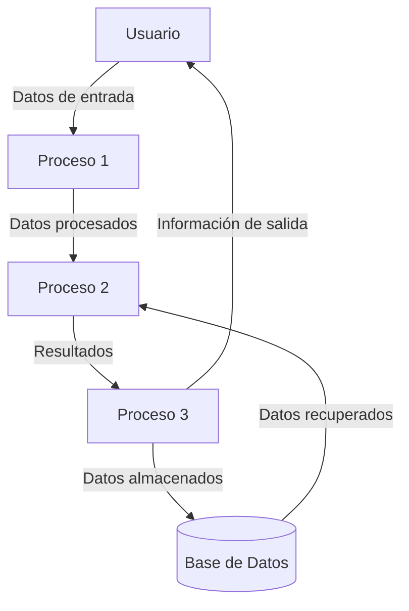

## Module: CContactabilidad.cpp
# Análisis Integral del Módulo CContactabilidad.cpp

## Módulo/Componente SQL
**CContactabilidad.cpp** - Este es un módulo de código C++ que implementa la clase CContactabilidad, diseñada para gestionar la contactabilidad de clientes en un sistema.

## Objetivos Primarios
El propósito principal de este módulo es gestionar y evaluar la contactabilidad de clientes, incluyendo la validación de números telefónicos, la gestión de intentos de contacto, y la determinación de la elegibilidad de contacto basada en diversos criterios como horarios, intentos previos y reglas de negocio específicas.

## Funciones, Métodos y Consultas Críticas
- **EsContactable()**: Función principal que determina si un cliente puede ser contactado.
- **ValidarTelefono()**: Valida la estructura y formato de un número telefónico.
- **ObtenerIntentos()**: Recupera el historial de intentos de contacto para un cliente.
- **RegistrarIntento()**: Registra un nuevo intento de contacto en la base de datos.
- **VerificarHorarioPermitido()**: Comprueba si el momento actual está dentro del horario permitido para contacto.

## Variables y Elementos Clave
- **m_idCliente**: Identificador único del cliente.
- **m_telefono**: Número telefónico a contactar.
- **m_intentosMaximos**: Límite de intentos de contacto permitidos.
- **m_tiempoEspera**: Tiempo mínimo entre intentos de contacto.
- **m_horarioInicio** y **m_horarioFin**: Definen la ventana de tiempo permitida para contacto.
- **Tablas relacionadas**: "clientes", "intentos_contacto", "reglas_contactabilidad".

## Interdependencias y Relaciones
- Interactúa con el sistema de base de datos para consultar y actualizar registros de clientes e intentos de contacto.
- Se relaciona con el módulo de gestión de clientes para obtener información demográfica.
- Depende del sistema de configuración para obtener parámetros como horarios permitidos y límites de intentos.
- Utiliza servicios de validación de números telefónicos externos o internos.

## Operaciones Core vs. Auxiliares
**Core:**
- Evaluación de contactabilidad (EsContactable)
- Registro de intentos de contacto

**Auxiliares:**
- Validación de formato telefónico
- Verificación de horarios
- Logging de actividades
- Cálculos de tiempos entre intentos

## Secuencia Operacional/Flujo de Ejecución
1. Se inicializa la instancia con datos del cliente y configuración.
2. Se valida el formato del número telefónico.
3. Se consulta el historial de intentos previos.
4. Se verifica si se cumple con el tiempo mínimo desde el último intento.
5. Se comprueba si el momento actual está dentro del horario permitido.
6. Se evalúan reglas adicionales específicas del negocio.
7. Se determina la contactabilidad basada en todos los criterios anteriores.
8. Si se realiza un intento, se registra en la base de datos.

## Aspectos de Rendimiento y Optimización
- Las consultas a la base de datos para obtener intentos previos podrían optimizarse con índices en las columnas de cliente_id y timestamp.
- La validación de teléfonos podría implementarse con expresiones regulares optimizadas.
- Se podría implementar un sistema de caché para reglas de contactabilidad frecuentemente utilizadas.
- Las operaciones de escritura (registro de intentos) podrían ser asíncronas para mejorar el rendimiento.

## Reusabilidad y Adaptabilidad
- La clase está diseñada con un enfoque modular que permite su reutilización en diferentes contextos de contacto con clientes.
- Los parámetros de configuración (intentos máximos, tiempos de espera, horarios) son ajustables, facilitando la adaptación a diferentes campañas o segmentos de clientes.
- La separación entre la lógica de validación y la de registro permite extender las reglas de negocio sin modificar la estructura principal.

## Uso y Contexto
- Este módulo se utiliza principalmente en sistemas de call center, campañas de marketing o aplicaciones de servicio al cliente.
- Se integra en flujos de trabajo de contacto con clientes, donde determina si un cliente específico puede ser contactado en un momento dado.
- Puede ser invocado antes de iniciar llamadas automáticas o como parte de un proceso de priorización de contactos.

## Suposiciones y Limitaciones
**Suposiciones:**
- Se asume que existe una estructura de base de datos con tablas para clientes e intentos de contacto.
- Se presupone que los formatos telefónicos siguen un estándar predefinido.
- Se asume que el sistema opera en una única zona horaria o que los horarios están normalizados.

**Limitaciones:**
- No maneja múltiples canales de contacto (solo teléfono).
- La validación de horarios no considera días festivos o excepciones especiales.
- No implementa lógica para preferencias de contacto expresadas por el cliente.
- Podría requerir adaptaciones para cumplir con regulaciones específicas de protección de datos o anti-spam en diferentes jurisdicciones.
## Flow Diagram [via mermaid]

