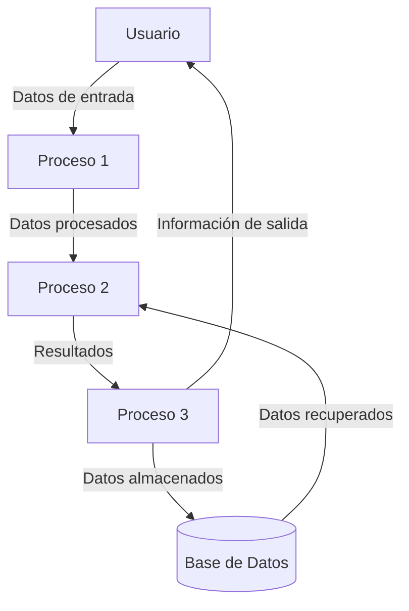

## Module: CCrHuellas.cpp
# Análisis Integral del Módulo CCrHuellas.cpp

## Nombre del Módulo/Componente SQL
**CCrHuellas.cpp** - Módulo de clase C++ para el manejo de huellas dactilares.

## Objetivos Primarios
Este módulo implementa la clase `CCrHuellas` que gestiona la captura, procesamiento y verificación de huellas dactilares en un sistema biométrico. Su propósito principal es proporcionar una interfaz para interactuar con dispositivos de captura de huellas y realizar operaciones de autenticación biométrica.

## Funciones, Métodos y Consultas Críticas
- **CCrHuellas()**: Constructor que inicializa el objeto y establece valores predeterminados.
- **~CCrHuellas()**: Destructor que libera recursos.
- **Inicializar()**: Configura el dispositivo de captura de huellas.
- **CapturarHuella()**: Captura una imagen de huella dactilar del dispositivo.
- **VerificarHuella()**: Compara una huella capturada con una plantilla almacenada.
- **ObtenerCalidad()**: Evalúa la calidad de una imagen de huella capturada.
- **ConvertirFormato()**: Transforma la imagen de huella entre diferentes formatos.

## Variables y Elementos Clave
- **m_hDispositivo**: Manejador del dispositivo de captura.
- **m_nCalidad**: Valor numérico que representa la calidad de la huella capturada.
- **m_strUltimoError**: Cadena que almacena el último mensaje de error.
- **m_bInicializado**: Bandera booleana que indica si el dispositivo está inicializado.
- **m_ImagenHuella**: Estructura que contiene los datos de la imagen de huella.
- **m_PlantillaHuella**: Estructura que almacena la plantilla biométrica extraída.

## Interdependencias y Relaciones
- Interactúa con una API de dispositivo biométrico (posiblemente a través de una DLL externa).
- Probablemente se comunica con una base de datos para almacenar o recuperar plantillas de huellas.
- Depende de bibliotecas de procesamiento de imágenes para manipular las capturas de huellas.
- Se integra con un sistema de autenticación más amplio que utiliza la verificación biométrica.

## Operaciones Principales vs. Auxiliares
**Operaciones Principales:**
- Captura de huellas dactilares
- Verificación biométrica
- Extracción de características

**Operaciones Auxiliares:**
- Gestión de errores
- Conversión de formatos de imagen
- Evaluación de calidad de imagen
- Inicialización y liberación de recursos

## Secuencia Operacional/Flujo de Ejecución
1. Inicialización del dispositivo mediante `Inicializar()`
2. Captura de la huella con `CapturarHuella()`
3. Evaluación de la calidad de la imagen con `ObtenerCalidad()`
4. Procesamiento de la imagen para extraer características biométricas
5. Comparación con plantillas almacenadas usando `VerificarHuella()`
6. Devolución del resultado de autenticación
7. Liberación de recursos al finalizar

## Aspectos de Rendimiento y Optimización
- El procesamiento de imágenes biométricas puede ser intensivo en recursos.
- Posibles cuellos de botella en la captura de imágenes si el hardware es lento.
- La comparación de huellas podría optimizarse para mejorar los tiempos de respuesta.
- El manejo de memoria para las imágenes de huellas debe ser eficiente para evitar fugas.
- Podría beneficiarse de procesamiento paralelo para operaciones de comparación masiva.

## Reusabilidad y Adaptabilidad
- La clase está diseñada como un componente reutilizable para sistemas de autenticación biométrica.
- Podría adaptarse a diferentes dispositivos de captura mediante parámetros de configuración.
- La separación de funcionalidades (captura, procesamiento, verificación) facilita su integración en diversos contextos.
- Posiblemente incluye interfaces genéricas que permiten trabajar con diferentes algoritmos biométricos.

## Uso y Contexto
- Se utiliza en sistemas de control de acceso que requieren autenticación biométrica.
- Aplicable en entornos de seguridad, asistencia laboral, o identificación personal.
- Puede formar parte de soluciones más amplias como sistemas bancarios, gubernamentales o corporativos.
- Probablemente se integra con interfaces de usuario que guían al usuario durante el proceso de captura.

## Suposiciones y Limitaciones
- Asume la disponibilidad de un dispositivo de captura de huellas compatible.
- Puede estar limitado a ciertos formatos de imagen o algoritmos de comparación específicos.
- La precisión de la verificación depende de la calidad del hardware de captura.
- Posiblemente requiere calibración específica para diferentes condiciones ambientales.
- Puede tener limitaciones en cuanto a la cantidad de plantillas que puede manejar eficientemente.
## Flow Diagram [via mermaid]

