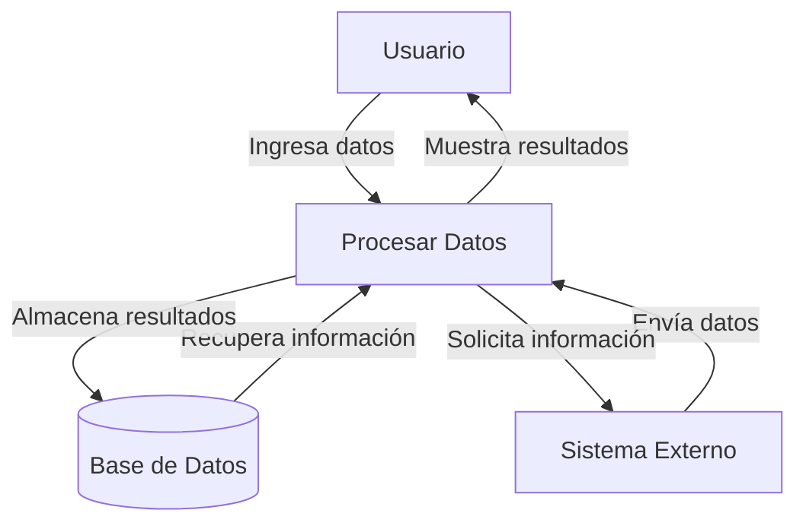
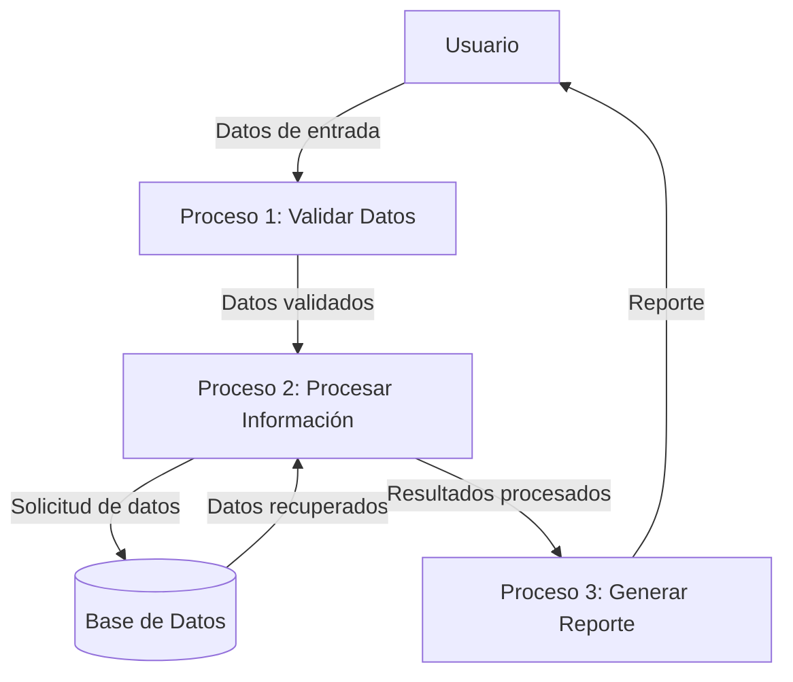

## Module: CDatosConvenio.cpp
# Análisis Integral del Módulo CDatosConvenio.cpp

## Nombre del Módulo/Componente SQL
**CDatosConvenio.cpp** - Módulo de clase C++ para gestión de datos de convenios.

## Objetivos Primarios
Este módulo implementa la clase `CDatosConvenio` que gestiona la información relacionada con convenios, específicamente para el manejo de datos de convenios en un sistema de gestión. Su propósito principal es proporcionar métodos para acceder, modificar y validar información de convenios, así como interactuar con una base de datos para operaciones CRUD (Crear, Leer, Actualizar, Eliminar).

## Funciones, Métodos y Consultas Críticas
- **Constructor y Destructor**: Inicialización y liberación de recursos.
- **SetDatos/GetDatos**: Métodos para establecer y obtener datos del convenio.
- **Validar**: Verifica la integridad y validez de los datos del convenio.
- **Grabar**: Almacena los datos del convenio en la base de datos.
- **Leer**: Recupera información de convenios desde la base de datos.
- **Borrar**: Elimina registros de convenios.
- **Métodos de acceso específicos**: Como `GetCodConvenio()`, `GetDescripcion()`, etc.

## Variables y Elementos Clave
- **m_strCodConvenio**: Código identificador del convenio.
- **m_strDescripcion**: Descripción textual del convenio.
- **m_strCodTipoConvenio**: Código del tipo de convenio.
- **m_strCodEntidad**: Código de la entidad asociada.
- **m_strCodMoneda**: Código de moneda utilizada.
- **m_dblImporte**: Valor monetario del convenio.
- **m_strObservaciones**: Notas adicionales sobre el convenio.
- **m_dtFechaInicio y m_dtFechaFin**: Fechas de vigencia del convenio.
- **m_bActivo**: Estado de activación del convenio.

## Interdependencias y Relaciones
- Interactúa con una base de datos para operaciones CRUD.
- Posible relación con tablas de entidades, tipos de convenio y monedas.
- Dependencia de clases de utilidad como `CUtil` para formateo y validación.
- Utiliza componentes de acceso a datos como `CADORecordset` para interactuar con la base de datos.

## Operaciones Principales vs. Auxiliares
**Operaciones Principales**:
- Validación de datos de convenio
- Grabación en base de datos
- Lectura de registros existentes
- Eliminación de convenios

**Operaciones Auxiliares**:
- Formateo de datos
- Validaciones específicas de campos
- Conversión de tipos de datos
- Manejo de errores

## Secuencia Operacional/Flujo de Ejecución
1. Inicialización de la instancia con datos predeterminados o proporcionados
2. Configuración de datos específicos mediante métodos Set
3. Validación de datos antes de operaciones críticas
4. Ejecución de operaciones de base de datos (grabar, leer, borrar)
5. Recuperación de resultados o manejo de errores
6. Liberación de recursos al finalizar

## Aspectos de Rendimiento y Optimización
- Posible optimización en las consultas a la base de datos para mejorar el rendimiento.
- Potencial para implementar caché de datos frecuentemente accedidos.
- Revisión de la eficiencia en la validación de datos para grandes volúmenes.
- Optimización de transacciones de base de datos para reducir bloqueos.

## Reusabilidad y Adaptabilidad
- La clase está diseñada con un enfoque modular que facilita su reutilización.
- Los métodos de acceso (getters/setters) permiten una fácil adaptación a diferentes interfaces.
- La separación entre lógica de negocio y acceso a datos facilita cambios en la capa de persistencia.
- Podría beneficiarse de una mayor parametrización para adaptarse a diferentes contextos.

## Uso y Contexto
Este módulo se utiliza en un sistema de gestión de convenios, probablemente en un contexto financiero o administrativo. Se emplea para:
- Crear nuevos convenios en el sistema
- Consultar convenios existentes
- Actualizar información de convenios
- Gestionar el ciclo de vida de los convenios (activación/desactivación)
- Mantener la integridad de los datos relacionados con convenios

## Suposiciones y Limitaciones
**Suposiciones**:
- Existencia de una estructura de base de datos compatible
- Disponibilidad de tablas relacionadas (entidades, tipos de convenio, monedas)
- Formato específico para códigos y descripciones

**Limitaciones**:
- Posible dependencia de un motor de base de datos específico
- Manejo limitado de concurrencia en operaciones de base de datos
- Validaciones que podrían requerir actualización ante cambios en reglas de negocio
- Posible falta de soporte para operaciones masivas o procesamiento por lotes
## Flow Diagram [via mermaid]

## Module: CDatosConvenio.cpp
# Análisis Integral del Módulo CDatosConvenio.cpp

## Nombre del Módulo/Componente SQL
CDatosConvenio.cpp - Clase para manejo de datos de convenios

## Objetivos Primarios
Este módulo implementa la clase CDatosConvenio, diseñada para gestionar la información relacionada con convenios en un sistema. Su propósito principal es proporcionar métodos para acceder, modificar y validar datos de convenios, actuando como una capa de acceso a datos que interactúa con una base de datos subyacente.

## Funciones, Métodos y Consultas Críticas
- **Constructor y Destructor**: Inicializa y libera recursos de la clase.
- **ObtenerDatosConvenio**: Recupera información de un convenio específico.
- **ObtenerDatosConvenioXML**: Obtiene datos de convenio en formato XML.
- **ObtenerDatosConvenioXMLPorId**: Recupera datos de convenio en XML usando un identificador.
- **ObtenerDatosConvenioXMLPorIdConvenio**: Similar al anterior pero con parámetros diferentes.
- **ObtenerDatosConvenioXMLPorIdConvenioYTipo**: Recupera datos filtrados por ID y tipo de convenio.
- **ObtenerDatosConvenioXMLPorIdConvenioYTipoYEstado**: Añade filtrado por estado.
- **ValidarConvenio**: Verifica la validez de un convenio según ciertos criterios.

## Variables y Elementos Clave
- **m_pConexion**: Puntero a la conexión de base de datos.
- **m_pError**: Puntero para manejo de errores.
- **Parámetros de métodos**: Identificadores de convenio (idConvenio), tipo de convenio (tipoConvenio), estado, y otros parámetros de filtrado.
- **Tablas implicadas**: Aunque no se especifican directamente, el código sugiere interacción con tablas relacionadas con convenios.

## Interdependencias y Relaciones
- **Dependencia de CConexion**: Utiliza una conexión a base de datos para realizar operaciones.
- **Dependencia de CError**: Emplea un mecanismo de manejo de errores.
- **Relación con sistema XML**: Varios métodos devuelven datos en formato XML, indicando integración con procesamiento XML.
- **Posible relación con otros módulos**: El código sugiere interacción con otros componentes del sistema que consumen los datos de convenios.

## Operaciones Principales vs. Auxiliares
- **Operaciones principales**: Los métodos de obtención de datos (ObtenerDatosConvenio, ObtenerDatosConvenioXML y sus variantes).
- **Operaciones auxiliares**: Validación de convenios (ValidarConvenio) y posiblemente operaciones internas de formateo de datos y manejo de errores.

## Secuencia Operacional/Flujo de Ejecución
1. Inicialización de la clase con conexión a base de datos y manejador de errores.
2. Llamada a métodos específicos según la necesidad (obtener datos o validar).
3. Ejecución de consultas a la base de datos para recuperar información.
4. Procesamiento de resultados, posiblemente con transformación a formato XML.
5. Devolución de datos al llamador o indicación de error si corresponde.

## Aspectos de Rendimiento y Optimización
- El código parece implementar múltiples variantes de métodos similares con diferentes parámetros, lo que podría indicar optimizaciones para casos de uso específicos.
- No hay información explícita sobre índices o estrategias de optimización de consultas.
- La generación de XML podría ser un punto de atención para el rendimiento si maneja grandes volúmenes de datos.

## Reusabilidad y Adaptabilidad
- La clase parece estar diseñada como un componente reutilizable para acceso a datos de convenios.
- La variedad de métodos con diferentes parámetros sugiere adaptabilidad a distintos escenarios de consulta.
- La separación de responsabilidades (conexión, manejo de errores) indica un diseño modular.

## Uso y Contexto
- Este módulo probablemente forma parte de un sistema más amplio que gestiona convenios o acuerdos.
- Es utilizado por componentes de nivel superior que necesitan acceder a información de convenios.
- El formato XML sugiere que los datos pueden ser consumidos por interfaces web o servicios que procesan este formato.

## Suposiciones y Limitaciones
- **Suposiciones**:
  - Existencia de una estructura de base de datos específica para convenios.
  - Disponibilidad de una conexión a base de datos funcional.
  - Formato predefinido para los datos XML generados.
  
- **Limitaciones**:
  - El código parece enfocarse solo en operaciones de lectura, sin evidencia clara de funcionalidad para crear o modificar convenios.
  - Dependencia de implementaciones específicas de CConexion y CError que no se detallan en el fragmento proporcionado.
  - Posible acoplamiento a un esquema de base de datos particular que podría limitar la portabilidad.
## Flow Diagram [via mermaid]

