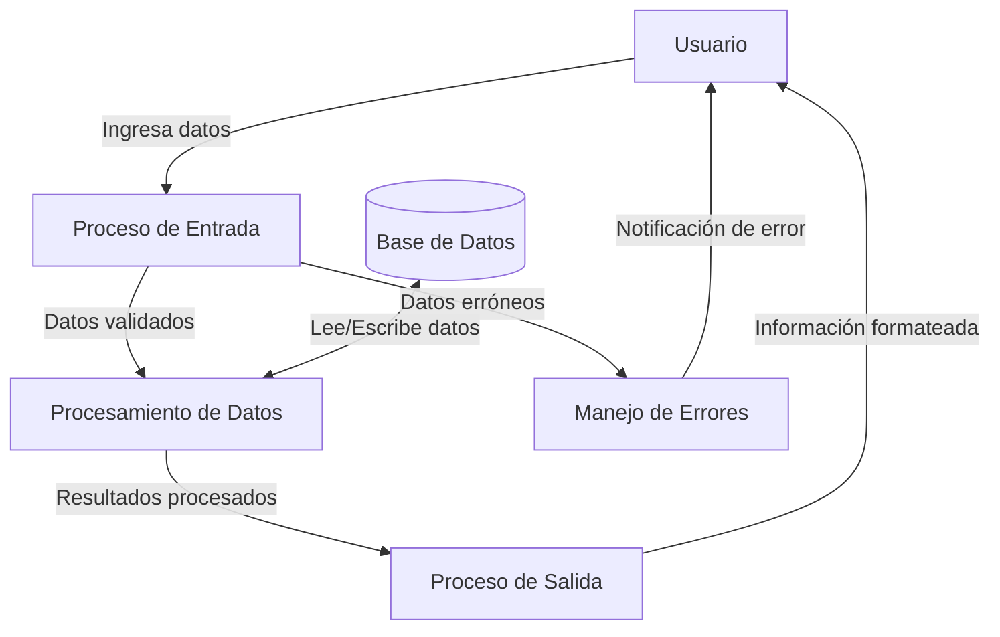

## Module: CDatosCrpromdirectas.cpp
# Análisis Integral del Módulo CDatosCrpromdirectas.cpp

## Nombre del Módulo/Componente SQL
**CDatosCrpromdirectas.cpp** - Clase para manejo de datos de promociones directas en un sistema de crédito.

## Objetivos Primarios
Este módulo gestiona la información relacionada con promociones directas de crédito. Su propósito principal es proporcionar métodos para consultar, insertar y actualizar datos de promociones en la base de datos, facilitando la administración de promociones especiales para clientes específicos.

## Funciones, Métodos y Consultas Críticas
1. **ConsultaPromDirectas** - Consulta promociones directas según parámetros específicos.
2. **InsertaPromDirectas** - Inserta nuevos registros de promociones directas.
3. **ActualizaPromDirectas** - Actualiza registros existentes de promociones directas.
4. **EliminaPromDirectas** - Elimina registros de promociones directas.
5. **ConsultaPromDirectasXId** - Consulta promociones por identificador específico.

Las consultas SQL principales incluyen SELECT para recuperar datos de promociones, INSERT para crear nuevos registros, UPDATE para modificar registros existentes y DELETE para eliminar promociones.

## Variables y Elementos Clave
- **Tablas principales**: CRPROMDIRECTAS, CRPROMOCIONES
- **Columnas críticas**: 
  - id_promdirecta (identificador único)
  - id_promocion (referencia a promociones)
  - id_cliente (cliente asociado)
  - fecha_inicio, fecha_fin (vigencia de la promoción)
  - estatus (estado de la promoción)
- **Parámetros importantes**: Identificadores de promoción, cliente, fechas de vigencia y estatus.

## Interdependencias y Relaciones
- Relación con la tabla CRPROMOCIONES a través del campo id_promocion
- Relación con tablas de clientes mediante id_cliente
- Posible interacción con módulos de gestión de clientes y sistema general de promociones
- Utiliza la clase CConexion para la gestión de conexiones a la base de datos

## Operaciones Core vs. Auxiliares
**Operaciones Core:**
- Consulta e inserción de promociones directas
- Actualización del estado de promociones
- Eliminación de promociones

**Operaciones Auxiliares:**
- Validación de parámetros
- Manejo de errores y excepciones
- Formateo de fechas y datos

## Secuencia Operacional/Flujo de Ejecución
1. Inicialización de la conexión a la base de datos
2. Preparación de consultas SQL con parámetros
3. Ejecución de consultas o comandos
4. Procesamiento de resultados (en caso de consultas)
5. Manejo de posibles errores
6. Cierre de conexiones y liberación de recursos

## Aspectos de Rendimiento y Optimización
- Posible cuello de botella en consultas sin índices adecuados
- Oportunidad de optimización en la construcción dinámica de consultas SQL
- Potencial para mejorar el manejo de transacciones en operaciones de inserción/actualización múltiples
- Considerar el uso de procedimientos almacenados para operaciones complejas

## Reusabilidad y Adaptabilidad
- Diseño modular que permite la reutilización en diferentes partes del sistema
- Métodos parametrizados que facilitan su adaptación a diferentes escenarios
- Posibilidad de extender la funcionalidad para incluir nuevos tipos de promociones
- Estructura que permite la integración con otros módulos del sistema

## Uso y Contexto
- Utilizado en el sistema de gestión de créditos para administrar promociones especiales
- Aplicado en procesos de marketing dirigido a clientes específicos
- Forma parte del subsistema de gestión de promociones y ofertas
- Probablemente invocado desde interfaces de usuario administrativas o procesos batch

## Suposiciones y Limitaciones
- Asume la existencia de una estructura de base de datos específica
- Requiere que las tablas CRPROMDIRECTAS y CRPROMOCIONES estén correctamente configuradas
- Limitado a la gestión de promociones directas, no maneja otros tipos de promociones
- Posible dependencia de un formato específico de fechas y parámetros
- No parece incluir validaciones avanzadas de reglas de negocio, que podrían estar implementadas en otra capa del sistema
## Flow Diagram [via mermaid]

