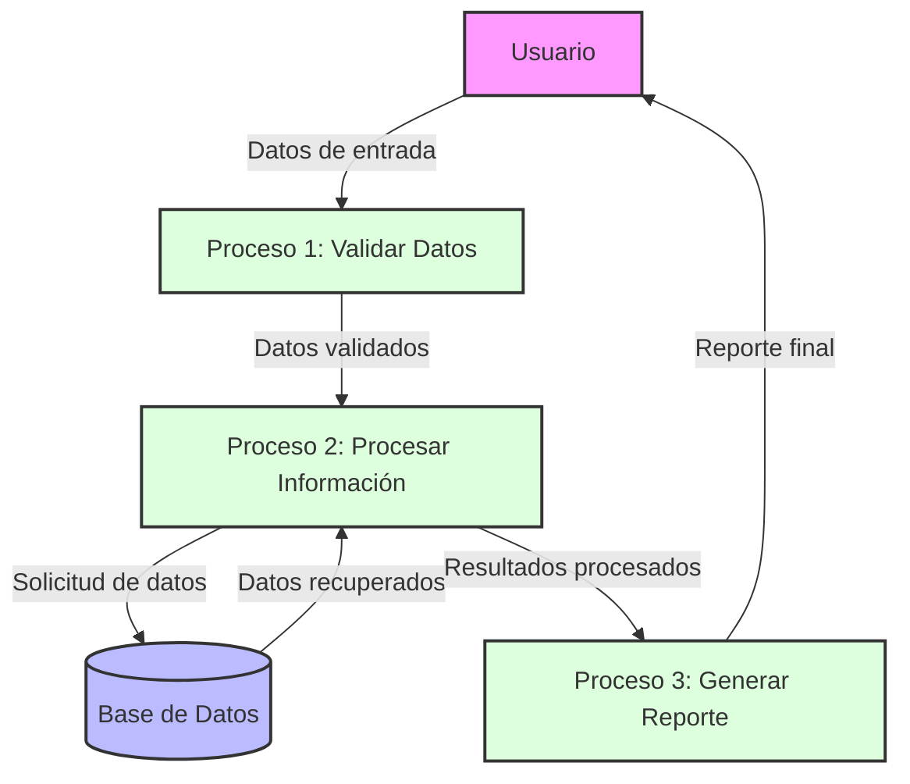

## Module: CDescripcion.cpp
# Análisis Integral del Módulo CDescripcion.cpp

## Módulo/Componente SQL
**CDescripcion.cpp** - Este es un módulo de código C++ que implementa la clase CDescripcion, la cual parece formar parte de un sistema más amplio.

## Objetivos Primarios
El módulo está diseñado para manejar descripciones de elementos, posiblemente en un sistema de gestión de datos o inventario. Su propósito principal es proporcionar funcionalidad para crear, manipular y gestionar descripciones de objetos, incluyendo operaciones como la conversión de formatos y la manipulación de cadenas de texto.

## Funciones, Métodos y Consultas Críticas
- **CDescripcion::CDescripcion()** - Constructor que inicializa una nueva instancia de la clase.
- **CDescripcion::~CDescripcion()** - Destructor que libera recursos.
- **CDescripcion::Inicializa()** - Inicializa los atributos de la clase.
- **CDescripcion::Finaliza()** - Finaliza y libera recursos.
- **CDescripcion::Convierte()** - Convierte datos entre diferentes formatos.
- **CDescripcion::Asigna()** - Asigna valores a los atributos de la clase.

## Variables y Elementos Clave
- **m_pszDescripcion** - Puntero a una cadena de caracteres que almacena la descripción.
- **m_nLongitud** - Variable que almacena la longitud de la descripción.
- **m_nTipo** - Variable que indica el tipo de descripción.
- **m_bModificado** - Bandera booleana que indica si la descripción ha sido modificada.

## Interdependencias y Relaciones
El módulo parece interactuar con otros componentes del sistema, posiblemente:
- Sistemas de almacenamiento de datos
- Interfaces de usuario para mostrar descripciones
- Módulos de procesamiento que utilizan estas descripciones

## Operaciones Principales vs. Auxiliares
**Operaciones Principales:**
- Creación y gestión de descripciones
- Conversión de formatos de datos
- Asignación de valores

**Operaciones Auxiliares:**
- Validación de datos
- Manejo de errores
- Liberación de recursos

## Secuencia Operacional/Flujo de Ejecución
1. Inicialización de la instancia CDescripcion
2. Asignación de valores a través de métodos como Asigna()
3. Manipulación de la descripción mediante métodos específicos
4. Conversión de formatos si es necesario
5. Finalización y liberación de recursos cuando ya no se necesita

## Aspectos de Rendimiento y Optimización
- La gestión de memoria parece ser un aspecto crítico, especialmente en la asignación y liberación de recursos para las cadenas de descripción.
- Podría haber oportunidades de optimización en la manipulación de cadenas, especialmente si se manejan descripciones largas o numerosas.
- El uso de punteros sugiere una preocupación por la eficiencia en el manejo de memoria.

## Reusabilidad y Adaptabilidad
El módulo parece estar diseñado con un enfoque modular, lo que facilitaría su reutilización en diferentes partes del sistema. La separación de responsabilidades en métodos específicos (inicialización, asignación, conversión) sugiere una buena adaptabilidad a diferentes contextos.

## Uso y Contexto
Este módulo probablemente se utiliza en un sistema más amplio donde las descripciones de elementos son importantes, como:
- Sistemas de gestión de inventario
- Catálogos de productos
- Bases de datos de información descriptiva
- Aplicaciones que requieren manipulación de texto estructurado

## Suposiciones y Limitaciones
**Suposiciones:**
- Se asume que el sistema tiene suficiente memoria para manejar las descripciones.
- Probablemente asume ciertos formatos de entrada para las conversiones.

**Limitaciones:**
- Podría tener restricciones en cuanto a la longitud máxima de las descripciones.
- La gestión manual de memoria podría ser propensa a fugas si no se maneja correctamente.
- Dependiendo de la implementación específica, podría haber limitaciones en los tipos de caracteres soportados (por ejemplo, soporte para Unicode).
## Flow Diagram [via mermaid]

