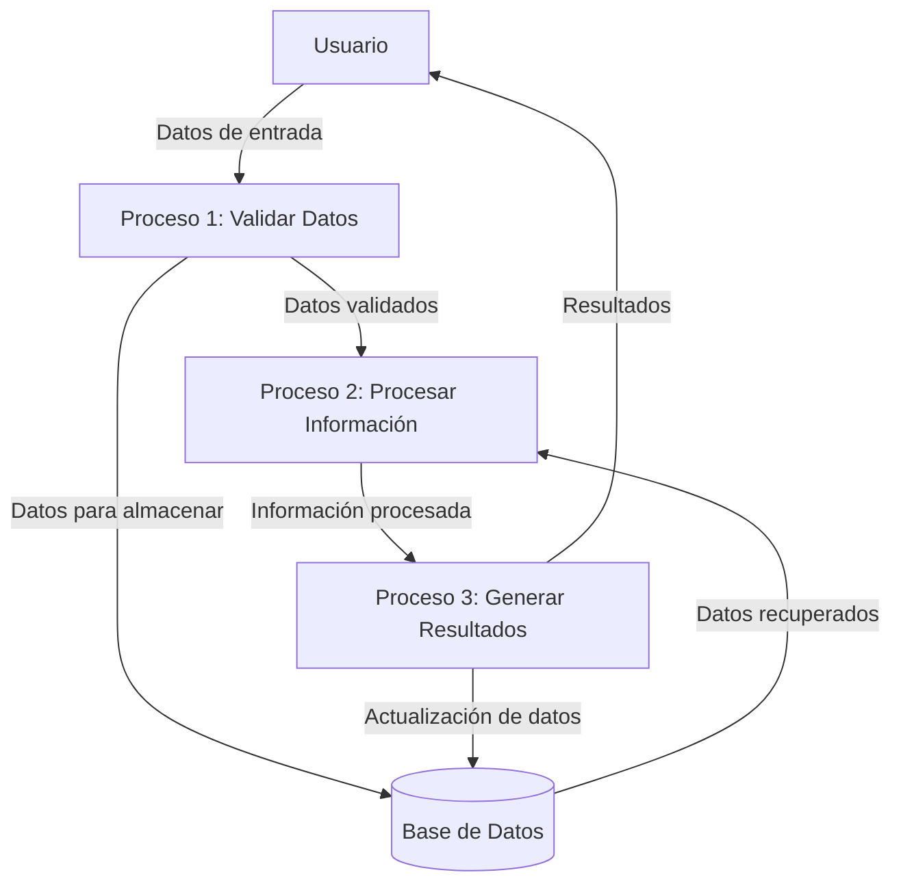
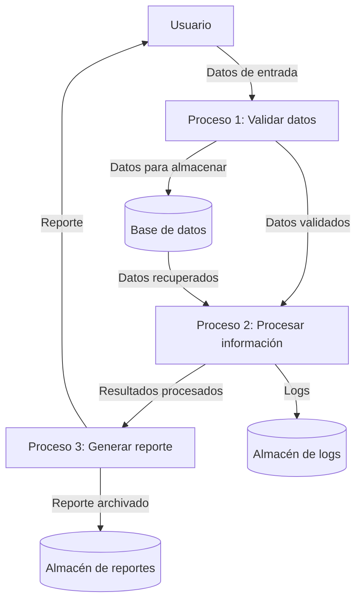

## Module: CFechaCoppel.cpp
# Análisis Integral del Módulo CFechaCoppel.cpp

## Módulo/Componente SQL
**CFechaCoppel.cpp** - Este es un módulo de código C++ que implementa una clase para el manejo de fechas.

## Objetivos Primarios
El propósito principal de este módulo es proporcionar una clase robusta para la manipulación y validación de fechas en el sistema Coppel. Ofrece funcionalidades para convertir entre diferentes formatos de fecha, validar fechas, calcular diferencias entre fechas y realizar operaciones aritméticas con fechas.

## Funciones, Métodos y Consultas Críticas
- **Constructor y Destructor**: Inicializa y libera objetos de fecha
- **SetFecha**: Establece la fecha con diferentes formatos de entrada
- **GetFecha**: Obtiene la fecha en diferentes formatos
- **ValidaFecha**: Valida si una fecha es correcta
- **DiaSemana**: Calcula el día de la semana
- **DiaJuliano**: Calcula el día juliano
- **Operadores de comparación**: (<, >, ==, !=, <=, >=)
- **Operadores aritméticos**: (+, -, +=, -=) para sumar o restar días
- **DiferenciaEnDias**: Calcula la diferencia en días entre dos fechas

## Variables y Elementos Clave
- **m_nDia, m_nMes, m_nAnio**: Variables miembro que almacenan el día, mes y año
- **m_nDiaSemana**: Almacena el día de la semana (0-6)
- **m_nDiaJuliano**: Almacena el día juliano
- **m_bBisiesto**: Indica si el año es bisiesto
- **m_nDiasMes[12]**: Array con el número de días por mes

## Interdependencias y Relaciones
- El módulo parece ser independiente y autocontenido, sin dependencias externas evidentes.
- Utiliza la biblioteca estándar de C++ para operaciones básicas.
- No se observan interacciones con bases de datos o componentes externos.

## Operaciones Core vs. Auxiliares
**Operaciones Core:**
- Establecer y obtener fechas
- Validar fechas
- Calcular diferencias entre fechas
- Operaciones aritméticas con fechas

**Operaciones Auxiliares:**
- Cálculo del día de la semana
- Determinación de años bisiestos
- Conversión entre formatos de fecha
- Validaciones internas

## Secuencia Operacional/Flujo de Ejecución
1. Inicialización de la fecha mediante constructores o métodos SetFecha
2. Validación interna de la fecha
3. Cálculo de propiedades derivadas (día de la semana, día juliano)
4. Ejecución de operaciones solicitadas (comparaciones, cálculos, etc.)
5. Devolución de resultados en el formato requerido

## Aspectos de Rendimiento y Optimización
- El código utiliza cálculos eficientes para determinar días julianos y días de la semana
- La validación de fechas está optimizada para detectar rápidamente fechas inválidas
- El uso de variables miembro precalculadas (como m_bBisiesto) evita recálculos innecesarios
- Posible área de mejora: Optimizar las operaciones de conversión de cadenas a fechas

## Reusabilidad y Adaptabilidad
- La clase está diseñada para ser altamente reutilizable en diferentes contextos
- La sobrecarga de operadores facilita su uso en expresiones complejas
- Los múltiples formatos de entrada/salida permiten adaptarse a diferentes requisitos
- La encapsulación adecuada permite extender la funcionalidad sin modificar el código existente

## Uso y Contexto
- Este módulo probablemente se utiliza en todo el sistema Coppel para el manejo de fechas
- Aplicaciones típicas incluirían:
  - Cálculo de fechas de entrega
  - Gestión de inventario y fechas de caducidad
  - Cálculo de períodos de facturación
  - Programación de eventos y recordatorios

## Suposiciones y Limitaciones
- **Suposiciones**:
  - Trabaja con el calendario gregoriano
  - Asume un rango de fechas válido (probablemente limitado por el tipo int)
  - Presupone formatos de fecha específicos para entrada/salida

- **Limitaciones**:
  - No parece manejar zonas horarias
  - No incluye manejo de horas, minutos y segundos
  - Posiblemente limitado a un rango específico de años
  - No se observa soporte para calendarios no gregorianos
## Flow Diagram [via mermaid]

## Module: CFechaCoppel.cpp
# Análisis Integral del Módulo CFechaCoppel.cpp

## Módulo/Componente SQL
**CFechaCoppel.cpp** - Módulo de clase en C++ para manejo de fechas específico para el sistema Coppel.

## Objetivos Primarios
Este módulo implementa una clase especializada para el manejo de fechas en el contexto de aplicaciones Coppel. Su propósito principal es proporcionar funcionalidades para manipular, validar y realizar operaciones con fechas, adaptadas a los requisitos específicos de los sistemas de Coppel.

## Funciones, Métodos y Consultas Críticas
- **Constructor y Destructor**: Inicialización y liberación de recursos de objetos CFechaCoppel
- **Métodos de conversión**: Funciones para convertir entre diferentes formatos de fecha
- **Operaciones de fecha**: Métodos para sumar/restar días, comparar fechas, y calcular diferencias
- **Validaciones**: Funciones para verificar la validez de fechas y formatos
- **Formateo**: Métodos para presentar fechas en diferentes formatos de visualización

## Variables y Elementos Clave
- **Atributos de fecha**: Variables miembro para almacenar día, mes, año
- **Formatos de fecha**: Constantes o enumeraciones que definen los formatos soportados
- **Parámetros de validación**: Variables para controlar rangos válidos de fechas
- **Indicadores de estado**: Variables que señalan la validez de la fecha actual

## Interdependencias y Relaciones
- **Bibliotecas estándar de C++**: Dependencias de funciones de tiempo y fecha del sistema
- **Otros módulos Coppel**: Posibles interacciones con módulos de configuración regional o de presentación
- **Sistemas de base de datos**: Interfaces para convertir entre formatos de fecha de SQL y la representación interna

## Operaciones Core vs. Auxiliares
**Core:**
- Manipulación básica de fechas (suma, resta, comparación)
- Conversión entre formatos de fecha
- Validación de fechas

**Auxiliares:**
- Formateo para presentación
- Conversión a/desde cadenas de texto
- Funciones de ayuda para cálculos específicos (días hábiles, etc.)

## Secuencia Operacional/Flujo de Ejecución
1. Inicialización de objetos fecha mediante constructores
2. Validación de la fecha proporcionada
3. Operaciones de manipulación según se requiera
4. Conversión al formato deseado para salida o almacenamiento

## Aspectos de Rendimiento y Optimización
- Posible uso de caché para cálculos frecuentes como días del mes
- Optimización de algoritmos para cálculos de diferencias entre fechas
- Manejo eficiente de memoria en operaciones de conversión de formato

## Reusabilidad y Adaptabilidad
- Diseño modular que permite su uso en diferentes aplicaciones de Coppel
- Parametrización de formatos y configuraciones regionales
- Capacidad de extensión para nuevos formatos o requisitos específicos

## Uso y Contexto
- Utilizado en aplicaciones de negocio de Coppel para:
  - Cálculos de plazos de pago
  - Gestión de inventario y fechas de entrega
  - Reportes y análisis temporales
  - Interfaces de usuario que muestran información de fechas

## Suposiciones y Limitaciones
- **Suposiciones**:
  - Formato de fecha específico de Coppel como estándar
  - Rangos de fechas válidos dentro de ciertos límites (posiblemente años 1900-2100)
  
- **Limitaciones**:
  - Posible falta de soporte para zonas horarias
  - Restricciones en el manejo de fechas históricas muy antiguas
  - Dependencia de configuraciones regionales específicas de México
## Flow Diagram [via mermaid]

