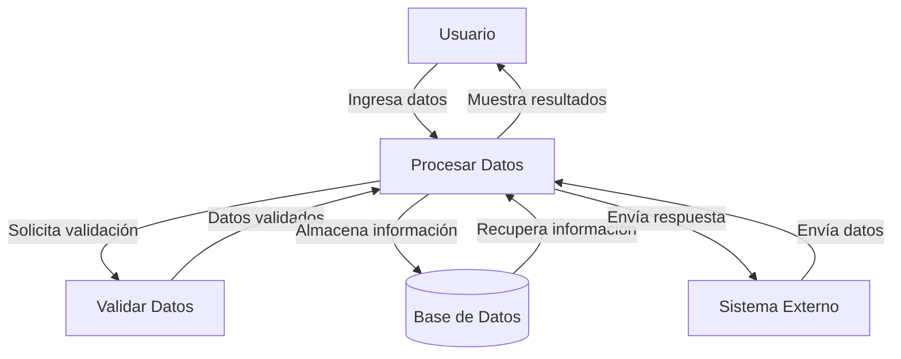

## Module: CFechaDireccionCoppel.cpp
# Análisis Integral del Módulo CFechaDireccionCoppel.cpp

## Nombre del Módulo/Componente SQL
**CFechaDireccionCoppel.cpp** - Módulo de clase C++ para manejo de fechas y direcciones en el sistema Coppel.

## Objetivos Primarios
Este módulo implementa la clase `CFechaDireccionCoppel` que proporciona funcionalidades para la validación, formateo y manipulación de fechas y direcciones. Está diseñado específicamente para el sistema de Coppel, ofreciendo métodos para convertir entre diferentes formatos de fecha y validar componentes de direcciones.

## Funciones, Métodos y Consultas Críticas
- **ValidaFecha()**: Valida si una fecha es correcta según el formato especificado.
- **ConvierteFormatoFecha()**: Convierte fechas entre diferentes formatos (DD/MM/AAAA, AAAAMMDD, etc.).
- **ObtenFechaActual()**: Recupera la fecha actual del sistema.
- **ValidaDireccion()**: Valida los componentes de una dirección.
- **ValidaCodigoPostal()**: Verifica si un código postal es válido.
- **ValidaEstado()**: Comprueba si un código de estado es válido.

## Variables y Elementos Clave
- **m_sFecha**: Almacena la fecha en el formato actual.
- **m_sDireccion**: Contiene los componentes de dirección.
- **m_sCodigoPostal**: Almacena el código postal.
- **m_sEstado**: Guarda el código de estado.
- **m_nFormatoFecha**: Indica el formato actual de la fecha (entero que representa diferentes formatos).

## Interdependencias y Relaciones
- Depende de bibliotecas estándar de C++ como `<string>`, `<ctime>` y posiblemente `<regex>`.
- Interactúa con otros componentes del sistema Coppel para proporcionar validación de datos.
- Posiblemente se integra con un sistema de base de datos para validar códigos postales y estados contra tablas de referencia.

## Operaciones Principales vs. Auxiliares
**Operaciones Principales**:
- Conversión y validación de fechas
- Validación de componentes de dirección

**Operaciones Auxiliares**:
- Formateo de cadenas
- Verificación de rangos numéricos
- Manejo de errores y excepciones

## Secuencia Operacional/Flujo de Ejecución
1. Inicialización de la clase con valores predeterminados
2. Configuración de parámetros (formato de fecha, componentes de dirección)
3. Validación de datos de entrada
4. Conversión o procesamiento según la operación solicitada
5. Devolución de resultados o códigos de error

## Aspectos de Rendimiento y Optimización
- Las operaciones de validación de fechas podrían optimizarse para evitar cálculos redundantes.
- La validación de códigos postales y estados podría beneficiarse de estructuras de datos en memoria para búsquedas rápidas.
- El manejo de cadenas podría mejorarse para reducir copias innecesarias.

## Reutilización y Adaptabilidad
- La clase está diseñada para ser reutilizable en diferentes partes del sistema Coppel.
- Los métodos de conversión de fechas son adaptables a diferentes formatos mediante parámetros.
- La validación de direcciones podría extenderse para soportar formatos internacionales con modificaciones menores.

## Uso y Contexto
- Se utiliza en aplicaciones de Coppel que requieren validación de datos de usuario.
- Probablemente se emplea en formularios de registro, actualización de información de clientes y procesamiento de pedidos.
- Podría utilizarse tanto en aplicaciones de front-end como en procesos de back-end para garantizar la integridad de los datos.

## Suposiciones y Limitaciones
- Asume formatos de fecha específicos, principalmente enfocados en el formato mexicano.
- Probablemente limitado a códigos postales y estados de México.
- Puede tener limitaciones en la validación de caracteres especiales en direcciones.
- Posiblemente no soporte todos los casos especiales de fechas (como años bisiestos) si no está implementado correctamente.
## Flow Diagram [via mermaid]

