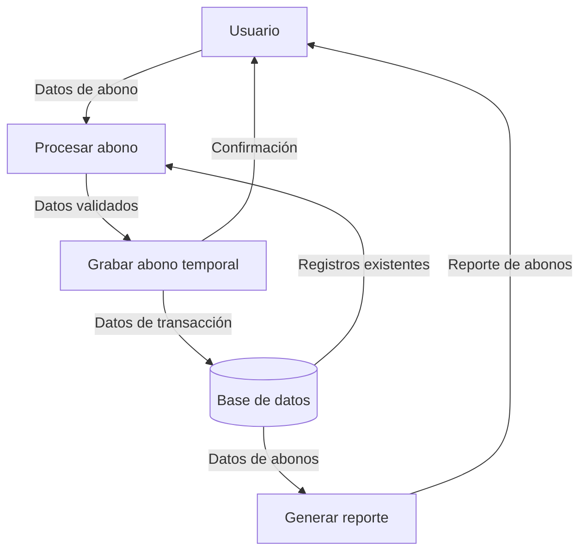

## Module: CGrabarAbonoTmpCaCarmov04.cpp
# Análisis Integral del Módulo CGrabarAbonoTmpCaCarmov04.cpp

## Módulo/Componente SQL
**CGrabarAbonoTmpCaCarmov04.cpp** - Este es un módulo de código C++ que interactúa con una base de datos mediante SQL para gestionar abonos temporales en un sistema de cartera o movimientos financieros.

## Objetivos Primarios
El propósito principal de este módulo es grabar o registrar abonos temporales en la tabla CA_CARMOV04, manejando transacciones financieras relacionadas con pagos o abonos. El código realiza operaciones de inserción y actualización en la base de datos, gestionando información financiera y contable.

## Funciones, Métodos y Consultas Críticas
- **CGrabarAbonoTmpCaCarmov04::Execute()**: Función principal que ejecuta la lógica de grabación de abonos temporales.
- **Consultas SQL principales**:
  - **INSERT INTO CA_CARMOV04**: Inserta registros de abonos temporales en la tabla.
  - **UPDATE CA_CARMOV04**: Actualiza registros existentes con nueva información de abonos.
  - Utiliza parámetros vinculados para prevenir inyección SQL.

## Variables y Elementos Clave
- **Tablas**: CA_CARMOV04 (tabla principal para abonos temporales)
- **Columnas clave**: 
  - CODCIA (código de compañía)
  - CODAGE (código de agencia)
  - NUMCTA (número de cuenta)
  - NUMCRE (número de crédito)
  - NUMCUO (número de cuota)
  - FECPAG (fecha de pago)
  - VALABO (valor del abono)
- **Variables importantes**:
  - m_strCodCia, m_strCodAge, m_strNumCta, m_strNumCre, m_strNumCuo (identificadores)
  - m_dblValAbo (valor del abono)
  - m_strFecPag (fecha de pago)

## Interdependencias y Relaciones
- El módulo interactúa con la tabla CA_CARMOV04 para almacenar información de abonos temporales.
- Depende de la estructura de la base de datos y las relaciones entre tablas del sistema de cartera.
- Utiliza la clase CDatabase para la conexión y manipulación de la base de datos.

## Operaciones Core vs. Auxiliares
- **Operaciones Core**:
  - Inserción y actualización de registros de abonos en CA_CARMOV04
  - Manejo de transacciones financieras
- **Operaciones Auxiliares**:
  - Validación de datos
  - Manejo de errores y excepciones
  - Formateo de fechas y valores monetarios

## Secuencia Operacional/Flujo de Ejecución
1. Inicialización de variables y conexión a la base de datos
2. Preparación de la consulta SQL (INSERT o UPDATE)
3. Vinculación de parámetros con los valores correspondientes
4. Ejecución de la consulta SQL
5. Manejo de resultados o errores
6. Cierre de la conexión y liberación de recursos

## Aspectos de Rendimiento y Optimización
- Utiliza parámetros vinculados para mejorar el rendimiento y la seguridad
- Podría beneficiarse de la implementación de transacciones para garantizar la integridad de los datos
- La manipulación de fechas y valores monetarios podría optimizarse para mejorar el rendimiento

## Reusabilidad y Adaptabilidad
- El módulo está diseñado como una clase específica para la operación de grabación de abonos temporales
- La parametrización permite cierta flexibilidad, pero está estrechamente acoplado a la estructura específica de la tabla CA_CARMOV04
- Para reutilizarlo en otros contextos, requeriría modificaciones significativas

## Uso y Contexto
- Se utiliza en un sistema de gestión financiera o de cartera para registrar abonos temporales
- Probablemente forma parte de un proceso más amplio de gestión de pagos o transacciones financieras
- Se invoca cuando se necesita registrar un nuevo abono o actualizar uno existente

## Suposiciones y Limitaciones
- **Suposiciones**:
  - La tabla CA_CARMOV04 ya existe con la estructura esperada
  - Los valores de entrada son validados antes de llamar a este módulo
  - La conexión a la base de datos está configurada correctamente
- **Limitaciones**:
  - No maneja explícitamente transacciones para garantizar la atomicidad
  - Está diseñado específicamente para una estructura de base de datos particular
  - No incluye validaciones exhaustivas de los datos de entrada
## Flow Diagram [via mermaid]

