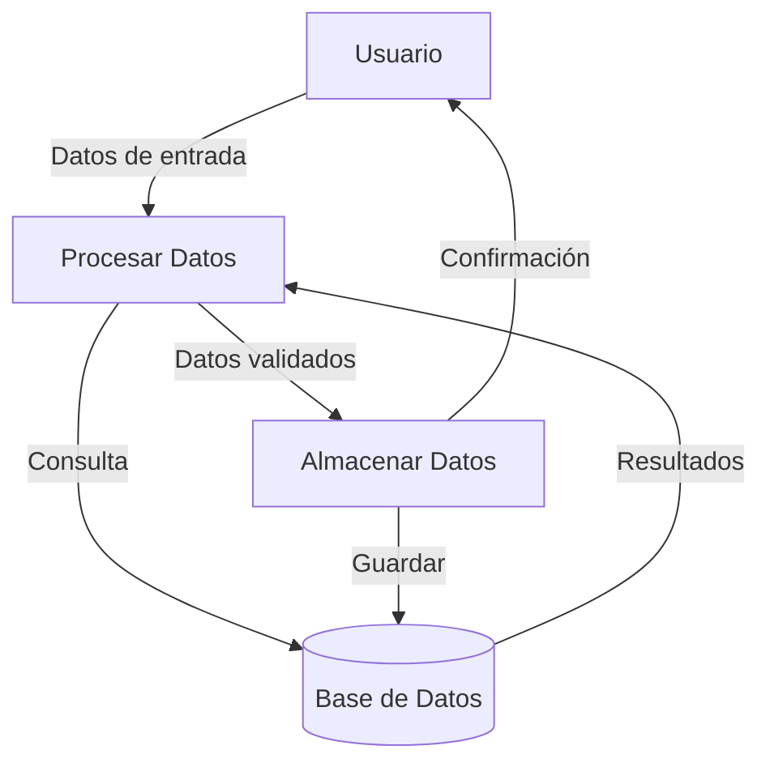

## Module: CGrabarCertificacionAbono.cpp
# Análisis Integral del Módulo CGrabarCertificacionAbono.cpp

## Nombre del Módulo/Componente SQL
**CGrabarCertificacionAbono.cpp** - Clase para la gestión de certificaciones de abono en un sistema financiero.

## Objetivos Primarios
Este módulo está diseñado para gestionar el proceso de certificación de abonos en un sistema financiero. Su propósito principal es validar, procesar y registrar certificaciones de abono, incluyendo la verificación de condiciones específicas y la actualización de registros en la base de datos.

## Funciones, Métodos y Consultas Críticas
1. **CGrabarCertificacionAbono::Ejecutar()** - Función principal que coordina todo el proceso de certificación.
2. **CGrabarCertificacionAbono::ValidarDatos()** - Valida la integridad y coherencia de los datos antes de procesarlos.
3. **CGrabarCertificacionAbono::GrabarCertificacion()** - Registra la certificación en la base de datos.
4. **Consultas SQL principales**:
   - Consultas SELECT para verificar la existencia y estado de certificaciones previas
   - Operaciones INSERT para registrar nuevas certificaciones
   - Operaciones UPDATE para actualizar estados de certificaciones existentes

## Variables y Elementos Clave
1. **Variables de clase**:
   - `m_nIdCertificacion` - Identificador único de la certificación
   - `m_nIdCertificacionAbono` - Identificador del abono específico
   - `m_nIdEstado` - Estado actual de la certificación
   - `m_nIdUsuario` - Usuario que realiza la operación

2. **Tablas principales**:
   - Tabla de certificaciones
   - Tabla de abonos
   - Tabla de estados
   - Tabla de usuarios/operadores

## Interdependencias y Relaciones
- El módulo interactúa con otros componentes del sistema financiero, especialmente con los módulos de gestión de usuarios y estados.
- Existe una relación jerárquica entre certificaciones y abonos, donde una certificación puede contener múltiples abonos.
- Se relaciona con el sistema de autenticación para validar permisos de usuario.
- Depende de servicios de base de datos para persistir la información.

## Operaciones Principales vs. Auxiliares
**Operaciones principales**:
- Validación de la certificación de abono
- Registro de la certificación en la base de datos
- Actualización del estado de la certificación

**Operaciones auxiliares**:
- Verificación de permisos de usuario
- Validación de formatos y rangos de datos
- Registro de logs de operación
- Manejo de excepciones y errores

## Secuencia Operacional/Flujo de Ejecución
1. Inicialización de parámetros y variables
2. Validación de permisos del usuario
3. Verificación de la existencia de certificaciones previas
4. Validación de los datos de la certificación
5. Registro de la certificación en la base de datos
6. Actualización del estado según el resultado
7. Generación de respuesta/resultado
8. Registro de la operación en logs

## Aspectos de Rendimiento y Optimización
- Potencial cuello de botella en las consultas a la base de datos, especialmente si las tablas de certificaciones y abonos son extensas.
- Oportunidad de optimización en la validación de datos mediante el uso de índices adecuados en las tablas relacionadas.
- Posible mejora en el manejo de transacciones para garantizar la integridad de los datos.

## Reusabilidad y Adaptabilidad
- El módulo está diseñado con un enfoque orientado a objetos, lo que facilita su reutilización.
- La separación de responsabilidades (validación, procesamiento, registro) permite adaptar partes específicas sin modificar todo el componente.
- La parametrización de las operaciones principales permite su uso en diferentes contextos dentro del sistema financiero.

## Uso y Contexto
- Este módulo se utiliza en el proceso de gestión financiera para certificar abonos realizados.
- Es invocado cuando un usuario autorizado necesita registrar o actualizar una certificación de abono.
- Forma parte de un flujo más amplio de gestión financiera que puede incluir facturación, contabilidad y reportes.

## Suposiciones y Limitaciones
**Suposiciones**:
- Se asume que las estructuras de base de datos están correctamente definidas y disponibles.
- Se presupone un sistema de autenticación y autorización funcional.
- Se espera que los datos de entrada cumplan con formatos predefinidos.

**Limitaciones**:
- El módulo podría tener dificultades para manejar grandes volúmenes de certificaciones simultáneas.
- La dependencia de múltiples tablas y relaciones puede afectar el rendimiento en sistemas con alta carga.
- No parece incluir mecanismos avanzados de recuperación ante fallos parciales durante el proceso de certificación.
## Flow Diagram [via mermaid]

