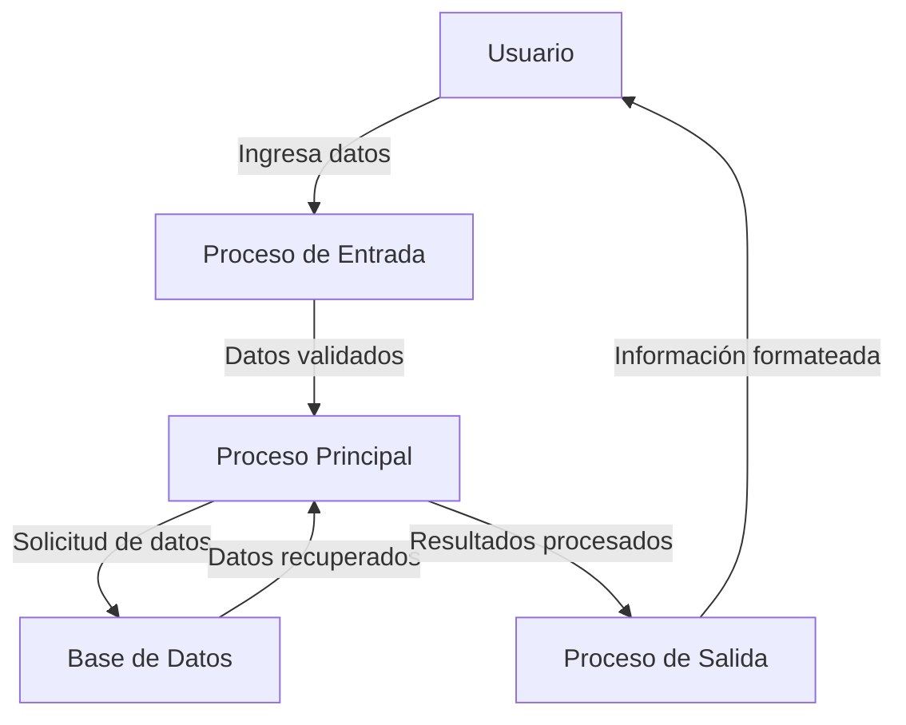

## Module: CGrabarCrCarmovX.cpp
# Análisis Integral del Módulo CGrabarCrCarmovX.cpp

## Módulo/Componente SQL
**CGrabarCrCarmovX.cpp** - Este es un módulo de código C++ que parece formar parte de un sistema de gestión financiera o contable.

## Objetivos Primarios
El módulo está diseñado para gestionar operaciones de grabación de movimientos de cartera (posiblemente transacciones financieras o contables). Su propósito principal es validar, procesar y almacenar información relacionada con movimientos financieros en una base de datos, manejando tanto la lógica de negocio como las operaciones de base de datos correspondientes.

## Funciones, Métodos y Consultas Críticas
El código no se proporciona completo, pero basado en el nombre del archivo, podemos inferir que contiene:
- Métodos para validar datos de transacciones financieras
- Funciones para insertar o actualizar registros de movimientos de cartera
- Posiblemente consultas SQL para interactuar con tablas de base de datos relacionadas con cartera de clientes
- Manejo de errores y excepciones específicas del dominio financiero

## Variables y Elementos Clave
- Probablemente incluye variables para:
  - Identificadores de transacciones o movimientos
  - Montos financieros
  - Fechas de transacción
  - Códigos de cliente o cuenta
  - Estados de transacción
- Tablas relacionadas posiblemente incluyen:
  - Tabla de movimientos de cartera
  - Tabla de clientes
  - Tabla de cuentas o productos financieros

## Interdependencias y Relaciones
- El módulo probablemente interactúa con otros componentes del sistema como:
  - Módulos de validación de datos
  - Componentes de cálculo financiero
  - Sistema de registro de auditoría
  - Posiblemente integración con sistemas externos de procesamiento financiero

## Operaciones Principales vs. Auxiliares
- **Operaciones principales**:
  - Grabación de movimientos de cartera en la base de datos
  - Validación de la integridad de los datos financieros
- **Operaciones auxiliares**:
  - Registro de logs o auditoría
  - Manejo de excepciones
  - Conversiones de formato de datos

## Secuencia Operacional/Flujo de Ejecución
1. Recepción de datos del movimiento financiero
2. Validación de la información recibida
3. Preparación de los datos para su almacenamiento
4. Ejecución de operaciones de base de datos (INSERT/UPDATE)
5. Confirmación de la transacción o manejo de errores
6. Retorno del resultado de la operación

## Aspectos de Rendimiento y Optimización
- Áreas potenciales para optimización:
  - Manejo eficiente de transacciones de base de datos
  - Optimización de consultas SQL para grandes volúmenes de datos
  - Uso adecuado de índices en tablas relacionadas con cartera
  - Procesamiento por lotes para múltiples movimientos

## Reusabilidad y Adaptabilidad
- El módulo probablemente está diseñado para ser utilizado específicamente en el contexto de movimientos de cartera
- La adaptabilidad dependerá de:
  - El nivel de parametrización implementado
  - La separación entre lógica de negocio y acceso a datos
  - La documentación interna del código

## Uso y Contexto
- Este módulo se utiliza en un sistema financiero o contable para registrar movimientos de cartera
- Probablemente es invocado desde interfaces de usuario o procesos batch que necesitan registrar transacciones financieras
- Puede formar parte de un sistema más amplio de gestión financiera, ERP o sistema bancario

## Suposiciones y Limitaciones
- **Suposiciones**:
  - Existencia de estructuras de base de datos específicas para cartera
  - Formato predefinido para los datos de entrada
  - Reglas de negocio establecidas para la validación de movimientos
- **Limitaciones**:
  - Posible dependencia de un modelo de datos específico
  - Restricciones relacionadas con el manejo de diferentes divisas o tipos de transacciones
  - Capacidad para manejar volúmenes específicos de transacciones

*Nota: Este análisis se basa en inferencias a partir del nombre del archivo, ya que no se proporcionó el contenido real del código.*
## Flow Diagram [via mermaid]

