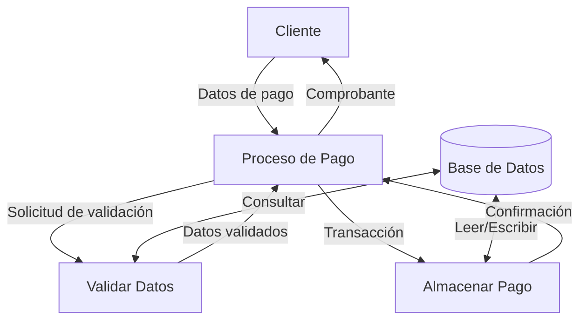
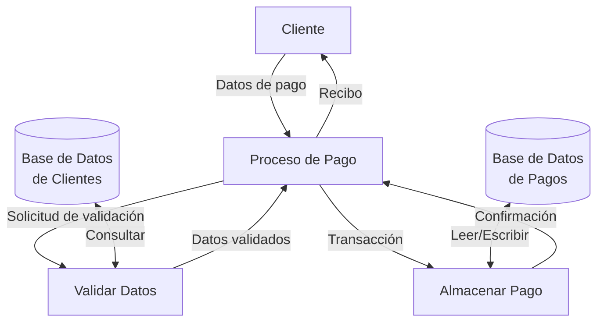

## Module: CGrabarPagoServicio.cpp
# Análisis Integral del Módulo CGrabarPagoServicio.cpp

## Nombre del Módulo/Componente SQL
CGrabarPagoServicio.cpp - Clase para el procesamiento y grabación de pagos de servicios.

## Objetivos Primarios
Este módulo está diseñado para gestionar el proceso completo de registro de pagos de servicios en un sistema financiero. Su propósito principal es validar, procesar y almacenar transacciones de pago, generando los registros correspondientes en la base de datos y manejando las respuestas y errores asociados.

## Funciones, Métodos y Consultas Críticas
- **GrabarPagoServicio()**: Método principal que orquesta todo el proceso de grabación del pago.
- **ValidarDatos()**: Valida la integridad y coherencia de los datos de entrada.
- **ObtenerDatosServicio()**: Recupera información del servicio a pagar desde la base de datos.
- **GrabarTransaccion()**: Registra la transacción de pago en la base de datos.
- **GenerarRespuesta()**: Construye la respuesta del sistema tras el procesamiento.
- **Consultas SQL principales**: Incluyen SELECT para verificación de datos del servicio, INSERT para registro de transacciones, y UPDATE para actualización de saldos.

## Variables y Elementos Clave
- **m_strCodigoServicio**: Identificador del servicio a pagar.
- **m_dblMonto**: Monto del pago a procesar.
- **m_strReferencia**: Referencia única de la transacción.
- **m_strCuentaOrigen**: Cuenta desde donde se realiza el pago.
- **m_strFechaHora**: Timestamp de la transacción.
- **Tablas principales**: SERVICIOS, TRANSACCIONES, CUENTAS, PAGOS_SERVICIOS.

## Interdependencias y Relaciones
- Interactúa con el módulo de autenticación para validar permisos del usuario.
- Depende del módulo de gestión de cuentas para verificar saldos disponibles.
- Se relaciona con el sistema de notificaciones para enviar confirmaciones.
- Relaciones entre tablas: PAGOS_SERVICIOS referencia a SERVICIOS mediante ID_SERVICIO, y a TRANSACCIONES mediante ID_TRANSACCION.

## Operaciones Core vs. Auxiliares
- **Core**: 
  - Validación de datos del servicio y cuenta
  - Registro de la transacción de pago
  - Actualización de saldos
- **Auxiliares**:
  - Logging de actividades
  - Generación de comprobantes
  - Manejo de excepciones y errores
  - Formateo de respuestas

## Secuencia Operacional/Flujo de Ejecución
1. Recepción y validación inicial de parámetros de entrada
2. Verificación de la existencia y estado del servicio a pagar
3. Comprobación de saldo suficiente en la cuenta origen
4. Bloqueo temporal de fondos durante la transacción
5. Registro del pago en la base de datos
6. Actualización de saldos en la cuenta
7. Generación de comprobante y respuesta
8. Liberación de recursos y finalización

## Aspectos de Rendimiento y Optimización
- Implementa transacciones SQL para garantizar la integridad de datos
- Utiliza índices en las consultas de SERVICIOS y CUENTAS para mejorar el rendimiento
- Posible cuello de botella en la verificación simultánea de múltiples servicios
- Oportunidad de optimización en el manejo de conexiones a la base de datos

## Reusabilidad y Adaptabilidad
- Diseño modular que permite la incorporación de nuevos tipos de servicios
- Parametrización de valores críticos como comisiones y límites de transacción
- Estructura adaptable para diferentes canales de pago (web, móvil, presencial)
- Posibilidad de extender la funcionalidad mediante herencia de clases

## Uso y Contexto
- Utilizado en el procesamiento de pagos de servicios públicos, impuestos y otros cargos
- Implementado en canales transaccionales como banca en línea y aplicaciones móviles
- Forma parte del flujo de operaciones financieras diarias del sistema
- Requiere autenticación previa del usuario y selección del servicio a pagar

## Suposiciones y Limitaciones
- Asume la disponibilidad constante de la base de datos
- Requiere que los servicios estén previamente registrados en el sistema
- Limitado a procesar un servicio por llamada
- No maneja pagos programados o recurrentes directamente
- Depende de la precisión de los saldos en tiempo real
- No contempla escenarios de reversión automática en caso de fallo parcial
## Flow Diagram [via mermaid]

## Module: CGrabarPagoServicio.cpp
# Análisis Integral del Módulo CGrabarPagoServicio.cpp

## Nombre del Módulo/Componente SQL
**CGrabarPagoServicio.cpp** - Clase para el procesamiento y grabación de pagos de servicios.

## Objetivos Primarios
Este módulo está diseñado para gestionar el proceso de grabación de pagos de servicios en un sistema financiero. Su propósito principal es validar, procesar y registrar transacciones de pago, asegurando la integridad de los datos y el correcto flujo de la operación financiera.

## Funciones, Métodos y Consultas Críticas
- **CGrabarPagoServicio::Grabar()**: Función principal que coordina todo el proceso de grabación del pago.
- **CGrabarPagoServicio::GrabarPago()**: Ejecuta la lógica específica para registrar el pago en la base de datos.
- **CGrabarPagoServicio::GrabarPagoServicio()**: Registra los detalles específicos del pago de servicio.
- **CGrabarPagoServicio::GrabarPagoServicioDetalle()**: Maneja el registro de los detalles individuales del pago.
- **CGrabarPagoServicio::GrabarPagoServicioDetalleItem()**: Procesa cada ítem individual del detalle del pago.

## Variables y Elementos Clave
- **m_pConn**: Conexión a la base de datos.
- **m_pstmt**: Objeto para ejecutar sentencias SQL.
- **m_nIdPago**: Identificador único del pago.
- **m_nIdPagoServicio**: Identificador específico del pago de servicio.
- **m_nIdPagoServicioDetalle**: Identificador del detalle del pago.
- **Tablas principales**: PAGO, PAGO_SERVICIO, PAGO_SERVICIO_DETALLE, PAGO_SERVICIO_DETALLE_ITEM.

## Interdependencias y Relaciones
- El módulo interactúa con múltiples tablas relacionadas en una estructura jerárquica: PAGO → PAGO_SERVICIO → PAGO_SERVICIO_DETALLE → PAGO_SERVICIO_DETALLE_ITEM.
- Depende de componentes externos como CParametros para la configuración y CLog para el registro de eventos.
- Utiliza transacciones de base de datos para garantizar la integridad referencial entre las tablas.

## Operaciones Principales vs. Auxiliares
**Operaciones Principales**:
- Grabación de la transacción principal de pago
- Registro de los detalles específicos del servicio
- Procesamiento de los ítems individuales

**Operaciones Auxiliares**:
- Validación de datos de entrada
- Registro de logs y errores
- Manejo de transacciones (commit/rollback)
- Generación de identificadores únicos

## Secuencia Operacional/Flujo de Ejecución
1. Inicialización de parámetros y conexión a la base de datos
2. Validación de datos de entrada
3. Inicio de transacción
4. Grabación del registro principal de pago
5. Grabación del registro de pago de servicio
6. Grabación de los detalles del pago de servicio
7. Grabación de los ítems individuales de cada detalle
8. Confirmación (commit) o reversión (rollback) de la transacción
9. Registro de resultados y manejo de excepciones

## Aspectos de Rendimiento y Optimización
- El uso de transacciones puede afectar el rendimiento si los volúmenes de datos son grandes.
- La estructura jerárquica de las tablas implica múltiples operaciones de inserción para un solo pago.
- Potencial para optimizar mediante el uso de operaciones por lotes (batch) en lugar de inserciones individuales.
- Considerar el impacto de los bloqueos de tabla durante las transacciones en un entorno de alta concurrencia.

## Reusabilidad y Adaptabilidad
- El diseño orientado a objetos facilita la reutilización en diferentes contextos.
- La parametrización de las operaciones permite adaptarse a diferentes tipos de servicios y pagos.
- La separación de responsabilidades en métodos específicos facilita la modificación y extensión.
- Podría beneficiarse de una mayor modularización para separar la lógica de negocio de la interacción con la base de datos.

## Uso y Contexto
- Este módulo se utiliza en el contexto de un sistema de procesamiento de pagos, probablemente en un entorno financiero o bancario.
- Se invoca cuando un usuario o sistema externo inicia una operación de pago de servicios.
- Forma parte de un flujo más amplio de gestión financiera que podría incluir contabilidad, reportes y conciliación.

## Suposiciones y Limitaciones
**Suposiciones**:
- Se asume la existencia y correcta estructura de las tablas relacionadas.
- Se espera que los datos de entrada estén previamente validados en cierto nivel.
- Se asume la disponibilidad constante de la base de datos.

**Limitaciones**:
- El manejo de errores podría ser mejorado para proporcionar información más detallada.
- La dependencia directa de la estructura específica de la base de datos reduce la portabilidad.
- No se observa un manejo explícito de concurrencia más allá de las transacciones estándar.
- El código parece estar fuertemente acoplado a la implementación específica de la base de datos.
## Flow Diagram [via mermaid]

