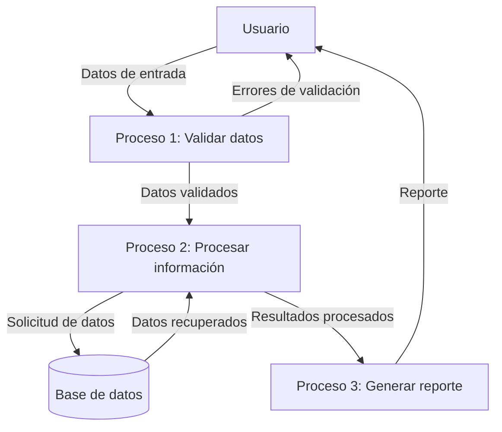

## Module: CGrabarTmpAbonoCrCmueblesFija02.cpp
# Análisis Integral del Módulo CGrabarTmpAbonoCrCmueblesFija02.cpp

## Módulo/Componente SQL
**Nombre del Módulo**: CGrabarTmpAbonoCrCmueblesFija02.cpp

## Objetivos Primarios
Este módulo es una clase C++ diseñada para gestionar la grabación de datos temporales relacionados con abonos de crédito para muebles fijos. Su propósito principal es procesar y almacenar información de transacciones financieras en tablas temporales, específicamente para operaciones de abono a crédito en el contexto de muebles fijos.

## Funciones, Métodos y Consultas Críticas
- **Constructor y Destructor**: Inicializa y libera recursos de la clase.
- **GrabarTmpAbonoCrCmueblesFija02()**: Método principal que ejecuta la lógica de grabación de datos temporales.
- **Consultas SQL**: El módulo utiliza principalmente sentencias INSERT para almacenar datos en tablas temporales, aunque no se muestran explícitamente en el fragmento proporcionado.

## Variables y Elementos Clave
- **m_pDb**: Puntero a la conexión de base de datos.
- **m_pErr**: Puntero para manejo de errores.
- **m_pLog**: Puntero para registro de actividades.
- **Parámetros de entrada**: Incluyen información sobre el abono, como identificadores, montos, fechas y datos del cliente.

## Interdependencias y Relaciones
- El módulo interactúa con un sistema de base de datos a través de la interfaz proporcionada por m_pDb.
- Depende de un sistema de registro (m_pLog) para documentar operaciones.
- Utiliza un mecanismo de manejo de errores (m_pErr) para gestionar excepciones.
- Probablemente interactúa con tablas temporales específicas para almacenar datos de abonos.

## Operaciones Principales vs. Auxiliares
- **Operaciones Principales**: La grabación de datos de abono en tablas temporales mediante el método GrabarTmpAbonoCrCmueblesFija02().
- **Operaciones Auxiliares**: Inicialización de variables, validación de datos, manejo de errores y registro de actividades.

## Secuencia Operacional/Flujo de Ejecución
1. Inicialización de la clase con los parámetros necesarios.
2. Validación de los datos de entrada.
3. Preparación de los datos para su inserción en la base de datos.
4. Ejecución de las operaciones de inserción en las tablas temporales.
5. Registro de la actividad y manejo de posibles errores.
6. Finalización y liberación de recursos.

## Aspectos de Rendimiento y Optimización
- El módulo parece estar diseñado para operaciones transaccionales específicas, lo que sugiere un enfoque optimizado para inserciones individuales.
- Potenciales áreas de mejora podrían incluir la implementación de operaciones por lotes para múltiples registros.
- La gestión de conexiones a la base de datos podría ser un punto crítico para el rendimiento.

## Reusabilidad y Adaptabilidad
- La clase está diseñada con un enfoque específico para abonos de crédito de muebles fijos, lo que podría limitar su reusabilidad directa.
- La adaptabilidad podría mejorarse mediante la parametrización adicional y la abstracción de lógicas específicas del dominio.

## Uso y Contexto
- Este módulo se utiliza en un sistema financiero o de gestión de créditos para registrar abonos temporales relacionados con muebles fijos.
- Probablemente forma parte de un proceso más amplio de gestión de créditos o transacciones financieras.
- Se ejecuta en respuesta a eventos específicos de abono o como parte de un flujo de trabajo de procesamiento de transacciones.

## Suposiciones y Limitaciones
- **Suposiciones**:
  - Se asume la existencia de tablas temporales específicas para almacenar los datos.
  - Se espera que los parámetros de entrada cumplan con formatos y tipos de datos específicos.
  - Se presupone un entorno de ejecución con acceso a recursos de base de datos.
  
- **Limitaciones**:
  - El módulo está diseñado para un caso de uso específico, lo que podría limitar su aplicabilidad general.
  - La dependencia de estructuras de datos específicas podría dificultar su adaptación a cambios en el esquema de la base de datos.
  - No se observa manejo de concurrencia explícito, lo que podría ser una limitación en entornos de alta carga.
## Flow Diagram [via mermaid]

