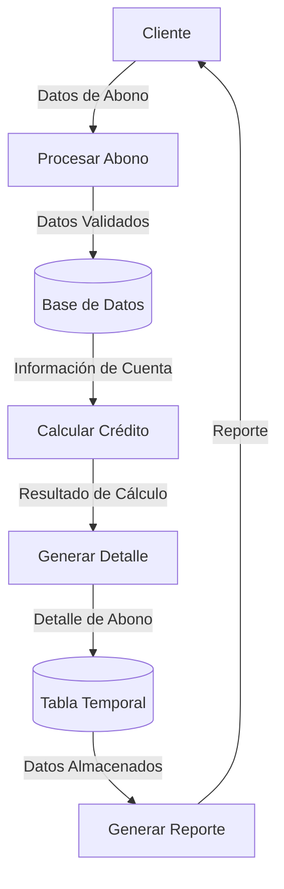

## Module: CGrabarTmpAbonoCrCropaDetalle.cpp
# Análisis Integral del Módulo CGrabarTmpAbonoCrCropaDetalle.cpp

## Módulo/Componente SQL
**Nombre del Módulo**: CGrabarTmpAbonoCrCropaDetalle.cpp

## Objetivos Primarios
Este módulo es una clase C++ diseñada para gestionar la grabación de datos temporales relacionados con abonos de crédito en un sistema financiero o contable. Su propósito principal es manipular registros de abonos de crédito, específicamente para operaciones de CROPA (posiblemente Créditos de Operaciones Agrícolas), manejando tanto la inserción como la actualización de estos datos en tablas temporales.

## Funciones, Métodos y Consultas Críticas
- **CGrabarTmpAbonoCrCropaDetalle()**: Constructor de la clase.
- **~CGrabarTmpAbonoCrCropaDetalle()**: Destructor de la clase.
- **Grabar()**: Método principal que gestiona la grabación de datos en la tabla temporal.
- **Consultas SQL principales**:
  - INSERT INTO para agregar nuevos registros a la tabla temporal.
  - UPDATE para modificar registros existentes en la tabla temporal.

## Variables y Elementos Clave
- **Parámetros de entrada**:
  - `pszUsuario`: Usuario que realiza la operación.
  - `pszTerminal`: Terminal desde donde se ejecuta.
  - `pszPrograma`: Programa que invoca la operación.
  - `pszFecha`: Fecha de la operación.
  - `pszHora`: Hora de la operación.
  - Diversos parámetros financieros como `dblMonto`, `dblSaldo`, `dblTasa`, etc.
- **Tablas principales**:
  - `TmpAbonoCrCropaDetalle`: Tabla temporal para almacenar detalles de abonos.

## Interdependencias y Relaciones
- El módulo interactúa con el sistema de base de datos a través de la clase `CDataBase`.
- Depende de la existencia y estructura de la tabla temporal `TmpAbonoCrCropaDetalle`.
- Utiliza funciones de manejo de errores y excepciones del sistema.

## Operaciones Principales vs. Auxiliares
- **Operaciones principales**:
  - Inserción de registros en la tabla temporal.
  - Actualización de registros existentes.
- **Operaciones auxiliares**:
  - Validación de parámetros.
  - Manejo de errores y excepciones.
  - Formateo de datos para su inserción en la base de datos.

## Secuencia Operativa/Flujo de Ejecución
1. Inicialización de variables y parámetros.
2. Preparación de la consulta SQL (INSERT o UPDATE).
3. Ejecución de la consulta en la base de datos.
4. Manejo de posibles errores o excepciones.
5. Retorno del resultado de la operación.

## Aspectos de Rendimiento y Optimización
- El código utiliza sentencias SQL parametrizadas, lo que puede mejorar el rendimiento y prevenir inyecciones SQL.
- No se observan índices específicos mencionados, lo que podría ser un área de optimización si la tabla temporal maneja grandes volúmenes de datos.
- La gestión de transacciones no está explícitamente manejada en el fragmento de código, lo que podría ser relevante para la integridad de los datos.

## Reusabilidad y Adaptabilidad
- La clase está diseñada con un enfoque modular, permitiendo su reutilización en diferentes contextos dentro del sistema.
- Los parámetros están bien definidos, facilitando la adaptación a diferentes escenarios de uso.
- La separación entre la lógica de negocio y el acceso a datos permite modificaciones más sencillas.

## Uso y Contexto
- Este módulo se utiliza en un contexto de gestión financiera, específicamente para el registro temporal de abonos a créditos.
- Es probable que forme parte de un sistema más amplio de gestión de créditos agrícolas (CROPA).
- Se invoca desde otros componentes del sistema que necesitan registrar o actualizar información de abonos.

## Suposiciones y Limitaciones
- **Suposiciones**:
  - Se asume la existencia y correcta estructura de la tabla `TmpAbonoCrCropaDetalle`.
  - Se espera que los parámetros de entrada estén correctamente formateados.
  - Se presupone un entorno de base de datos compatible con las consultas SQL utilizadas.
- **Limitaciones**:
  - El código no parece incluir validaciones exhaustivas de los datos de entrada.
  - No se observa manejo explícito de transacciones, lo que podría afectar la integridad de los datos en caso de fallos.
  - La documentación interna del código parece limitada, lo que podría dificultar su mantenimiento futuro.
## Flow Diagram [via mermaid]

