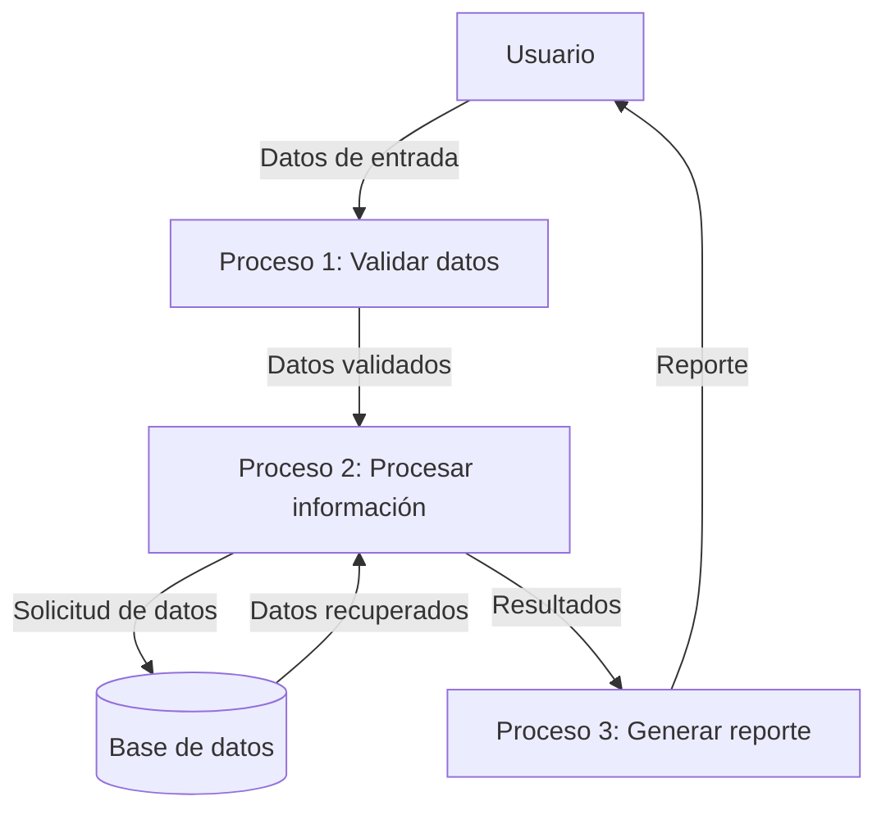

## Module: CGrabarTmpAbonoCrCropaFija02.cpp
# Análisis Integral del Módulo CGrabarTmpAbonoCrCropaFija02.cpp

## Módulo/Componente SQL
**Nombre del Módulo**: CGrabarTmpAbonoCrCropaFija02.cpp

## Objetivos Primarios
Este módulo es una clase C++ diseñada para gestionar operaciones relacionadas con abonos de crédito en el contexto de "Cropa Fija". Su propósito principal es procesar y grabar datos temporales de abonos de crédito, realizando validaciones específicas y manipulando información en la base de datos.

## Funciones, Métodos y Consultas Críticas
- **CGrabarTmpAbonoCrCropaFija02()**: Constructor de la clase.
- **~CGrabarTmpAbonoCrCropaFija02()**: Destructor de la clase.
- **Grabar()**: Método principal que ejecuta la lógica de grabación de datos temporales.
- **Consultas SQL principales**:
  - Consultas SELECT para validar existencia de registros y obtener información.
  - Consultas INSERT para insertar datos en tablas temporales.
  - Consultas UPDATE para actualizar información existente.

## Variables y Elementos Clave
- **m_pDb**: Objeto de conexión a la base de datos.
- **m_pLog**: Objeto para registro de logs.
- **m_pParam**: Objeto para manejo de parámetros.
- **Tablas principales**: 
  - TMP_ABONO_CR_CROPA_FIJA
  - ABONO_CR_CROPA_FIJA
  - CREDITO
- **Columnas críticas**: 
  - ID_ABONO_CR_CROPA_FIJA
  - ID_CREDITO
  - FECHA_ABONO
  - MONTO_ABONO
  - ESTADO

## Interdependencias y Relaciones
- El módulo interactúa con múltiples tablas de la base de datos, estableciendo relaciones entre créditos y sus abonos.
- Depende de clases externas como CDb para conexión a base de datos, CLog para registro de eventos y CParam para manejo de parámetros.
- Utiliza relaciones entre tablas mediante claves foráneas, especialmente entre CREDITO y las tablas de abonos.

## Operaciones Core vs. Auxiliares
- **Operaciones Core**:
  - Validación de datos de abono.
  - Inserción de registros en tablas temporales.
  - Actualización de estados y montos en registros existentes.
- **Operaciones Auxiliares**:
  - Registro de logs.
  - Manejo de errores y excepciones.
  - Validaciones secundarias de datos.

## Secuencia Operacional/Flujo de Ejecución
1. Inicialización de variables y conexión a la base de datos.
2. Validación de parámetros de entrada.
3. Verificación de la existencia del crédito asociado.
4. Validación de reglas de negocio específicas para el abono.
5. Inserción o actualización de datos en tablas temporales.
6. Actualización de estados y montos relacionados.
7. Registro de la operación en logs.
8. Retorno del resultado de la operación.

## Aspectos de Rendimiento y Optimización
- Potenciales cuellos de botella en consultas SQL complejas o sin índices adecuados.
- Oportunidades de optimización en la gestión de transacciones y commits.
- Posible mejora en el manejo de excepciones para evitar bloqueos de recursos.
- Recomendable revisar índices en las tablas principales para mejorar el rendimiento de las consultas.

## Reusabilidad y Adaptabilidad
- El módulo está diseñado como una clase independiente, lo que facilita su reutilización.
- La parametrización de las operaciones permite adaptarlo a diferentes contextos.
- La separación de responsabilidades (conexión a BD, logging, lógica de negocio) mejora su mantenibilidad.
- Podría beneficiarse de una mayor modularización de las operaciones SQL específicas.

## Uso y Contexto
- Se utiliza en un sistema financiero para gestionar abonos a créditos de tipo "Cropa Fija".
- Es invocado cuando se necesita registrar o actualizar información temporal de abonos.
- Forma parte de un proceso más amplio de gestión de créditos y pagos.
- Depende de la estructura específica de la base de datos y de las reglas de negocio establecidas para los abonos de crédito.

## Suposiciones y Limitaciones
- Asume la existencia de una estructura específica de base de datos con tablas y campos predefinidos.
- Requiere que los parámetros de entrada cumplan con formatos específicos.
- Limitado a la gestión de un tipo específico de abono (Cropa Fija).
- Depende de la disponibilidad y correcto funcionamiento de los componentes externos (CDb, CLog, CParam).
- No maneja concurrencia de manera explícita, lo que podría generar problemas en entornos multiusuario.
## Flow Diagram [via mermaid]

