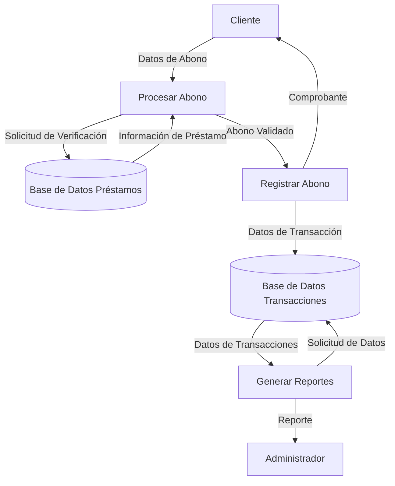

## Module: CGrabarTmpAbonoCrPrestamosFija.cpp
# Análisis Integral del Módulo CGrabarTmpAbonoCrPrestamosFija.cpp

## Módulo/Componente SQL
**Nombre del Módulo**: CGrabarTmpAbonoCrPrestamosFija.cpp

## Objetivos Primarios
Este módulo es una clase C++ diseñada para gestionar la grabación temporal de abonos a créditos o préstamos con tasa fija. Su propósito principal es procesar y almacenar información relacionada con transacciones de abono en tablas temporales, preparando los datos para su posterior procesamiento en un sistema financiero.

## Funciones, Métodos y Consultas Críticas
- **CGrabarTmpAbonoCrPrestamosFija::Grabar()**: Función principal que coordina el proceso de grabación de datos temporales.
- **CGrabarTmpAbonoCrPrestamosFija::GrabarTmpAbonoCrPrestamos()**: Método que realiza la inserción de datos en la tabla temporal de abonos a préstamos.
- **CGrabarTmpAbonoCrPrestamosFija::GrabarTmpAbonoCrPrestamosDetalle()**: Método que gestiona el detalle de los abonos a préstamos.
- **Consultas SQL**: El módulo utiliza principalmente sentencias INSERT para almacenar datos en tablas temporales.

## Variables y Elementos Clave
- **m_pDb**: Puntero a la conexión de base de datos.
- **m_pTrans**: Puntero a la transacción.
- **m_pError**: Puntero para manejo de errores.
- **Tablas principales**: TMP_ABONO_CR_PRESTAMOS y TMP_ABONO_CR_PRESTAMOS_DETALLE.
- **Parámetros clave**: Identificadores de préstamo, montos, fechas, tasas de interés, y códigos de transacción.

## Interdependencias y Relaciones
- El módulo interactúa con el sistema de base de datos a través de la clase CDb.
- Depende de la clase CError para el manejo de excepciones.
- Utiliza la clase CTrans para gestionar transacciones.
- Las tablas temporales que manipula están relacionadas con tablas permanentes del sistema de créditos y préstamos.

## Operaciones Principales vs. Auxiliares
- **Operaciones principales**: La grabación de datos en las tablas temporales mediante los métodos GrabarTmpAbonoCrPrestamos() y GrabarTmpAbonoCrPrestamosDetalle().
- **Operaciones auxiliares**: Validaciones de datos, manejo de errores, y conversiones de formato.

## Secuencia Operacional/Flujo de Ejecución
1. Inicialización de variables y conexión a la base de datos.
2. Validación de parámetros de entrada.
3. Grabación de datos principales en TMP_ABONO_CR_PRESTAMOS.
4. Grabación de detalles en TMP_ABONO_CR_PRESTAMOS_DETALLE.
5. Manejo de errores y excepciones durante el proceso.
6. Finalización y retorno del resultado de la operación.

## Aspectos de Rendimiento y Optimización
- El código utiliza transacciones para garantizar la integridad de los datos.
- Podría optimizarse mediante la preparación de sentencias SQL para reducir la sobrecarga de compilación repetida.
- La gestión de memoria parece adecuada, pero podría revisarse para evitar posibles fugas.

## Reusabilidad y Adaptabilidad
- La clase está diseñada con un enfoque modular, lo que facilita su reutilización.
- Los métodos están bien segmentados por funcionalidad.
- La parametrización de las funciones permite adaptarlas a diferentes contextos de uso.
- Podría mejorarse la adaptabilidad mediante una mayor abstracción de las operaciones de base de datos.

## Uso y Contexto
- Este módulo se utiliza en el contexto de un sistema financiero para el procesamiento de abonos a préstamos.
- Es probable que forme parte de un proceso más amplio de gestión de créditos.
- Se ejecuta como parte de un flujo de trabajo que incluye la captura de datos de abono, su procesamiento temporal y su posterior aplicación definitiva.

## Suposiciones y Limitaciones
- **Suposiciones**:
  - Se asume la existencia de una estructura de base de datos específica con tablas temporales predefinidas.
  - Se presupone un formato específico para los datos de entrada.
  - Se asume que las transacciones de base de datos están disponibles y funcionan correctamente.
  
- **Limitaciones**:
  - El código parece estar diseñado para un sistema específico y podría requerir adaptaciones significativas para otros entornos.
  - La gestión de errores podría ser más robusta para manejar casos extremos.
  - No se observa documentación detallada sobre los parámetros y valores de retorno, lo que podría dificultar su mantenimiento.
## Flow Diagram [via mermaid]

