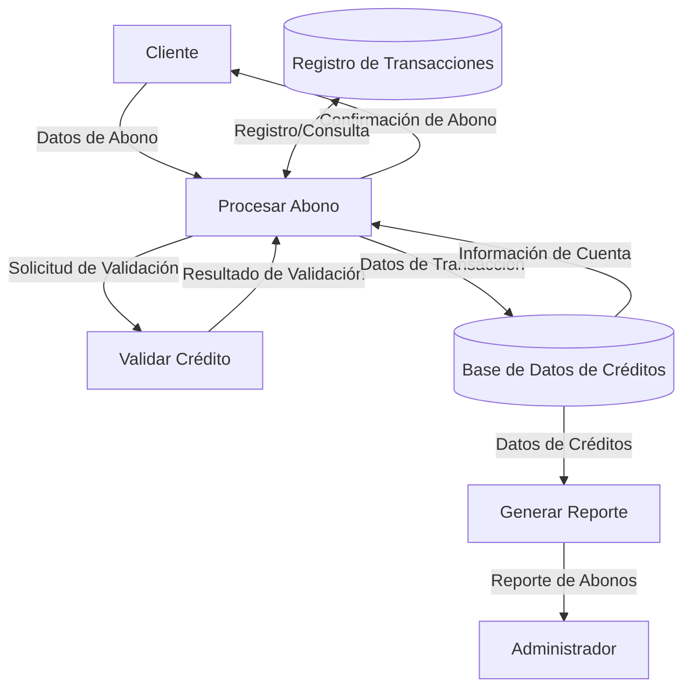

## Module: CGrabarTmpAbonoCrRevolvente.cpp
# Análisis Integral del Módulo CGrabarTmpAbonoCrRevolvente.cpp

## Módulo/Componente SQL
**CGrabarTmpAbonoCrRevolvente.cpp** - Clase C++ que maneja operaciones de abono para créditos revolventes.

## Objetivos Primarios
Este módulo gestiona la grabación temporal de abonos para créditos revolventes en un sistema financiero. Su propósito principal es procesar y validar datos de abonos, realizar cálculos financieros y almacenar esta información en tablas temporales para su posterior procesamiento.

## Funciones, Métodos y Consultas Críticas
- **GrabarTmpAbonoCrRevolvente()**: Función principal que coordina todo el proceso de grabación.
- **ObtenerDatosCredito()**: Recupera información del crédito desde la base de datos.
- **ObtenerDatosCliente()**: Obtiene datos del cliente asociado al crédito.
- **CalcularMontoAbono()**: Calcula el monto del abono según parámetros específicos.
- **ValidarAbono()**: Verifica que el abono cumpla con las reglas de negocio.
- **InsertarTmpAbono()**: Ejecuta consultas SQL INSERT para almacenar los datos temporales.
- **ActualizarSaldos()**: Actualiza los saldos después de procesar el abono.

## Variables y Elementos Clave
- **m_nIdCredito**: Identificador único del crédito.
- **m_dMontoAbono**: Monto del abono a procesar.
- **m_nIdCliente**: Identificador del cliente.
- **m_dSaldoActual**: Saldo actual del crédito.
- **m_dTasaInteres**: Tasa de interés aplicable.
- **Tablas principales**: TMP_ABONOS_CR_REVOLVENTE, CREDITOS, CLIENTES, PARAMETROS_SISTEMA.

## Interdependencias y Relaciones
- Se relaciona con el módulo de créditos para obtener información del crédito.
- Interactúa con el módulo de clientes para validar datos del titular.
- Utiliza el sistema de parámetros para obtener configuraciones de negocio.
- Las tablas temporales creadas serán utilizadas posteriormente por procesos de conciliación y cierre.

## Operaciones Core vs. Auxiliares
**Operaciones Core:**
- Cálculo del monto de abono y su aplicación.
- Inserción de registros en tablas temporales.
- Actualización de saldos.

**Operaciones Auxiliares:**
- Validaciones de datos y reglas de negocio.
- Logging de operaciones.
- Manejo de excepciones y errores.

## Secuencia Operacional/Flujo de Ejecución
1. Inicialización de variables y parámetros.
2. Obtención de datos del crédito y cliente.
3. Validación de reglas de negocio para el abono.
4. Cálculo del monto final del abono considerando intereses y comisiones.
5. Inserción de datos en tablas temporales.
6. Actualización de saldos si es necesario.
7. Registro de la operación en logs del sistema.
8. Retorno del resultado de la operación.

## Aspectos de Rendimiento y Optimización
- Posibles cuellos de botella en consultas a tablas de créditos con gran volumen de datos.
- Oportunidad de optimización en el proceso de cálculo de intereses que podría ser computacionalmente intensivo.
- Se recomienda revisar los índices en las tablas temporales para mejorar el rendimiento de las inserciones masivas.

## Reusabilidad y Adaptabilidad
- El módulo está diseñado con un enfoque orientado a objetos que facilita su reutilización.
- Los parámetros de configuración permiten adaptarlo a diferentes tipos de créditos revolventes.
- La separación de responsabilidades en métodos específicos facilita la modificación de componentes individuales.

## Uso y Contexto
- Se utiliza en el proceso diario de aplicación de abonos a créditos revolventes.
- Es invocado desde el sistema principal de gestión de créditos o desde procesos batch nocturnos.
- Forma parte del flujo de trabajo de gestión de pagos y actualización de saldos.

## Suposiciones y Limitaciones
- Asume que las estructuras de las tablas de créditos y clientes ya existen y tienen un formato específico.
- Requiere que los parámetros del sistema estén correctamente configurados.
- Está diseñado específicamente para créditos de tipo revolvente y podría no ser aplicable a otros tipos de crédito sin modificaciones.
- Tiene limitaciones en el manejo de monedas extranjeras que requerirían adaptaciones adicionales.
## Flow Diagram [via mermaid]

