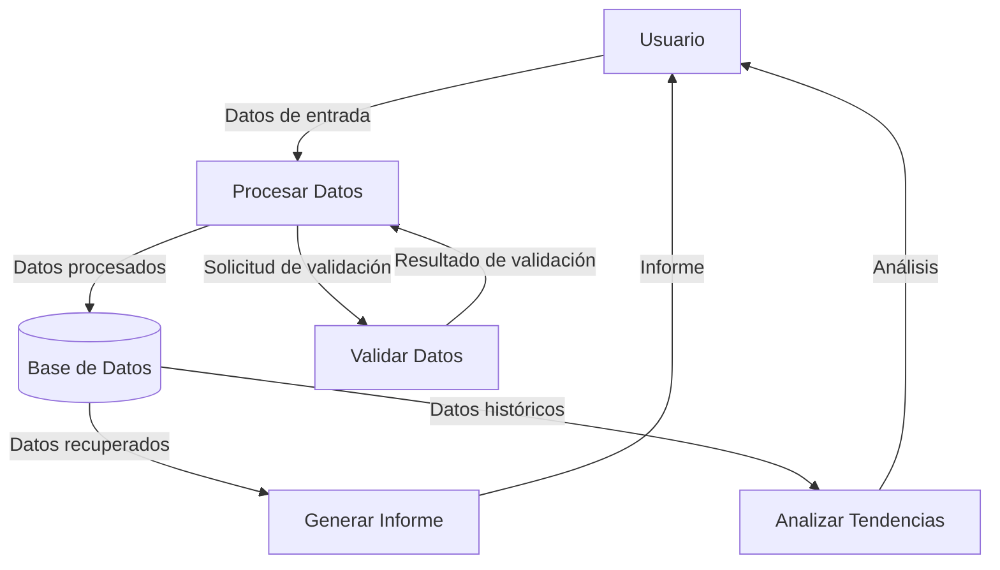

## Module: CGrabarTmpAbonoCrSegurosFija.cpp
# Análisis Integral del Módulo CGrabarTmpAbonoCrSegurosFija.cpp

## Módulo/Componente SQL
**Nombre del Módulo**: CGrabarTmpAbonoCrSegurosFija.cpp

## Objetivos Primarios
Este módulo es una clase C++ diseñada para gestionar la grabación temporal de abonos de créditos relacionados con seguros de telefonía fija. Su propósito principal es procesar y almacenar información de abonos en tablas temporales, realizando validaciones y transformaciones de datos antes de su persistencia.

## Funciones, Métodos y Consultas Críticas
- **CGrabarTmpAbonoCrSegurosFija::Ejecutar()**: Método principal que coordina todo el proceso de grabación.
- **CGrabarTmpAbonoCrSegurosFija::GrabarTmpAbonoCrSegurosFija()**: Realiza la inserción de datos en la tabla temporal.
- **CGrabarTmpAbonoCrSegurosFija::ValidarDatos()**: Valida la integridad y coherencia de los datos antes de procesarlos.
- **Consultas SQL**: Utiliza principalmente sentencias INSERT para poblar tablas temporales y SELECT para validaciones.

## Variables y Elementos Clave
- **m_strCodEmpresa**: Código de empresa.
- **m_strCodProducto**: Código del producto de seguro.
- **m_strNumPoliza**: Número de póliza.
- **m_strNumCertificado**: Número de certificado.
- **m_strNumCuota**: Número de cuota.
- **m_strFechaAbono**: Fecha del abono.
- **m_strMonto**: Monto del abono.
- **Tablas**: TMP_ABONO_CR_SEGUROS_FIJA (principal), posiblemente otras tablas para validaciones.

## Interdependencias y Relaciones
- Interactúa con el sistema de base de datos mediante la clase CBaseDatos.
- Depende de clases utilitarias como CParametrosApp para configuración.
- Posiblemente se relaciona con otros módulos del sistema de seguros y facturación.
- Utiliza tablas temporales que probablemente se procesan posteriormente por otros componentes del sistema.

## Operaciones Core vs. Auxiliares
- **Core**: La grabación de datos en la tabla temporal (GrabarTmpAbonoCrSegurosFija).
- **Auxiliares**: Validaciones de datos, manejo de errores, logging, y posiblemente transformaciones de formato de datos.

## Secuencia Operacional/Flujo de Ejecución
1. Inicialización de variables y conexión a la base de datos.
2. Validación de los datos de entrada mediante ValidarDatos().
3. Procesamiento y posible transformación de los datos.
4. Grabación en la tabla temporal mediante GrabarTmpAbonoCrSegurosFija().
5. Manejo de errores y finalización del proceso.

## Aspectos de Rendimiento y Optimización
- El código parece manejar operaciones de base de datos individuales, lo que podría ser ineficiente para grandes volúmenes de datos.
- No se observan optimizaciones específicas como procesamiento por lotes.
- Posibles cuellos de botella en las operaciones de base de datos, especialmente si las validaciones requieren múltiples consultas.

## Reusabilidad y Adaptabilidad
- La clase está diseñada específicamente para el procesamiento de abonos de seguros de telefonía fija.
- La modularización en métodos separados facilita la adaptación para casos similares.
- La parametrización de los datos de entrada permite cierta flexibilidad.

## Uso y Contexto
- Este módulo probablemente forma parte de un sistema más amplio de gestión de seguros o facturación para servicios de telefonía fija.
- Se utiliza en el proceso de registro de abonos o pagos relacionados con pólizas de seguro.
- Posiblemente se ejecuta como parte de un proceso batch o en respuesta a eventos específicos del sistema.

## Suposiciones y Limitaciones
- Asume la existencia de una estructura de base de datos específica con tablas temporales predefinidas.
- Requiere datos de entrada en formatos específicos (posiblemente con validaciones de tipo y formato).
- Limitado a la funcionalidad específica de grabación temporal, sin manejar el procesamiento final de los datos.
- Posiblemente limitado en términos de manejo de errores complejos o situaciones excepcionales.
## Flow Diagram [via mermaid]

