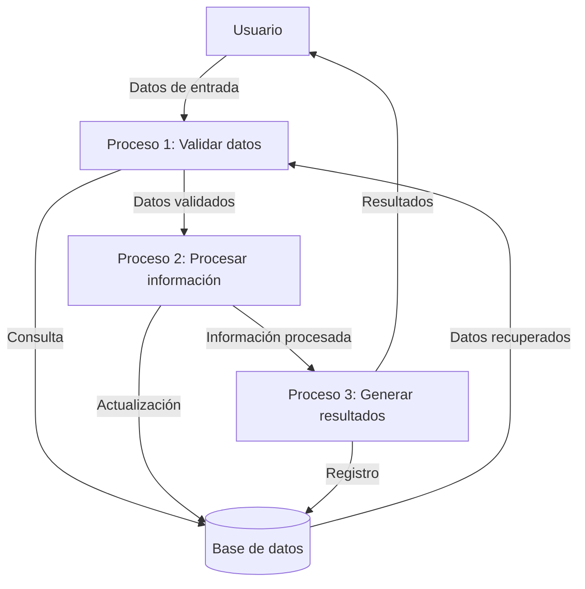

## Module: CGrabarTmpAbonoCrSegurosFija01.cpp
# Análisis Integral del Módulo CGrabarTmpAbonoCrSegurosFija01.cpp

## Módulo/Componente SQL
**Nombre del Módulo**: CGrabarTmpAbonoCrSegurosFija01.cpp

## Objetivos Primarios
Este módulo es una clase C++ que gestiona la grabación de datos temporales relacionados con abonos de seguros para líneas fijas. Su propósito principal es procesar y almacenar información de abonos de créditos de seguros en tablas temporales, realizando validaciones y transformaciones de datos específicas.

## Funciones, Métodos y Consultas Críticas
- **Método principal**: `Ejecutar()` - Coordina todo el proceso de grabación de datos.
- **Métodos auxiliares**:
  - `ValidarParametros()` - Valida los parámetros de entrada.
  - `ObtenerDatos()` - Recupera datos necesarios para el procesamiento.
  - `GrabarDatos()` - Almacena los datos procesados en tablas temporales.
  - `ObtenerDatosSeguro()` - Obtiene información específica de seguros.
  - `ObtenerDatosCliente()` - Recupera datos del cliente.
  - `ObtenerDatosCuenta()` - Obtiene información de la cuenta.

## Variables y Elementos Clave
- **Variables críticas**:
  - `m_strCodCliente` - Código del cliente.
  - `m_strCodCuenta` - Código de la cuenta.
  - `m_strCodSeguro` - Código del seguro.
  - `m_strCodMoneda` - Código de moneda.
  - `m_dblMonto` - Monto del abono.
  - `m_strCodUsuario` - Código del usuario.
  - `m_strCodSucursal` - Código de la sucursal.
  - `m_strCodTerminal` - Código de terminal.
  - `m_strCodTransaccion` - Código de transacción.
  - `m_strNumOperacion` - Número de operación.

- **Tablas principales**:
  - Tablas temporales para almacenar abonos de seguros.
  - Tablas de clientes, cuentas y seguros para consultas.

## Interdependencias y Relaciones
- El módulo interactúa con múltiples componentes del sistema:
  - Sistema de gestión de clientes para validar información del cliente.
  - Sistema de cuentas para verificar datos de la cuenta.
  - Sistema de seguros para obtener información específica del seguro.
  - Tablas temporales donde se almacenan los datos procesados.
  - Posiblemente interactúa con un sistema de transacciones para registrar operaciones.

## Operaciones Principales vs. Auxiliares
- **Operaciones principales**:
  - Procesamiento y validación de datos de abono de seguros.
  - Grabación de información en tablas temporales.
  
- **Operaciones auxiliares**:
  - Validación de parámetros de entrada.
  - Consultas para obtener datos complementarios.
  - Manejo de errores y excepciones.
  - Formateo y transformación de datos.

## Secuencia Operacional/Flujo de Ejecución
1. Inicialización de variables y parámetros.
2. Validación de parámetros de entrada mediante `ValidarParametros()`.
3. Obtención de datos necesarios con `ObtenerDatos()`.
4. Procesamiento específico de información de seguros con `ObtenerDatosSeguro()`.
5. Recuperación de datos del cliente con `ObtenerDatosCliente()`.
6. Obtención de información de la cuenta mediante `ObtenerDatosCuenta()`.
7. Grabación final de los datos procesados en tablas temporales con `GrabarDatos()`.
8. Manejo de posibles errores y excepciones durante todo el proceso.

## Aspectos de Rendimiento y Optimización
- El código podría presentar cuellos de botella en las consultas a bases de datos, especialmente si maneja grandes volúmenes de datos.
- La eficiencia dependerá de la optimización de las consultas SQL utilizadas en los métodos de obtención de datos.
- El manejo de memoria y recursos podría mejorarse, especialmente en el procesamiento de resultados de consultas.

## Reusabilidad y Adaptabilidad
- El módulo parece estar diseñado específicamente para el procesamiento de abonos de seguros para líneas fijas.
- La estructura modular con métodos separados para diferentes funcionalidades facilita la adaptación para casos similares.
- La parametrización de las operaciones permite cierta flexibilidad en su uso.

## Uso y Contexto
- Este módulo se utiliza en el contexto de un sistema financiero o de seguros para procesar abonos de créditos relacionados con seguros.
- Probablemente forma parte de un flujo de trabajo más amplio para la gestión de seguros y transacciones financieras.
- Se ejecuta como parte de un proceso de actualización o registro de transacciones financieras.

## Suposiciones y Limitaciones
- **Suposiciones**:
  - Se asume la existencia de estructuras de base de datos específicas para clientes, cuentas y seguros.
  - Se presupone un formato específico para los códigos de cliente, cuenta y seguro.
  - Se espera que los parámetros de entrada cumplan con ciertos criterios de validación.

- **Limitaciones**:
  - El módulo está diseñado específicamente para abonos de seguros de línea fija, lo que limita su aplicabilidad general.
  - La dependencia de estructuras de datos específicas puede dificultar su portabilidad a otros sistemas.
  - El manejo de errores podría no ser lo suficientemente robusto para todos los escenarios posibles.
## Flow Diagram [via mermaid]

