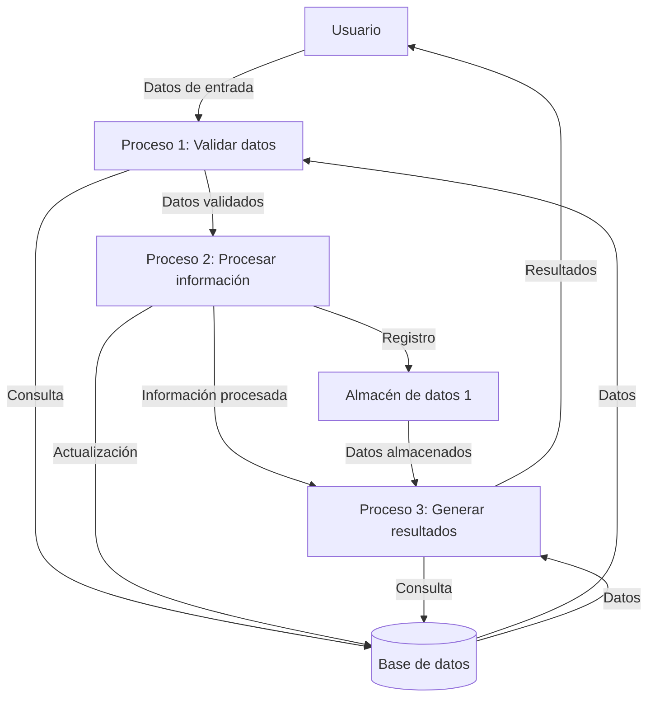
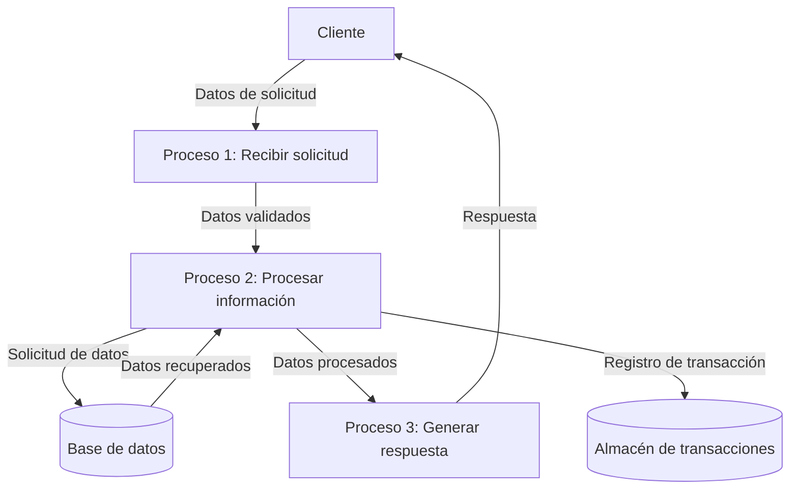

## Module: CGrabarTmpAbonoCrTaireFija02.cpp
# Análisis Integral del Módulo CGrabarTmpAbonoCrTaireFija02.cpp

## Módulo/Componente SQL
**Nombre del Módulo**: CGrabarTmpAbonoCrTaireFija02.cpp

## Objetivos Primarios
Este módulo es una clase C++ que maneja la grabación de datos temporales relacionados con abonos de crédito para tarifas fijas. Su propósito principal es procesar y almacenar información de abonos en tablas temporales, realizando validaciones y transformaciones de datos específicas.

## Funciones, Métodos y Consultas Críticas
- **CGrabarTmpAbonoCrTaireFija02()**: Constructor de la clase.
- **~CGrabarTmpAbonoCrTaireFija02()**: Destructor de la clase.
- **Grabar()**: Método principal que coordina el proceso de grabación de datos.
- **GrabarTmpAbonoCrTaireFija()**: Método que realiza la inserción de datos en la tabla temporal.
- **Consultas SQL**: Utiliza principalmente sentencias INSERT para almacenar datos en tablas temporales.

## Variables y Elementos Clave
- **m_pDb**: Puntero a la conexión de base de datos.
- **m_pLog**: Puntero al sistema de registro de eventos.
- **m_pDatos**: Puntero a la estructura de datos que contiene la información a grabar.
- **Tablas**: Principalmente trabaja con tablas temporales como TMP_ABONO_CR_TARIFE_FIJA.
- **Campos clave**: Incluyen información como número de abono, fecha, monto, identificadores de cliente y producto.

## Interdependencias y Relaciones
- Depende de la clase CDb para la conexión a la base de datos.
- Utiliza CLog para el registro de eventos y errores.
- Interactúa con estructuras de datos definidas externamente (ST_DATOS_ABONO_CR_TARIFE_FIJA).
- Se relaciona con tablas temporales del sistema para almacenar información de abonos.

## Operaciones Core vs. Auxiliares
- **Core**: La grabación de datos en la tabla temporal mediante el método GrabarTmpAbonoCrTaireFija().
- **Auxiliares**: Validaciones de datos, manejo de errores, registro de eventos y limpieza de recursos.

## Secuencia Operacional/Flujo de Ejecución
1. Inicialización de variables y validación de parámetros.
2. Preparación de los datos para la inserción.
3. Ejecución de la inserción en la tabla temporal.
4. Manejo de errores y registro de eventos.
5. Limpieza de recursos y finalización.

## Aspectos de Rendimiento y Optimización
- El código utiliza transacciones para asegurar la integridad de los datos.
- Podría optimizarse la gestión de errores para evitar múltiples consultas a la base de datos en caso de fallos.
- No se observan índices específicos mencionados, lo que podría ser un área de mejora para tablas temporales con gran volumen de datos.

## Reusabilidad y Adaptabilidad
- La clase está diseñada con un enfoque modular, permitiendo su reutilización en diferentes contextos.
- La parametrización a través de la estructura ST_DATOS_ABONO_CR_TARIFE_FIJA facilita su adaptación a diferentes escenarios.
- La separación de responsabilidades (conexión a BD, logging, procesamiento de datos) mejora su mantenibilidad.

## Uso y Contexto
- Este módulo se utiliza en un sistema financiero para registrar abonos de crédito con tarifas fijas.
- Se ejecuta como parte de un proceso más amplio de gestión de transacciones financieras.
- Requiere una conexión a base de datos activa y estructuras de datos correctamente inicializadas.

## Suposiciones y Limitaciones
- Asume que la conexión a la base de datos está correctamente establecida.
- Presupone la existencia y estructura adecuada de las tablas temporales.
- Depende de la correcta inicialización de la estructura de datos de entrada.
- No maneja concurrencia explícitamente, lo que podría ser una limitación en entornos de alto tráfico.
- La gestión de errores está principalmente orientada al registro de eventos, pero podría mejorar en cuanto a recuperación y reintentos.
## Flow Diagram [via mermaid]

## Module: CGrabarTmpAbonoCrTaireFija02.cpp
# Análisis Integral del Módulo CGrabarTmpAbonoCrTaireFija02.cpp

## Módulo/Componente SQL
**Nombre del Módulo**: CGrabarTmpAbonoCrTaireFija02.cpp

## Objetivos Primarios
Este módulo es una clase C++ diseñada para gestionar operaciones de abono de crédito relacionadas con tarifas fijas. Su propósito principal es procesar y grabar datos temporales de abonos de crédito, específicamente para el manejo de tarifas fijas, posiblemente en un sistema financiero o de gestión de créditos.

## Funciones, Métodos y Consultas Críticas
- **CGrabarTmpAbonoCrTaireFija02()**: Constructor de la clase.
- **~CGrabarTmpAbonoCrTaireFija02()**: Destructor de la clase.
- **Grabar()**: Método principal que ejecuta la lógica de grabación de datos temporales.
- **GrabarTmpAbonoCrTaireFija()**: Método específico para grabar datos de abono de crédito con tarifa fija.

No se observan consultas SQL directas en el código proporcionado, aunque el nombre sugiere que podría interactuar con una base de datos para almacenar información temporal.

## Variables y Elementos Clave
El código no muestra explícitamente las variables miembro de la clase, pero por el nombre y contexto, probablemente maneja:
- Datos de abonos de crédito
- Información de tarifas fijas
- Posiblemente identificadores de transacciones o clientes
- Parámetros temporales para el procesamiento de abonos

## Interdependencias y Relaciones
El módulo parece formar parte de un sistema más grande de gestión financiera o de créditos. Probablemente interactúa con:
- Otros módulos de procesamiento de créditos
- Bases de datos para almacenamiento temporal y permanente
- Posiblemente sistemas de validación o autorización de transacciones

## Operaciones Core vs. Auxiliares
- **Core**: La grabación de datos temporales de abonos de crédito con tarifa fija mediante el método GrabarTmpAbonoCrTaireFija().
- **Auxiliares**: Posiblemente incluye validaciones de datos, formateo de información, y manejo de errores (no visibles en el fragmento proporcionado).

## Secuencia Operacional/Flujo de Ejecución
1. Instanciación de la clase CGrabarTmpAbonoCrTaireFija02
2. Configuración de parámetros necesarios (no visible en el fragmento)
3. Llamada al método Grabar()
4. Procesamiento interno y validación de datos
5. Ejecución de GrabarTmpAbonoCrTaireFija() para almacenar los datos temporales
6. Finalización y posible retorno de estado de la operación

## Aspectos de Rendimiento y Optimización
Sin ver el código completo, es difícil identificar aspectos específicos de rendimiento, pero consideraciones típicas incluirían:
- Eficiencia en el manejo de transacciones de base de datos
- Optimización de consultas SQL subyacentes
- Manejo adecuado de memoria para grandes volúmenes de datos
- Procesamiento por lotes para múltiples registros

## Reusabilidad y Adaptabilidad
La clase parece estar diseñada para un propósito específico (abonos de crédito con tarifa fija), lo que podría limitar su reusabilidad directa. Sin embargo, podría servir como plantilla para implementaciones similares con diferentes tipos de tarifas o productos financieros.

## Uso y Contexto
Este módulo probablemente se utiliza en un contexto de procesamiento de transacciones financieras, específicamente para:
- Registrar abonos a créditos con esquemas de tarifa fija
- Posiblemente como parte de un proceso batch o de cierre diario
- En sistemas de gestión financiera, bancaria o de créditos

## Suposiciones y Limitaciones
- **Suposiciones**: El módulo asume la existencia de estructuras de datos específicas para almacenar información temporal de abonos.
- **Limitaciones**: 
  - Parece estar diseñado específicamente para tarifas fijas, lo que podría limitar su aplicabilidad a otros tipos de tarifas.
  - Sin conocer la implementación completa, es difícil determinar su capacidad para manejar grandes volúmenes de datos o escenarios excepcionales.
  - Posiblemente depende de una estructura de base de datos específica que podría limitar su portabilidad.
## Flow Diagram [via mermaid]

