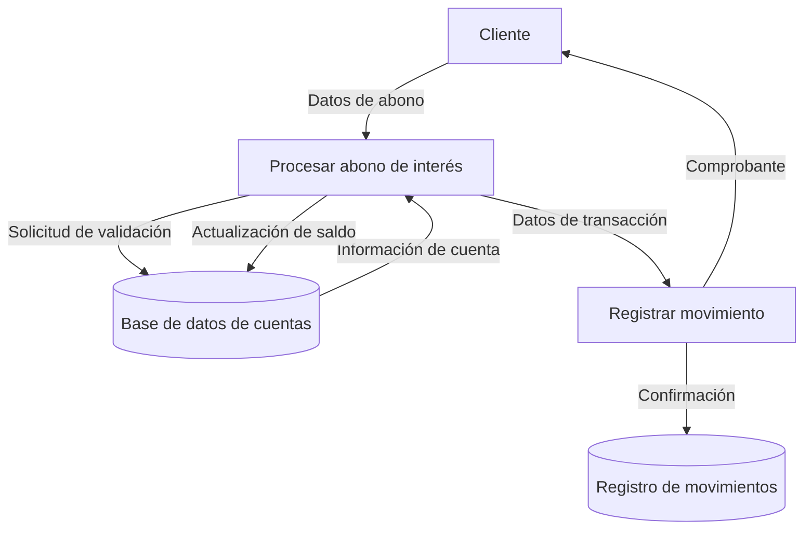

## Module: CGrabarTmpAbonoInteresCaCarmov05.cpp
# Análisis Integral del Módulo CGrabarTmpAbonoInteresCaCarmov05.cpp

## Módulo/Componente SQL
**Nombre del Módulo**: CGrabarTmpAbonoInteresCaCarmov05.cpp

## Objetivos Primarios
Este módulo es una clase C++ diseñada para gestionar el proceso de grabación de abonos de intereses en cuentas de cartera de movimientos. Su propósito principal es procesar y registrar transacciones financieras relacionadas con intereses en un sistema de gestión de cartera, específicamente para la versión 05 del proceso.

## Funciones, Métodos y Consultas Críticas
- **GrabarTmpAbonoInteresCaCarmov05()**: Método principal que coordina el proceso de grabación de abonos.
- **GrabarTmpAbonoInteresCaCarmov05_Paso1()**: Realiza el primer paso del proceso de grabación.
- **GrabarTmpAbonoInteresCaCarmov05_Paso2()**: Ejecuta el segundo paso del proceso.
- **GrabarTmpAbonoInteresCaCarmov05_Paso3()**: Completa el tercer paso del proceso.
- **GrabarTmpAbonoInteresCaCarmov05_Paso4()**: Finaliza el proceso con el cuarto paso.

El código parece utilizar consultas SQL para interactuar con la base de datos, aunque no se muestran explícitamente en el fragmento proporcionado.

## Variables y Elementos Clave
- **m_pDb**: Probablemente una conexión a la base de datos.
- **m_pErr**: Objeto para manejo de errores.
- **m_pLog**: Sistema de registro de eventos.
- **Tablas relacionadas**: Posiblemente tablas de cartera, movimientos, intereses y transacciones temporales.

## Interdependencias y Relaciones
El módulo parece interactuar con:
- Sistema de base de datos para almacenar y recuperar información financiera.
- Sistema de registro para documentar operaciones.
- Sistema de manejo de errores para gestionar excepciones.
- Otros componentes del sistema de gestión de cartera que utilizan los datos procesados.

## Operaciones Principales vs. Auxiliares
- **Operaciones principales**: Los cuatro pasos de grabación (Paso1 a Paso4) que constituyen el flujo principal del proceso.
- **Operaciones auxiliares**: Manejo de errores, registro de eventos, validaciones y posiblemente cálculos financieros.

## Secuencia Operacional/Flujo de Ejecución
1. Inicialización del proceso en el método principal.
2. Ejecución secuencial de los cuatro pasos del proceso (Paso1 → Paso2 → Paso3 → Paso4).
3. Cada paso probablemente realiza operaciones específicas como validación, cálculo, actualización y confirmación.
4. Manejo de errores y registro de eventos durante todo el proceso.

## Aspectos de Rendimiento y Optimización
- El procesamiento por pasos sugiere una estructura modular que podría facilitar la optimización.
- Posibles áreas de mejora incluirían la eficiencia de las consultas SQL subyacentes y la gestión de transacciones.
- La estructura en pasos podría permitir procesamiento por lotes para mejorar el rendimiento con grandes volúmenes de datos.

## Reusabilidad y Adaptabilidad
- La estructura modular con pasos separados facilita la adaptación a diferentes requisitos.
- El sufijo "05" sugiere que es una versión específica, posiblemente parte de una serie de implementaciones similares.
- La reutilización probablemente requeriría adaptaciones específicas al contexto financiero y estructura de datos.

## Uso y Contexto
- Este módulo se utiliza en un sistema financiero para procesar abonos de intereses en carteras de clientes.
- Probablemente forma parte de un proceso más amplio de gestión financiera o contable.
- Su ejecución podría ser programada (batch) o desencadenada por eventos específicos del sistema.

## Suposiciones y Limitaciones
- **Suposiciones**: 
  - Existencia de estructuras de base de datos específicas para cartera y movimientos.
  - Formato y reglas de negocio predefinidas para el cálculo de intereses.
  - Configuración adecuada del entorno de ejecución.
  
- **Limitaciones**:
  - Específico para la versión 05 del proceso, lo que podría limitar su aplicabilidad general.
  - Dependencia de la estructura de datos existente.
  - Posibles restricciones en cuanto a volumen de transacciones procesables simultáneamente.
## Flow Diagram [via mermaid]

