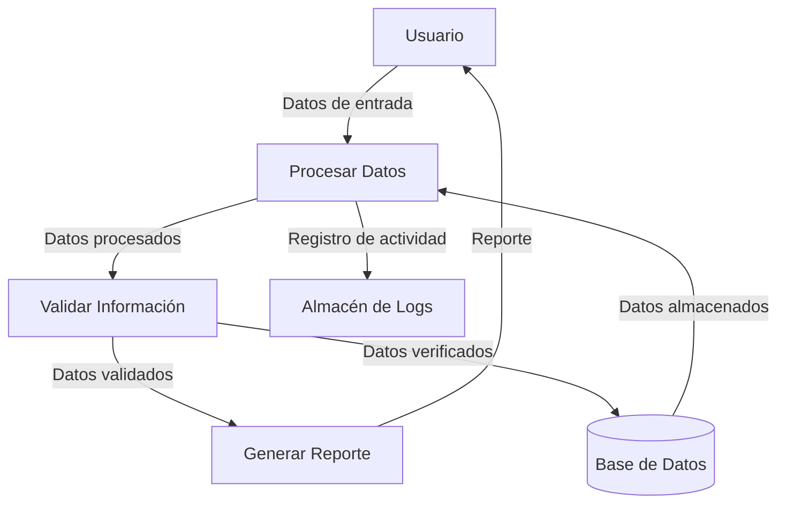
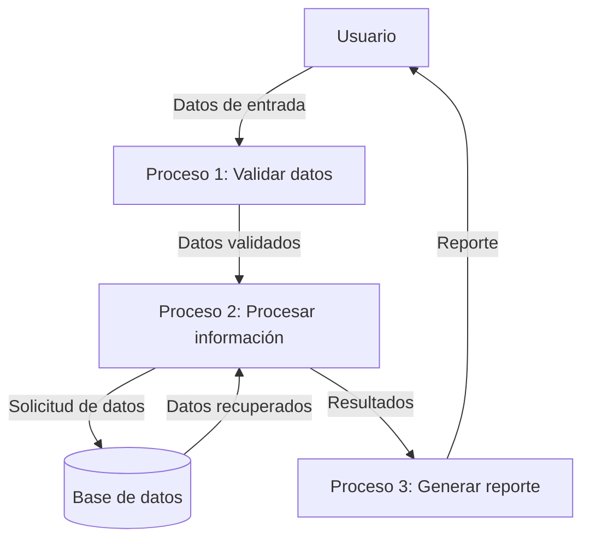

## Module: CGrabarTmpBeneficiariosCaCarmov01.cpp
# Análisis Integral del Módulo CGrabarTmpBeneficiariosCaCarmov01.cpp

## Módulo/Componente SQL
**CGrabarTmpBeneficiariosCaCarmov01.cpp** - Módulo de programación en C++ que interactúa con una base de datos mediante SQL.

## Objetivos Primarios
Este módulo está diseñado para grabar información de beneficiarios en una tabla temporal (`TMP_BENEFICIARIOS_CA_CARMOV01`). Su propósito principal es procesar y almacenar datos de beneficiarios relacionados con movimientos de cuentas, posiblemente como parte de un sistema financiero o bancario.

## Funciones, Métodos y Consultas Críticas
- **CGrabarTmpBeneficiariosCaCarmov01::Ejecutar()**: Función principal que coordina la ejecución del proceso.
- **Consultas SQL principales**:
  - **INSERT INTO**: Inserta registros en la tabla temporal de beneficiarios.
  - **SELECT**: Consulta datos de beneficiarios para su procesamiento.

## Variables y Elementos Clave
- **Tablas**:
  - `TMP_BENEFICIARIOS_CA_CARMOV01`: Tabla temporal para almacenar información de beneficiarios.
- **Columnas importantes**:
  - `CUENTA`, `BENEFICIARIO`, `PORCENTAJE`, `NOMBRE`, `APELLIDO_PATERNO`, `APELLIDO_MATERNO`
- **Variables de programa**:
  - `m_strCuenta`: Almacena el número de cuenta.
  - `m_strBeneficiario`: Identificador del beneficiario.
  - `m_strPorcentaje`: Porcentaje asignado al beneficiario.
  - `m_strNombre`, `m_strApellidoPaterno`, `m_strApellidoMaterno`: Datos personales del beneficiario.

## Interdependencias y Relaciones
- El módulo interactúa con la base de datos a través de operaciones SQL.
- Existe una relación implícita con otras tablas del sistema que contienen información de cuentas y posiblemente información personal de clientes.
- Utiliza la clase `CConexion` para establecer y gestionar la conexión con la base de datos.

## Operaciones Principales vs. Auxiliares
- **Operaciones principales**:
  - Inserción de datos de beneficiarios en la tabla temporal.
- **Operaciones auxiliares**:
  - Validación de datos.
  - Manejo de errores y excepciones.
  - Registro de actividades (logging).

## Secuencia Operacional/Flujo de Ejecución
1. Inicialización de variables y conexión a la base de datos.
2. Preparación de la consulta SQL para inserción.
3. Ejecución de la consulta con los parámetros proporcionados.
4. Manejo de posibles errores durante la ejecución.
5. Cierre de la conexión y liberación de recursos.

## Aspectos de Rendimiento y Optimización
- La inserción en tablas temporales sugiere un enfoque de procesamiento por lotes, lo que puede mejorar el rendimiento.
- Potenciales áreas de optimización:
  - Uso de transacciones para múltiples inserciones.
  - Verificación de índices en la tabla temporal para mejorar la velocidad de inserción.
  - Posible implementación de inserción masiva para grandes volúmenes de datos.

## Reusabilidad y Adaptabilidad
- El módulo parece estar diseñado específicamente para la tabla `TMP_BENEFICIARIOS_CA_CARMOV01`, lo que limita su reusabilidad directa.
- Para adaptarlo a otros contextos, sería necesario modificar las estructuras de datos y consultas SQL específicas.
- La separación de la lógica de conexión a la base de datos (clase `CConexion`) favorece cierto nivel de modularidad.

## Uso y Contexto
- Este módulo probablemente forma parte de un sistema más amplio de gestión financiera o bancaria.
- Se utiliza en el contexto de procesamiento de beneficiarios asociados a cuentas, posiblemente durante operaciones como apertura de cuentas, modificación de beneficiarios o generación de reportes.
- Podría ser invocado por otros módulos del sistema que requieran almacenar temporalmente información de beneficiarios.

## Suposiciones y Limitaciones
- **Suposiciones**:
  - La tabla temporal `TMP_BENEFICIARIOS_CA_CARMOV01` ya existe en la base de datos.
  - Los datos proporcionados para inserción son válidos y cumplen con las restricciones de la tabla.
  - Existe un sistema de gestión de errores que maneja las excepciones lanzadas por este módulo.
- **Limitaciones**:
  - El módulo está estrechamente acoplado a la estructura específica de la tabla temporal.
  - No parece incluir validaciones complejas de los datos antes de la inserción.
  - Dependencia de la implementación específica de la clase `CConexion` para la interacción con la base de datos.
## Flow Diagram [via mermaid]

## Module: CGrabarTmpBeneficiariosCaCarmov01.cpp
# Análisis Integral del Módulo CGrabarTmpBeneficiariosCaCarmov01.cpp

## Módulo/Componente SQL
**CGrabarTmpBeneficiariosCaCarmov01.cpp** - Módulo de programación en C++ que interactúa con una base de datos mediante consultas SQL.

## Objetivos Primarios
Este módulo está diseñado para grabar datos de beneficiarios en una tabla temporal (`TMP_BENEFICIARIOS_CA_CARMOV01`) dentro de un sistema de gestión financiera o contable. Su propósito principal es procesar y almacenar información relacionada con beneficiarios de cuentas o movimientos, posiblemente como parte de un proceso de carga o actualización de datos.

## Funciones, Métodos y Consultas Críticas
- **Función principal**: `CGrabarTmpBeneficiariosCaCarmov01` - Maneja la lógica principal para insertar registros en la tabla temporal.
- **Consultas SQL principales**:
  - **INSERT**: Inserta datos en la tabla temporal `TMP_BENEFICIARIOS_CA_CARMOV01`.
  - **Posibles SELECT**: Aunque no se ve explícitamente en el fragmento proporcionado, probablemente existan consultas para validar datos antes de la inserción.

## Variables y Elementos Clave
- **Tabla principal**: `TMP_BENEFICIARIOS_CA_CARMOV01`
- **Parámetros probables**:
  - Información del beneficiario (nombre, identificación)
  - Datos de la cuenta o movimiento asociado
  - Fechas de operación
  - Códigos de transacción o identificadores únicos
- **Variables de control**: Posiblemente incluye variables para manejar estados de transacción, contadores de registros procesados y códigos de error.

## Interdependencias y Relaciones
- Interactúa con el sistema de base de datos, probablemente Oracle o SQL Server.
- La tabla temporal `TMP_BENEFICIARIOS_CA_CARMOV01` posiblemente se relaciona con tablas permanentes de beneficiarios, cuentas y movimientos.
- Puede formar parte de un proceso ETL (Extracción, Transformación, Carga) más amplio.

## Operaciones Core vs. Auxiliares
- **Core**: La inserción de datos en la tabla temporal.
- **Auxiliares**: Validación de datos, manejo de errores, registro de actividades (logging), y posible limpieza de datos temporales anteriores.

## Secuencia Operacional/Flujo de Ejecución
1. Inicialización de variables y conexión a la base de datos
2. Posible validación de parámetros de entrada
3. Preparación de la sentencia SQL para inserción
4. Ejecución de la inserción en la tabla temporal
5. Manejo de resultados y posibles errores
6. Cierre de conexiones y liberación de recursos

## Aspectos de Rendimiento y Optimización
- La eficiencia dependerá del volumen de datos a procesar.
- Posibles áreas de optimización:
  - Uso de inserciones por lotes en lugar de individuales
  - Índices adecuados en la tabla temporal
  - Manejo eficiente de transacciones para grandes volúmenes de datos

## Reusabilidad y Adaptabilidad
- El módulo parece estar diseñado para una tarea específica, lo que podría limitar su reusabilidad directa.
- La adaptabilidad dependería de la parametrización implementada y de la estructura de la tabla temporal.
- Podría requerir modificaciones para adaptarse a cambios en la estructura de datos o requisitos de negocio.

## Uso y Contexto
- Utilizado probablemente en procesos batch o de carga periódica de información de beneficiarios.
- Podría formar parte de un sistema financiero, bancario o de gestión de cuentas.
- Posiblemente se ejecuta como parte de un proceso programado o desencadenado por eventos específicos.

## Suposiciones y Limitaciones
- **Suposiciones**:
  - Existencia previa de la tabla temporal con la estructura adecuada
  - Permisos de usuario suficientes para operaciones de inserción
  - Formato específico de los datos de entrada
- **Limitaciones**:
  - Capacidad para manejar grandes volúmenes de datos
  - Dependencia de la estructura específica de la base de datos
  - Posible falta de mecanismos de recuperación ante fallos parciales durante el proceso
## Flow Diagram [via mermaid]

