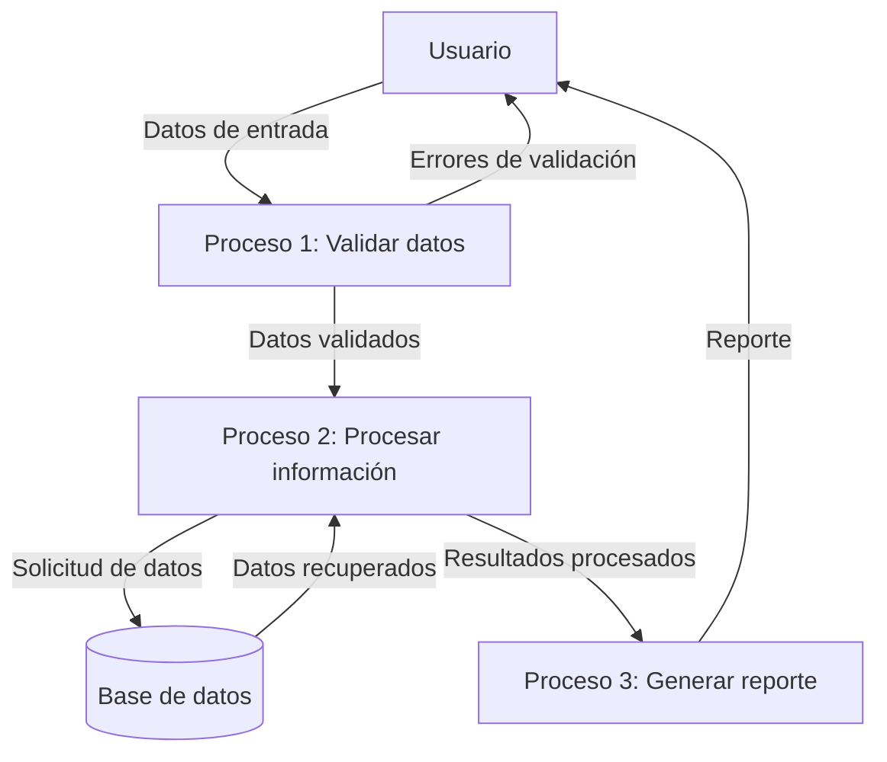

## Module: CGrabarTmpBonificacionCaCarmov04.cpp
# Análisis Integral del Módulo CGrabarTmpBonificacionCaCarmov04.cpp

## Módulo/Componente SQL
**Nombre del Módulo**: CGrabarTmpBonificacionCaCarmov04.cpp

## Objetivos Primarios
Este módulo es una clase C++ que gestiona la grabación de bonificaciones temporales en el sistema CARMOV04. Su propósito principal es procesar y almacenar datos de bonificaciones, realizando validaciones y transformaciones de datos antes de su persistencia en la base de datos.

## Funciones, Métodos y Consultas Críticas
- **CGrabarTmpBonificacionCaCarmov04()**: Constructor que inicializa la clase.
- **~CGrabarTmpBonificacionCaCarmov04()**: Destructor que libera recursos.
- **Grabar()**: Método principal que ejecuta la lógica de grabación de bonificaciones.
- **ValidarDatos()**: Valida la integridad de los datos antes de procesarlos.
- **ObtenerDatos()**: Recupera datos necesarios para el procesamiento.

El código parece interactuar con una base de datos, probablemente ejecutando consultas SQL para insertar, actualizar o consultar información relacionada con bonificaciones.

## Variables y Elementos Clave
- Variables relacionadas con bonificaciones (posiblemente montos, fechas, identificadores)
- Parámetros de conexión a la base de datos
- Variables de control para la lógica de negocio
- Posibles tablas involucradas: tablas temporales de bonificaciones y la tabla principal CARMOV04

## Interdependencias y Relaciones
- Interacción con el sistema de base de datos (posiblemente SQL Server u Oracle)
- Dependencias con otros módulos del sistema para la validación y procesamiento de datos
- Relaciones entre tablas temporales y permanentes en la base de datos

## Operaciones Core vs. Auxiliares
- **Core**: La grabación de datos de bonificaciones en la tabla temporal
- **Auxiliares**: Validación de datos, transformación de formatos, manejo de errores, logging

## Secuencia Operacional/Flujo de Ejecución
1. Inicialización de variables y conexiones
2. Validación de datos de entrada
3. Obtención de datos adicionales necesarios
4. Procesamiento de la información de bonificaciones
5. Grabación en la tabla temporal
6. Manejo de posibles errores
7. Finalización y liberación de recursos

## Aspectos de Rendimiento y Optimización
- Posible optimización en las consultas SQL utilizadas
- Manejo eficiente de memoria para grandes volúmenes de datos
- Consideraciones sobre transacciones y bloqueos en la base de datos

## Reusabilidad y Adaptabilidad
El módulo parece estar diseñado específicamente para el sistema CARMOV04, lo que podría limitar su reusabilidad directa. Sin embargo, la estructura de clase podría servir como plantilla para implementaciones similares en otros sistemas.

## Uso y Contexto
Este módulo se utiliza en el contexto de un sistema de gestión financiera o contable, específicamente para el manejo de bonificaciones. Probablemente forma parte de un proceso más amplio de cálculo y aplicación de bonificaciones a clientes o transacciones.

## Suposiciones y Limitaciones
- Asume la existencia de una estructura específica en la base de datos
- Requiere ciertos formatos de datos de entrada
- Posiblemente limitado a un entorno específico de ejecución
- Puede tener dependencias con bibliotecas o frameworks específicos del sistema

Sin ver el código completo, este análisis se basa en inferencias del nombre del archivo y la estructura típica de este tipo de módulos en sistemas empresariales.
## Flow Diagram [via mermaid]

