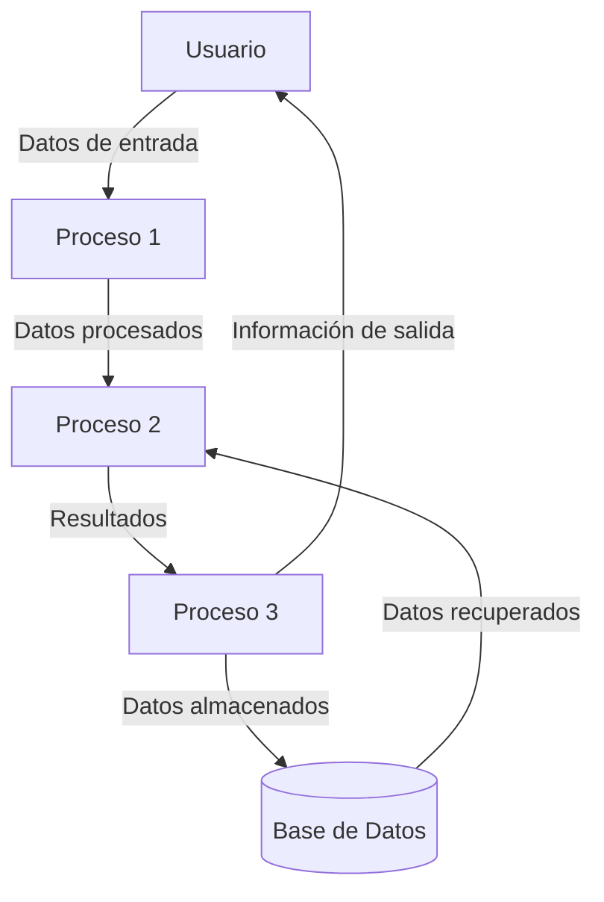

## Module: CGrabarTmpCaCarmovEtp2.cpp
# Análisis Integral del Módulo CGrabarTmpCaCarmovEtp2.cpp

## Módulo/Componente SQL
**Nombre del Módulo**: CGrabarTmpCaCarmovEtp2.cpp

## Objetivos Primarios
Este módulo es una clase C++ que gestiona la grabación de datos en tablas temporales relacionadas con movimientos de carga (CARMOV) en una segunda etapa del proceso. Su propósito principal es procesar y almacenar información de movimientos de carga, realizando validaciones y transformaciones de datos antes de su inserción en tablas temporales.

## Funciones, Métodos y Consultas Críticas
- **CGrabarTmpCaCarmovEtp2()**: Constructor que inicializa variables y establece conexiones.
- **~CGrabarTmpCaCarmovEtp2()**: Destructor que libera recursos.
- **Grabar()**: Método principal que coordina el proceso de grabación de datos.
- **GrabarTmpCaCarmovEtp2()**: Ejecuta la inserción de datos en la tabla temporal.
- **Consultas SQL**: Principalmente operaciones INSERT para almacenar datos en tablas temporales relacionadas con movimientos de carga.

## Variables y Elementos Clave
- **m_pDb**: Puntero a la conexión de base de datos.
- **m_pLog**: Puntero al sistema de registro de eventos.
- **m_pTmpCaCarmovEtp2**: Estructura que almacena datos para la tabla temporal.
- **Tablas**: TMP_CA_CARMOV_ETP2 (principal), posiblemente interactúa con otras tablas temporales.
- **Columnas clave**: Incluyen identificadores de carga, fechas, códigos de operación, y otros campos relacionados con movimientos de carga.

## Interdependencias y Relaciones
- Depende de una conexión de base de datos activa (m_pDb).
- Utiliza un sistema de registro (m_pLog) para documentar operaciones y errores.
- Interactúa con tablas temporales del sistema, principalmente TMP_CA_CARMOV_ETP2.
- Posiblemente se relaciona con otros módulos del sistema de gestión de carga.

## Operaciones Principales vs. Auxiliares
- **Operaciones principales**: 
  - GrabarTmpCaCarmovEtp2() - Inserción de datos en la tabla temporal.
  - Grabar() - Coordinación del proceso completo.
- **Operaciones auxiliares**:
  - Validación de datos antes de la inserción.
  - Registro de eventos y errores.
  - Manejo de excepciones.

## Secuencia Operacional/Flujo de Ejecución
1. Inicialización de variables y conexiones en el constructor.
2. Llamada al método Grabar() que coordina el proceso.
3. Preparación de datos para la inserción.
4. Ejecución de GrabarTmpCaCarmovEtp2() para insertar en la tabla temporal.
5. Manejo de errores y registro de eventos durante el proceso.
6. Liberación de recursos al finalizar.

## Aspectos de Rendimiento y Optimización
- El código parece manejar operaciones de base de datos individuales, lo que podría ser ineficiente para grandes volúmenes de datos.
- Posible área de mejora: implementar operaciones por lotes (batch) para inserciones múltiples.
- La gestión de memoria y recursos parece adecuada con la liberación explícita en el destructor.

## Reusabilidad y Adaptabilidad
- La clase está diseñada específicamente para la grabación en TMP_CA_CARMOV_ETP2, lo que limita su reusabilidad directa.
- La estructura modular permite adaptaciones para procesos similares con modificaciones en los campos y tablas objetivo.
- La separación de responsabilidades (conexión, registro, operaciones) facilita el mantenimiento.

## Uso y Contexto
- Este módulo forma parte de un sistema más amplio de gestión de carga, específicamente en una segunda etapa de procesamiento.
- Se utiliza para almacenar temporalmente información de movimientos de carga antes de su procesamiento final.
- Probablemente es invocado por un controlador o proceso principal que gestiona el flujo de trabajo completo.

## Suposiciones y Limitaciones
- **Suposiciones**:
  - Existencia de una estructura de base de datos específica con la tabla TMP_CA_CARMOV_ETP2.
  - Disponibilidad de una conexión de base de datos válida.
  - Formato de datos de entrada consistente y validado.
- **Limitaciones**:
  - Específico para un esquema de base de datos particular.
  - Posible ineficiencia en el procesamiento de grandes volúmenes de datos.
  - Dependencia de estructuras de datos externas que deben mantenerse consistentes.
## Flow Diagram [via mermaid]

