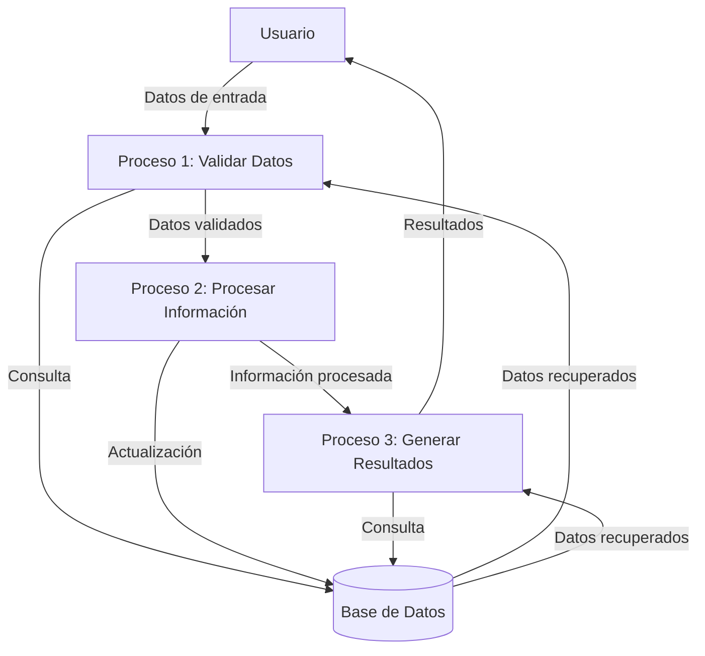

## Module: CGrabarTmpCaCarmovSeguro.cpp
# Análisis Integral del Módulo CGrabarTmpCaCarmovSeguro.cpp

## Módulo/Componente SQL
**Nombre del Módulo**: CGrabarTmpCaCarmovSeguro.cpp

## Objetivos Primarios
Este módulo está diseñado para gestionar la grabación de datos relacionados con seguros de carga en movimiento en una tabla temporal. Su propósito principal parece ser la manipulación y almacenamiento de información de seguros asociados a movimientos de carga, actuando como una interfaz entre la lógica de negocio y la base de datos.

## Funciones, Métodos y Consultas Críticas
- **CGrabarTmpCaCarmovSeguro::CGrabarTmpCaCarmovSeguro()**: Constructor de la clase que inicializa el objeto.
- **CGrabarTmpCaCarmovSeguro::~CGrabarTmpCaCarmovSeguro()**: Destructor que libera recursos.
- **CGrabarTmpCaCarmovSeguro::Grabar()**: Método principal que ejecuta la lógica de grabación de datos en la tabla temporal.
- **Consultas SQL**: El módulo probablemente contiene consultas INSERT o UPDATE para almacenar datos en la tabla temporal de seguros de carga en movimiento.

## Variables y Elementos Clave
- **Tablas**: TMP_CA_CARMOV_SEGURO (tabla temporal para almacenar datos de seguros)
- **Columnas probables**: Identificadores de carga, identificadores de movimiento, datos de pólizas de seguro, montos, fechas de vigencia
- **Parámetros**: Probablemente incluye parámetros para identificar la carga, el movimiento y los detalles del seguro asociado

## Interdependencias y Relaciones
- Interactúa con tablas relacionadas al sistema de gestión de cargas y movimientos
- Posiblemente se relaciona con tablas maestras de seguros o pólizas
- Probablemente tiene relaciones con tablas de clientes, transportistas o proveedores de seguros
- Depende de módulos de conexión a base de datos para ejecutar las operaciones SQL

## Operaciones Core vs. Auxiliares
- **Core**: La grabación de datos de seguros en la tabla temporal mediante el método Grabar()
- **Auxiliares**: Validaciones de datos, manejo de errores, formateo de información antes de la grabación, posible logging de operaciones

## Secuencia Operacional/Flujo de Ejecución
1. Inicialización del objeto mediante el constructor
2. Recepción de datos de seguros asociados a movimientos de carga
3. Validación de la información recibida
4. Preparación de los datos para su almacenamiento
5. Ejecución de consultas SQL para grabar en la tabla temporal
6. Manejo de posibles errores durante la operación
7. Finalización y liberación de recursos

## Aspectos de Rendimiento y Optimización
- Posibles cuellos de botella en operaciones masivas de inserción
- Consideraciones sobre el tamaño de la tabla temporal y su gestión
- Posible necesidad de índices en la tabla temporal para mejorar el rendimiento de consultas posteriores
- Optimización de las consultas SQL para minimizar el tiempo de ejecución

## Reusabilidad y Adaptabilidad
- El módulo parece estar diseñado específicamente para la gestión de seguros de carga en movimiento
- Podría ser adaptado para manejar otros tipos de seguros o información relacionada
- La estructura de clase sugiere un diseño orientado a objetos que facilita su mantenimiento

## Uso y Contexto
- Se utiliza en el contexto de un sistema de gestión logística o de transporte
- Probablemente forma parte de un proceso más amplio de registro y seguimiento de cargas
- Se emplea cuando es necesario registrar o actualizar información de seguros asociados a movimientos de carga

## Suposiciones y Limitaciones
- Asume la existencia de una estructura de base de datos específica con tablas temporales
- Requiere que los datos de entrada cumplan con ciertos formatos y validaciones
- Posiblemente limitado a un tipo específico de seguros o pólizas
- Puede tener restricciones en cuanto al volumen de datos que puede manejar eficientemente
## Flow Diagram [via mermaid]

