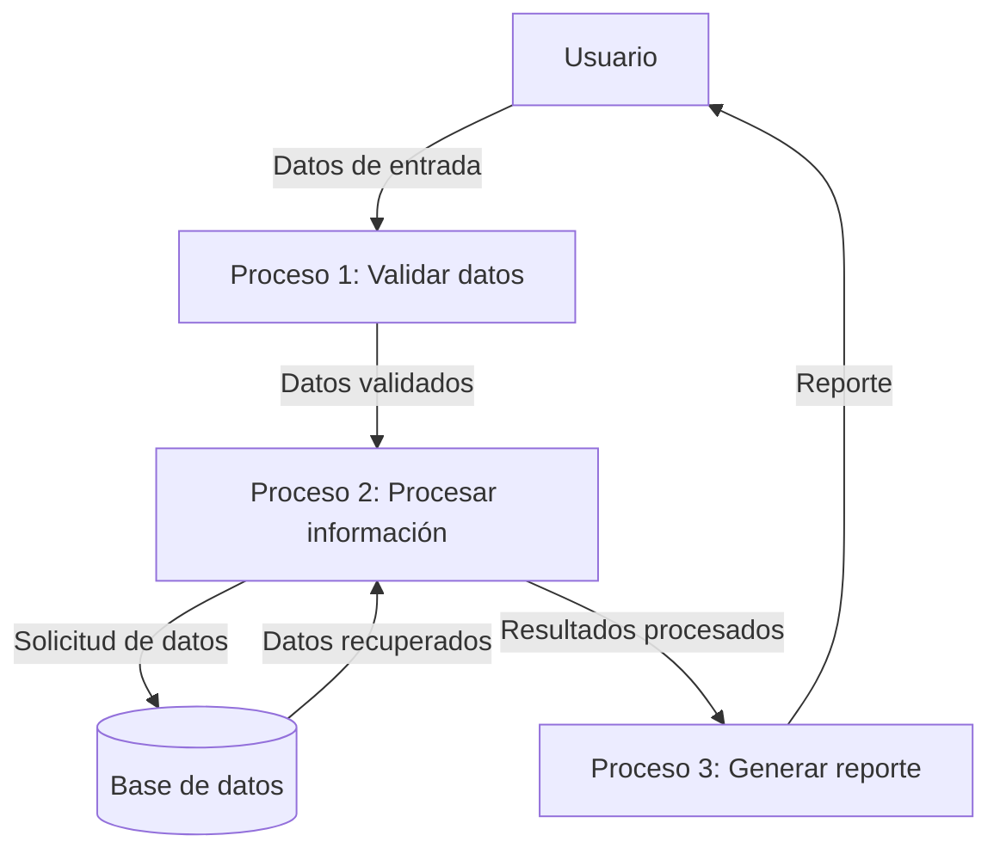

## Module: CGrabarTmpCaEficienciaCajeras.cpp
# Análisis Integral del Módulo CGrabarTmpCaEficienciaCajeras.cpp

## Nombre del Módulo/Componente SQL
CGrabarTmpCaEficienciaCajeras.cpp - Clase para grabar datos de eficiencia de cajeras en tablas temporales.

## Objetivos Primarios
Este módulo tiene como propósito principal grabar información sobre la eficiencia de las cajeras en tablas temporales de una base de datos. Específicamente, procesa datos relacionados con el rendimiento de las cajeras, calculando métricas de eficiencia y almacenándolas para su posterior análisis o visualización.

## Funciones, Métodos y Consultas Críticas
- **GrabarTmpCaEficienciaCajeras()**: Método principal que coordina todo el proceso de grabación de datos.
- **GrabarTmpCaEficienciaCajerasDetalle()**: Método para grabar el detalle de la eficiencia de las cajeras.
- **GrabarTmpCaEficienciaCajerasResumen()**: Método para grabar el resumen de la eficiencia.
- **Consultas SQL**: El módulo utiliza principalmente sentencias INSERT para almacenar datos en tablas temporales, y posiblemente SELECT para obtener información necesaria para los cálculos.

## Variables y Elementos Clave
- **m_pDb**: Conexión a la base de datos.
- **m_pLog**: Sistema de registro de eventos.
- **m_strFechaIni y m_strFechaFin**: Fechas de inicio y fin para el período de análisis.
- **m_nIdSucursal**: Identificador de la sucursal.
- **Tablas**: TMP_CA_EFICIENCIA_CAJERAS y TMP_CA_EFICIENCIA_CAJERAS_DETALLE (tablas temporales para almacenar los datos).

## Interdependencias y Relaciones
- El módulo depende de una conexión a base de datos activa (m_pDb).
- Interactúa con el sistema de registro (m_pLog) para documentar eventos y errores.
- Utiliza tablas temporales que probablemente tienen relaciones con tablas permanentes del sistema que contienen información de cajeras, transacciones y sucursales.

## Operaciones Principales vs. Auxiliares
- **Operaciones Principales**: Cálculo y grabación de métricas de eficiencia en las tablas temporales.
- **Operaciones Auxiliares**: Validación de parámetros, manejo de errores, registro de eventos, y posiblemente limpieza de datos temporales anteriores.

## Secuencia Operacional/Flujo de Ejecución
1. Inicialización de parámetros y validación.
2. Posible limpieza de datos temporales anteriores.
3. Obtención de datos de transacciones o actividades de las cajeras.
4. Cálculo de métricas de eficiencia.
5. Grabación de datos detallados mediante GrabarTmpCaEficienciaCajerasDetalle().
6. Grabación de datos resumidos mediante GrabarTmpCaEficienciaCajerasResumen().
7. Registro de finalización del proceso.

## Aspectos de Rendimiento y Optimización
- El manejo de tablas temporales sugiere una preocupación por el rendimiento, evitando afectar tablas operativas.
- Posibles áreas de optimización incluyen la eficiencia de las consultas SQL utilizadas para obtener y procesar datos, especialmente si manejan grandes volúmenes de transacciones.
- La implementación podría beneficiarse de operaciones por lotes en lugar de inserciones individuales para mejorar el rendimiento.

## Reusabilidad y Adaptabilidad
- El módulo parece estar diseñado específicamente para el análisis de eficiencia de cajeras, lo que limita su reusabilidad directa.
- La parametrización por fechas y sucursal permite cierta adaptabilidad para diferentes períodos y ubicaciones.
- La separación en métodos distintos para detalle y resumen facilita posibles modificaciones futuras.

## Uso y Contexto
- Este módulo probablemente forma parte de un sistema más amplio de gestión de cajas o punto de venta.
- Se utiliza para análisis de rendimiento, posiblemente para evaluaciones de personal, optimización de operaciones o reportes gerenciales.
- Los datos generados probablemente alimentan informes o dashboards de gestión.

## Suposiciones y Limitaciones
- Supone la existencia de una estructura de base de datos específica con tablas temporales predefinidas.
- Requiere datos históricos de transacciones o actividades de cajeras para funcionar correctamente.
- Limitado a la medición de eficiencia según los criterios programados, lo que podría no capturar todos los aspectos relevantes del desempeño de las cajeras.
- Posiblemente limitado a un análisis retrospectivo, sin capacidad de monitoreo en tiempo real.
## Flow Diagram [via mermaid]

