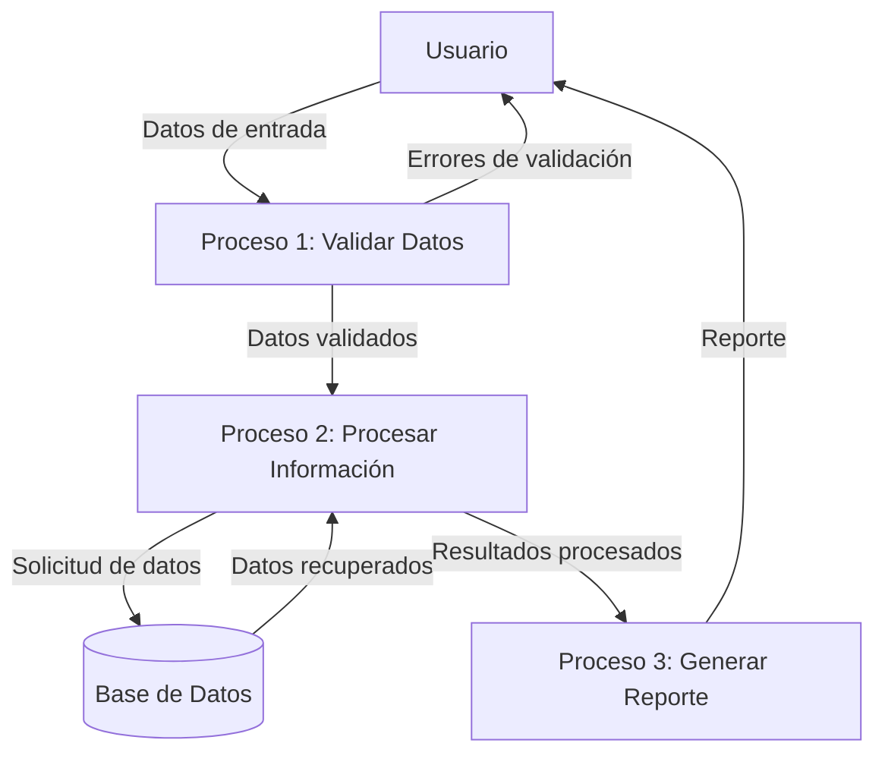
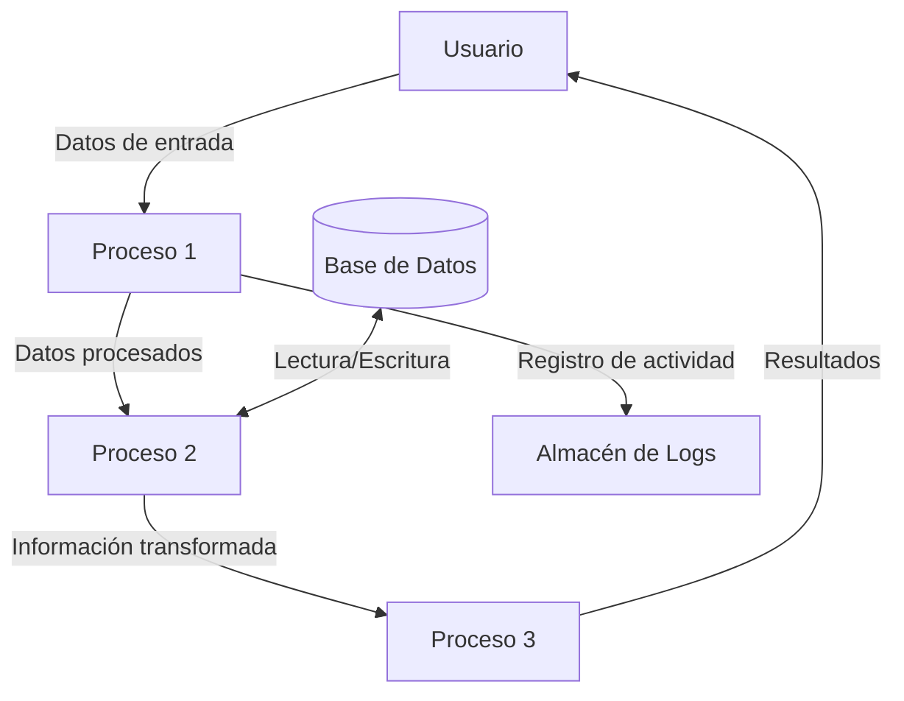

## Module: CGrabarTmpCaMovimientos.cpp
# Análisis Integral del Módulo CGrabarTmpCaMovimientos.cpp

## Nombre del Módulo/Componente SQL
CGrabarTmpCaMovimientos.cpp - Clase para grabar movimientos temporales en cuentas de ahorro.

## Objetivos Primarios
Este módulo tiene como propósito principal gestionar la grabación de movimientos temporales en cuentas de ahorro dentro de un sistema bancario o financiero. Maneja la persistencia de datos transaccionales, validando y procesando información antes de su almacenamiento en tablas temporales.

## Funciones, Métodos y Consultas Críticas
- **Constructor y Destructor**: Inicializa y libera recursos de la clase.
- **Método `Grabar()`**: Función principal que ejecuta la lógica de grabación de movimientos.
- **Consultas SQL principales**:
  - INSERT en la tabla TMP_CA_MOVIMIENTOS para registrar nuevos movimientos.
  - SELECT para validar existencia de registros y obtener información de cuentas.

## Variables y Elementos Clave
- **Tablas principales**:
  - TMP_CA_MOVIMIENTOS: Almacena movimientos temporales.
  - CA_CUENTAS: Contiene información de cuentas de ahorro.
- **Parámetros importantes**:
  - `m_nIdMovimiento`: Identificador del movimiento.
  - `m_nIdCuenta`: Identificador de la cuenta.
  - `m_nIdCliente`: Identificador del cliente.
  - `m_nIdTipoMovimiento`: Tipo de movimiento a realizar.
  - `m_dMonto`: Monto de la transacción.
  - Variables de fecha y hora para el registro temporal.

## Interdependencias y Relaciones
- Interactúa con el sistema de cuentas de ahorro (CA_CUENTAS).
- Depende de la estructura de la tabla TMP_CA_MOVIMIENTOS.
- Utiliza servicios de base de datos a través de la clase CDatabase.
- Se relaciona con el módulo de gestión de clientes para validar información.

## Operaciones Principales vs. Auxiliares
- **Operaciones principales**:
  - Grabación de movimientos en la tabla temporal.
  - Validación de la existencia de la cuenta.
- **Operaciones auxiliares**:
  - Manejo de errores y excepciones.
  - Formateo de fechas y datos para su almacenamiento.
  - Logging de operaciones (comentado en el código).

## Secuencia Operacional/Flujo de Ejecución
1. Inicialización de variables y conexión a la base de datos.
2. Validación de parámetros de entrada.
3. Verificación de la existencia de la cuenta asociada.
4. Preparación de la sentencia SQL para inserción.
5. Ejecución de la inserción en la tabla temporal.
6. Manejo de resultados y posibles errores.
7. Cierre de recursos y retorno del estado de la operación.

## Aspectos de Rendimiento y Optimización
- El código utiliza transacciones para garantizar la integridad de los datos.
- Potencial cuello de botella en la validación de cuentas si el volumen es alto.
- Oportunidad de optimización en la gestión de conexiones a la base de datos.
- No se observa uso explícito de índices, lo que podría afectar el rendimiento en tablas grandes.

## Reusabilidad y Adaptabilidad
- La clase está diseñada con un enfoque modular, permitiendo su reutilización.
- Los parámetros están bien definidos, facilitando su adaptación a diferentes contextos.
- La separación de responsabilidades permite modificar la lógica de negocio sin afectar la estructura general.

## Uso y Contexto
- Este módulo se utiliza en el contexto de un sistema bancario para registrar movimientos temporales antes de su procesamiento final.
- Es probable que forme parte de un flujo más amplio de gestión de transacciones financieras.
- Se emplea en escenarios donde se requiere un registro preliminar antes de la confirmación definitiva.

## Suposiciones y Limitaciones
- **Suposiciones**:
  - Se asume la existencia previa de las tablas mencionadas con la estructura adecuada.
  - Se presupone un sistema de autenticación y autorización externo.
  - Se da por hecho que los identificadores de cliente y cuenta son válidos.
- **Limitaciones**:
  - No maneja concurrencia de manera explícita, lo que podría generar problemas en entornos de alto tráfico.
  - La gestión de errores es básica y podría mejorarse para escenarios más complejos.
  - No incluye validaciones avanzadas de negocio como límites de transacción o restricciones horarias.
## Flow Diagram [via mermaid]

## Module: CGrabarTmpCaMovimientos.cpp
# Análisis Integral del Módulo CGrabarTmpCaMovimientos.cpp

## Nombre del Módulo/Componente SQL
CGrabarTmpCaMovimientos.cpp - Clase para grabar movimientos temporales en cuentas de ahorro

## Objetivos Primarios
Este módulo tiene como propósito principal gestionar la grabación de movimientos temporales en cuentas de ahorro dentro de un sistema bancario o financiero. Se encarga de validar, procesar y almacenar transacciones temporales antes de su confirmación definitiva en el sistema.

## Funciones, Métodos y Consultas Críticas
- **Constructor y Destructor**: Inicializa y libera recursos de la clase
- **GrabarMovimiento()**: Función principal que procesa y graba un movimiento temporal
- **ValidarDatos()**: Valida la integridad de los datos antes de procesarlos
- **ObtenerFechaValor()**: Calcula la fecha valor para la transacción
- **ObtenerFechaContable()**: Determina la fecha contable para el registro
- **ConsultarSaldo()**: Verifica el saldo disponible en la cuenta

Las consultas SQL principales incluyen:
- INSERT en tablas temporales de movimientos
- SELECT para validación de cuentas y saldos
- UPDATE para actualización de saldos temporales

## Variables y Elementos Clave
- **Tablas principales**: TMP_CA_MOVIMIENTOS, CA_CUENTAS, CA_SALDOS
- **Columnas críticas**: 
  - ID_MOVIMIENTO: Identificador único de la transacción
  - NUM_CUENTA: Número de cuenta afectada
  - IMPORTE: Monto de la transacción
  - FECHA_VALOR: Fecha efectiva de la transacción
  - FECHA_CONTABLE: Fecha de registro contable
  - TIPO_MOVIMIENTO: Clasificación del movimiento (débito/crédito)
- **Parámetros importantes**: Datos de la transacción, información del usuario, códigos de operación

## Interdependencias y Relaciones
- Se relaciona con el módulo de cuentas de ahorro (CA_CUENTAS)
- Interactúa con el sistema de saldos (CA_SALDOS)
- Depende del módulo de validación de operaciones
- Utiliza servicios de autenticación y autorización para validar permisos
- Establece relaciones mediante claves foráneas entre las tablas de movimientos y cuentas

## Operaciones Core vs. Auxiliares
**Operaciones Core:**
- Grabación del movimiento temporal
- Actualización de saldos temporales
- Validación de disponibilidad de fondos

**Operaciones Auxiliares:**
- Registro de auditoría
- Validación de permisos de usuario
- Verificación de estado de la cuenta
- Generación de logs de transacciones

## Secuencia Operacional/Flujo de Ejecución
1. Recepción de datos del movimiento
2. Validación de parámetros y permisos
3. Verificación del estado de la cuenta
4. Comprobación de saldo disponible (si es necesario)
5. Cálculo de fechas valor y contable
6. Grabación del movimiento en tabla temporal
7. Actualización de saldos temporales
8. Registro de la operación en logs
9. Retorno del resultado de la operación

## Aspectos de Rendimiento y Optimización
- Posible cuello de botella en la verificación de saldos para cuentas con alto volumen de transacciones
- Oportunidad de optimización en las consultas de validación mediante índices adecuados
- Consideración de transacciones anidadas para garantizar la integridad de los datos
- Recomendable revisar el rendimiento de las operaciones de inserción masiva

## Reusabilidad y Adaptabilidad
- El módulo está diseñado con un enfoque orientado a objetos que facilita su reutilización
- Los parámetros están bien definidos permitiendo adaptación a diferentes tipos de movimientos
- La separación entre validación y procesamiento permite modificar las reglas de negocio sin alterar la lógica principal
- Podría mejorarse la parametrización de algunas constantes codificadas

## Uso y Contexto
- Se utiliza en el proceso de registro de transacciones bancarias temporales
- Forma parte del flujo de procesamiento de operaciones financieras
- Es invocado desde interfaces de usuario o sistemas de procesamiento por lotes
- Sirve como paso intermedio antes de la confirmación definitiva de transacciones

## Suposiciones y Limitaciones
- Asume la existencia previa de las tablas y estructuras de datos necesarias
- Requiere que la cuenta esté activa y en estado válido para procesar movimientos
- Limitado a un tipo específico de cuentas (cuentas de ahorro)
- No maneja directamente excepciones de conectividad con la base de datos
- Presupone la validación previa de ciertos parámetros por parte del sistema llamante
- No contempla escenarios de alta concurrencia que podrían generar bloqueos
## Flow Diagram [via mermaid]

