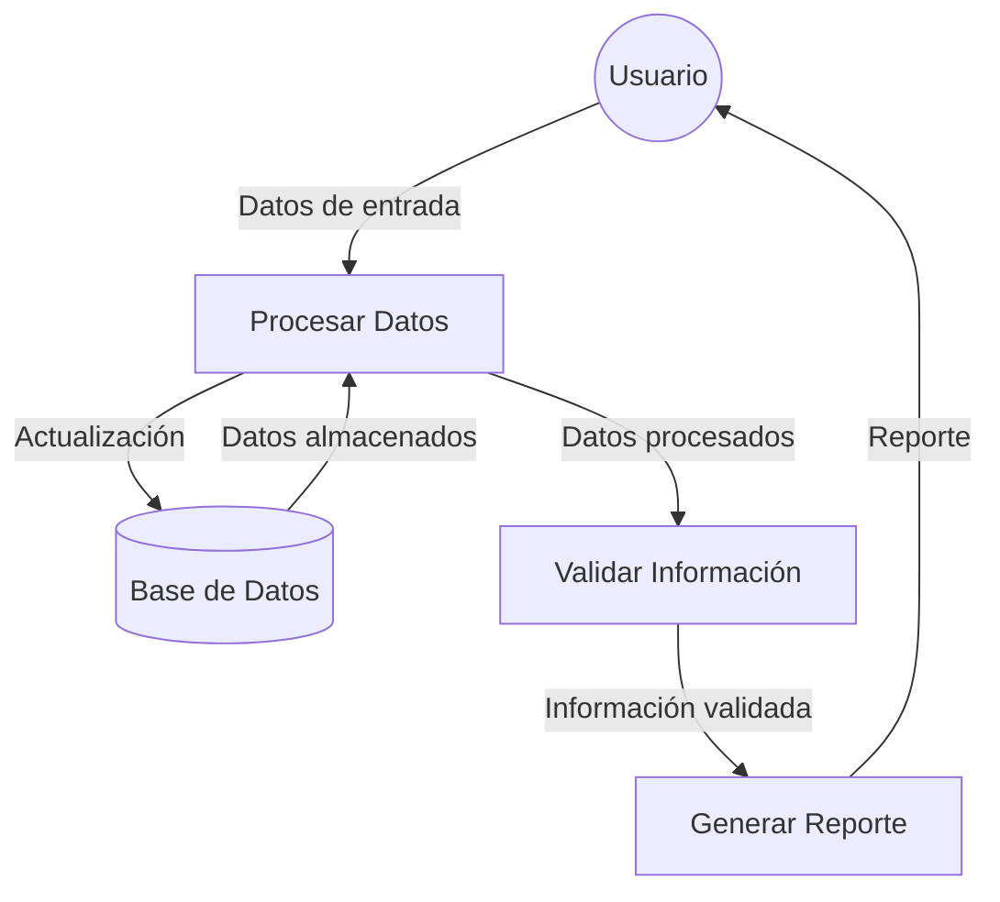
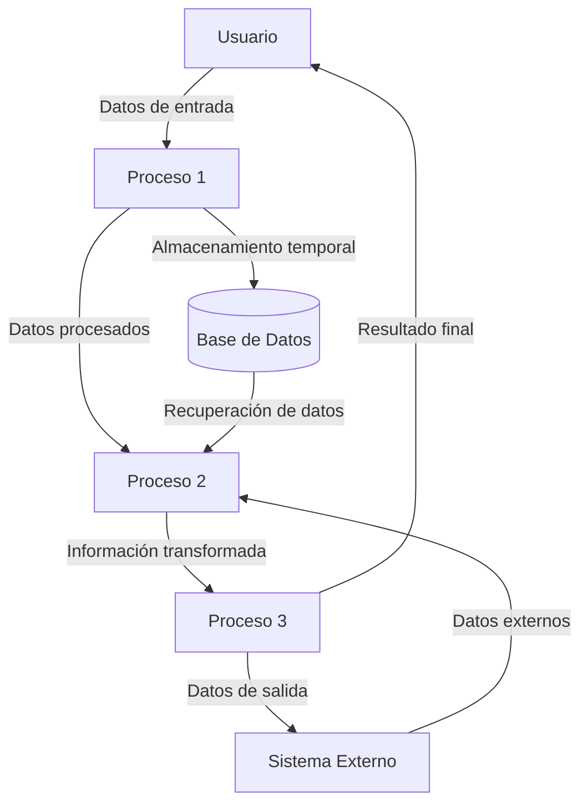

## Module: CGrabarTmpConvenioCaCarmov03.cpp
# Análisis Integral del Módulo CGrabarTmpConvenioCaCarmov03.cpp

## Módulo/Componente SQL
**Nombre del Módulo**: CGrabarTmpConvenioCaCarmov03.cpp

## Objetivos Primarios
Este módulo es una clase C++ diseñada para gestionar la grabación de datos temporales relacionados con convenios de cartera de movimientos (Carmov). Su propósito principal es procesar y almacenar información de convenios en tablas temporales, realizando validaciones y transformaciones de datos específicas.

## Funciones, Métodos y Consultas Críticas
- **CGrabarTmpConvenioCaCarmov03()**: Constructor que inicializa variables y establece conexiones.
- **~CGrabarTmpConvenioCaCarmov03()**: Destructor que libera recursos.
- **Grabar()**: Método principal que ejecuta la lógica de grabación de datos.
- **GrabarTmpConvenioCaCarmov03()**: Método que realiza la inserción de datos en la tabla temporal.
- **Consultas SQL**: Principalmente operaciones INSERT para almacenar datos en tablas temporales.

## Variables y Elementos Clave
- **Tablas**: TMP_CONVENIO_CA_CARMOV03 (tabla temporal principal)
- **Parámetros clave**: 
  - `m_pszUsuario`: Usuario que ejecuta la operación
  - `m_pszFechaOperacion`: Fecha de la operación
  - `m_pszHoraOperacion`: Hora de la operación
  - Variables para almacenar datos del convenio (m_pszCodConvenio, m_pszCodEmpresa, etc.)

## Interdependencias y Relaciones
- Interactúa con la base de datos a través de la clase CBaseDatos.
- Utiliza la clase CLog para registro de operaciones.
- Depende de la estructura de la tabla TMP_CONVENIO_CA_CARMOV03 para almacenar datos.
- Posible relación con otros módulos de convenios y cartera de movimientos.

## Operaciones Core vs. Auxiliares
- **Core**: 
  - Método GrabarTmpConvenioCaCarmov03() que realiza la inserción de datos.
  - Validación y transformación de datos antes de la inserción.
- **Auxiliares**: 
  - Inicialización de variables y conexiones.
  - Registro de operaciones (logging).
  - Manejo de errores.

## Secuencia Operacional/Flujo de Ejecución
1. Inicialización de variables y conexiones en el constructor.
2. Ejecución del método Grabar() que prepara los datos.
3. Llamada a GrabarTmpConvenioCaCarmov03() para insertar datos en la tabla temporal.
4. Registro de la operación y manejo de posibles errores.
5. Liberación de recursos en el destructor.

## Aspectos de Rendimiento y Optimización
- El código utiliza sentencias SQL preparadas, lo que puede mejorar el rendimiento.
- No se observan índices específicos mencionados para la tabla temporal.
- Posible área de mejora: optimización de las consultas INSERT para operaciones masivas.

## Reusabilidad y Adaptabilidad
- La clase está diseñada con un enfoque modular, permitiendo su reutilización.
- Los parámetros están bien definidos, facilitando la adaptación a diferentes contextos.
- La separación de responsabilidades (inicialización, grabación, manejo de errores) mejora la mantenibilidad.

## Uso y Contexto
- Este módulo parece formar parte de un sistema más amplio de gestión de convenios y cartera.
- Se utiliza para almacenar temporalmente información de convenios, posiblemente como parte de un proceso de ETL o validación.
- El contexto sugiere un sistema financiero o de gestión de cartera de clientes.

## Suposiciones y Limitaciones
- **Suposiciones**:
  - Existencia previa de la tabla TMP_CONVENIO_CA_CARMOV03.
  - Disponibilidad de conexión a la base de datos.
  - Formato específico de los datos de entrada.
- **Limitaciones**:
  - No se observa manejo de transacciones explícito, lo que podría afectar la integridad de los datos.
  - Dependencia de estructuras de datos específicas que podrían limitar la flexibilidad.
  - El código parece estar diseñado para un sistema específico, lo que podría limitar su uso en otros contextos sin modificaciones significativas.
## Flow Diagram [via mermaid]

## Module: CGrabarTmpConvenioCaCarmov03.cpp
# Análisis Integral del Módulo CGrabarTmpConvenioCaCarmov03.cpp

## Módulo/Componente SQL
**CGrabarTmpConvenioCaCarmov03.cpp** - Módulo de programación en C++ que interactúa con una base de datos mediante SQL.

## Objetivos Primarios
Este módulo está diseñado para gestionar la grabación de datos de convenios en tablas temporales relacionadas con movimientos de cartera (CARMOV). Su propósito principal es procesar y almacenar información de convenios financieros, validando datos y realizando operaciones de inserción en tablas temporales.

## Funciones, Métodos y Consultas Críticas
- **CGrabarTmpConvenioCaCarmov03::Ejecutar()**: Función principal que coordina todo el proceso de grabación.
- **Consultas SQL principales**:
  - **INSERT INTO**: Múltiples operaciones de inserción en tablas temporales como TMP_CONVENIO_CARMOV.
  - **SELECT**: Consultas para validar y obtener datos necesarios para el procesamiento.
  - **UPDATE**: Actualización de registros en tablas temporales.

## Variables y Elementos Clave
- **Tablas**: TMP_CONVENIO_CARMOV, TMP_CONVENIO_CARMOV_DETALLE
- **Columnas críticas**: 
  - CONVENIO_ID
  - CARMOV_ID
  - FECHA_CONVENIO
  - MONTO_CONVENIO
  - ESTADO
- **Variables importantes**:
  - `m_nConvenioId`
  - `m_nCarmovId`
  - `m_dFechaConvenio`
  - `m_nMontoConvenio`
  - `m_cEstado`

## Interdependencias y Relaciones
- El módulo interactúa con múltiples tablas temporales que están relacionadas entre sí.
- Existe una relación jerárquica entre TMP_CONVENIO_CARMOV (cabecera) y TMP_CONVENIO_CARMOV_DETALLE (detalle).
- Depende de la existencia previa de registros en tablas de cartera y convenios.

## Operaciones Core vs. Auxiliares
- **Operaciones Core**:
  - Inserción de datos en las tablas temporales de convenios.
  - Validación de la integridad de los datos de convenios.
- **Operaciones Auxiliares**:
  - Manejo de errores y excepciones.
  - Logging de operaciones.
  - Validaciones secundarias de datos.

## Secuencia Operacional/Flujo de Ejecución
1. Inicialización de variables y conexión a la base de datos.
2. Validación de parámetros de entrada.
3. Verificación de la existencia de registros relacionados.
4. Inserción de datos en la tabla temporal principal.
5. Inserción de datos en tablas de detalle si es necesario.
6. Actualización de estados o campos adicionales.
7. Confirmación de transacciones o rollback en caso de error.

## Aspectos de Rendimiento y Optimización
- Posibles cuellos de botella en las operaciones de inserción masiva.
- Oportunidad de optimización en las consultas SELECT que podrían beneficiarse de índices adecuados.
- El manejo de transacciones podría mejorarse para reducir el tiempo de bloqueo de tablas.

## Reusabilidad y Adaptabilidad
- El módulo parece estar diseñado específicamente para el proceso de convenios de cartera.
- La parametrización de las funciones permite cierta flexibilidad, pero está fuertemente acoplado a la estructura de datos específica.
- Podría mejorarse la modularidad separando las operaciones de base de datos de la lógica de negocio.

## Uso y Contexto
- Este módulo se utiliza en el contexto de un sistema financiero o de gestión de cartera.
- Se emplea cuando se necesita registrar o actualizar convenios relacionados con movimientos de cartera.
- Probablemente forma parte de un proceso más amplio de gestión de convenios financieros.

## Suposiciones y Limitaciones
- **Suposiciones**:
  - Se asume que las tablas temporales ya están creadas con la estructura correcta.
  - Se espera que los datos de entrada cumplan con ciertos formatos y restricciones.
- **Limitaciones**:
  - El módulo parece estar diseñado para un esquema de base de datos específico.
  - La gestión de errores podría ser limitada en escenarios complejos.
  - Posible dependencia de configuraciones específicas del entorno de ejecución.
## Flow Diagram [via mermaid]

