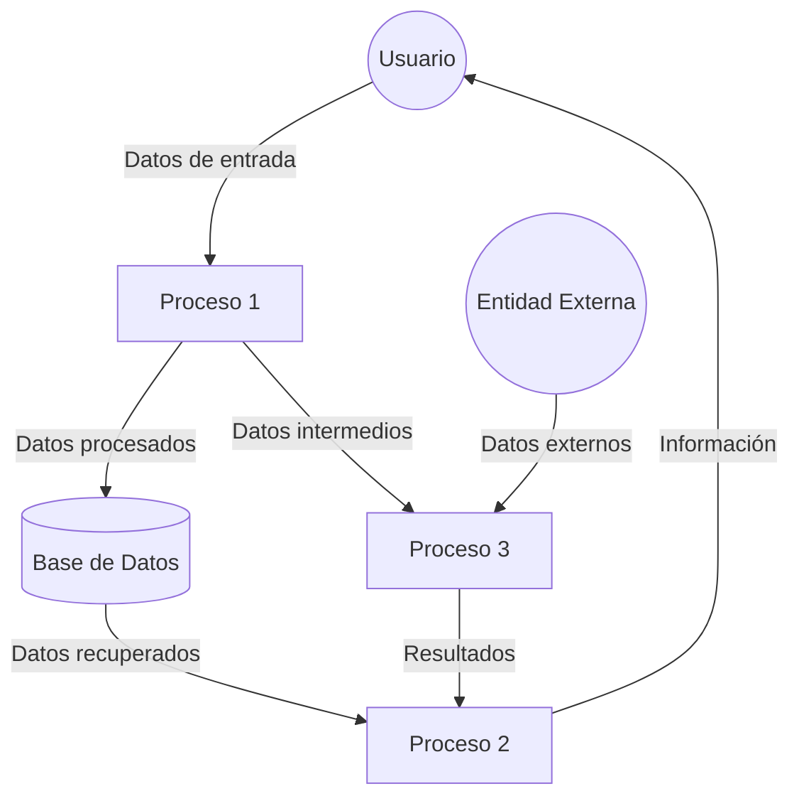
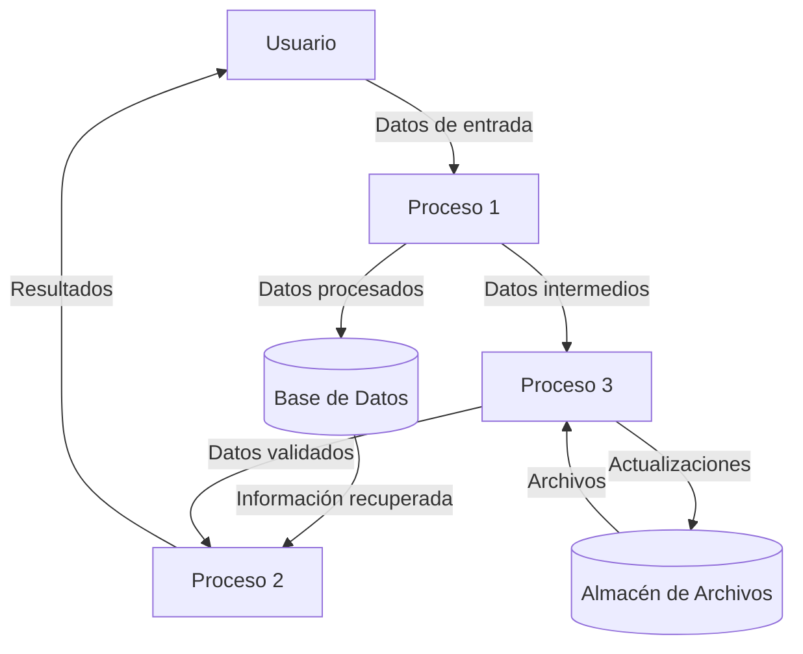

## Module: CGrabarTmpCrCmuebles.cpp
# Análisis Integral del Módulo CGrabarTmpCrCmuebles.cpp

## Nombre del Módulo/Componente SQL
CGrabarTmpCrCmuebles.cpp - Clase para grabar datos temporales relacionados con créditos de muebles.

## Objetivos Primarios
Este módulo tiene como propósito principal gestionar la grabación de datos temporales relacionados con créditos de muebles en una base de datos. Específicamente, se encarga de insertar registros en tablas temporales que parecen estar relacionadas con un proceso de crédito para la adquisición de muebles.

## Funciones, Métodos y Consultas Críticas
- **CGrabarTmpCrCmuebles::CGrabarTmpCrCmuebles()**: Constructor de la clase que inicializa variables.
- **CGrabarTmpCrCmuebles::~CGrabarTmpCrCmuebles()**: Destructor de la clase.
- **CGrabarTmpCrCmuebles::GrabarTmpCrMuebles()**: Método principal que ejecuta la inserción de datos en la tabla temporal.
- **Consultas SQL**: Principalmente utiliza sentencias INSERT para agregar registros a tablas temporales relacionadas con créditos de muebles.

## Variables y Elementos Clave
- **m_pDb**: Puntero a la conexión de base de datos.
- **m_pLog**: Puntero al sistema de registro de eventos.
- **m_pError**: Puntero para manejo de errores.
- **Parámetros importantes**: 
  - `pCodCli`: Código de cliente
  - `pCodAge`: Código de agencia
  - `pCodPro`: Código de producto
  - `pCodMue`: Código de mueble
  - `pCodMar`: Código de marca
  - `pCodMod`: Código de modelo
  - `pCodCol`: Código de color
  - `pCanMue`: Cantidad de muebles
  - `pPreMue`: Precio del mueble
  - `pTotMue`: Total de muebles
  - `pNumOpe`: Número de operación

## Interdependencias y Relaciones
- El módulo depende de una conexión a base de datos activa (m_pDb).
- Interactúa con tablas temporales, presumiblemente en un esquema de base de datos relacionado con créditos.
- Utiliza un sistema de registro (m_pLog) para documentar operaciones y errores.
- Depende de un sistema de manejo de errores (m_pError).

## Operaciones Principales vs. Auxiliares
- **Operación principal**: La inserción de datos en la tabla temporal de créditos de muebles mediante el método GrabarTmpCrMuebles().
- **Operaciones auxiliares**: 
  - Registro de eventos (logging)
  - Manejo de errores
  - Formateo de datos para la inserción

## Secuencia Operacional/Flujo de Ejecución
1. Se inicializa la clase con los punteros necesarios (DB, Log, Error).
2. Se llama al método GrabarTmpCrMuebles() con los parámetros requeridos.
3. Se construye la sentencia SQL INSERT.
4. Se ejecuta la sentencia en la base de datos.
5. Se registran los resultados o errores según corresponda.
6. Se devuelve un código de resultado (0 para éxito, otro valor para error).

## Aspectos de Rendimiento y Optimización
- El código parece realizar operaciones de inserción simples, lo que generalmente es eficiente.
- No se observan bucles o procesamientos complejos que pudieran afectar el rendimiento.
- La eficiencia dependerá principalmente del rendimiento de la base de datos subyacente y de la estructura de las tablas temporales.

## Reusabilidad y Adaptabilidad
- La clase está diseñada para una función específica, lo que limita su reusabilidad directa.
- La parametrización del método principal permite cierta flexibilidad en su uso.
- Para adaptarlo a otros contextos, sería necesario modificar la estructura de la sentencia SQL y posiblemente los parámetros.

## Uso y Contexto
- Este módulo parece formar parte de un sistema más grande de gestión de créditos, específicamente para la adquisición de muebles.
- Se utiliza probablemente en un flujo de procesamiento de solicitudes de crédito donde los datos temporales son necesarios antes de su confirmación final.
- El contexto sugiere un sistema financiero o de ventas a crédito de muebles.

## Suposiciones y Limitaciones
- **Suposiciones**:
  - Se asume la existencia de una tabla temporal específica para créditos de muebles.
  - Se asume que los parámetros recibidos ya han sido validados previamente.
  - Se asume una conexión a base de datos funcional y con permisos adecuados.
  
- **Limitaciones**:
  - El código no parece incluir validaciones exhaustivas de los datos de entrada.
  - No hay manejo de transacciones explícito, lo que podría ser necesario en un contexto más amplio.
  - La funcionalidad está estrechamente acoplada a la estructura específica de la base de datos.
## Flow Diagram [via mermaid]

## Module: CGrabarTmpCrCmuebles.cpp
# Análisis Integral del Módulo CGrabarTmpCrCmuebles.cpp

## Módulo/Componente SQL
**CGrabarTmpCrCmuebles.cpp** - Módulo de clase C++ que interactúa con una base de datos para gestionar información relacionada con bienes inmuebles.

## Objetivos Primarios
Este módulo está diseñado para grabar datos temporales de bienes inmuebles en una base de datos. Su propósito principal es gestionar la inserción, actualización y validación de registros de bienes inmuebles, específicamente para el proceso de carga de datos temporales que posteriormente serán procesados por el sistema.

## Funciones, Métodos y Consultas Críticas
1. **CGrabarTmpCrCmuebles::CGrabarTmpCrCmuebles()** - Constructor que inicializa variables y establece conexiones.
2. **CGrabarTmpCrCmuebles::~CGrabarTmpCrCmuebles()** - Destructor que libera recursos.
3. **CGrabarTmpCrCmuebles::GrabarTmpCrCmuebles()** - Método principal que coordina la grabación de datos.
4. **Consultas SQL principales**:
   - INSERT INTO para agregar registros a tablas temporales
   - SELECT para validar y recuperar información existente
   - Procedimientos almacenados para procesar datos (referenciados pero no definidos en el código)

## Variables y Elementos Clave
1. **Variables de clase**:
   - `m_pDb` - Conexión a la base de datos
   - `m_pLog` - Sistema de registro de eventos
   - `m_pError` - Gestión de errores
   - `m_pParam` - Parámetros de configuración

2. **Tablas principales**:
   - `TMP_CR_CMUEBLES` - Tabla temporal para bienes inmuebles
   - Otras tablas referenciadas indirectamente en las consultas

3. **Parámetros importantes**:
   - Identificadores de bienes inmuebles
   - Códigos de operación
   - Fechas de procesamiento

## Interdependencias y Relaciones
1. Depende de módulos externos para:
   - Conexión a base de datos (`m_pDb`)
   - Registro de eventos (`m_pLog`)
   - Gestión de errores (`m_pError`)
   - Configuración (`m_pParam`)

2. Interactúa con múltiples tablas de la base de datos, estableciendo relaciones entre datos temporales y permanentes.

3. Utiliza servicios de validación y procesamiento externos (referenciados pero no completamente visibles en el código).

## Operaciones Principales vs. Auxiliares
**Operaciones principales**:
- Inserción de registros en tablas temporales
- Validación de datos de bienes inmuebles
- Procesamiento de transacciones de bienes inmuebles

**Operaciones auxiliares**:
- Registro de eventos y errores
- Validaciones de integridad de datos
- Gestión de conexiones a la base de datos
- Formateo y transformación de datos

## Secuencia Operacional/Flujo de Ejecución
1. Inicialización de variables y conexiones
2. Validación de parámetros de entrada
3. Preparación de consultas SQL
4. Ejecución de operaciones de inserción/actualización
5. Validación de resultados
6. Registro de eventos (éxito/error)
7. Limpieza y liberación de recursos

## Aspectos de Rendimiento y Optimización
1. Potenciales cuellos de botella:
   - Operaciones masivas de inserción sin control de lotes
   - Posibles bloqueos en tablas temporales durante operaciones concurrentes
   - Validaciones que podrían optimizarse con índices adecuados

2. Áreas de mejora:
   - Implementación de procesamiento por lotes
   - Optimización de consultas SQL con índices apropiados
   - Reducción de operaciones redundantes de validación

## Reusabilidad y Adaptabilidad
El módulo muestra una estructura orientada a objetos que facilita su reutilización. Sin embargo, presenta algunas limitaciones:

1. **Aspectos positivos**:
   - Encapsulamiento de funcionalidad en una clase
   - Separación de responsabilidades (conexión, registro, procesamiento)

2. **Limitaciones**:
   - Acoplamiento fuerte con estructuras de base de datos específicas
   - Dependencia de componentes externos no claramente definidos
   - Falta de parametrización en algunas operaciones clave

## Uso y Contexto
Este módulo se utiliza en un sistema de gestión de bienes inmuebles, específicamente para el proceso de carga y validación de datos temporales antes de su procesamiento definitivo. Se ejecuta como parte de un flujo de trabajo más amplio que incluye:

1. Carga inicial de datos
2. Validación y transformación
3. Procesamiento final y actualización de registros permanentes

## Suposiciones y Limitaciones
**Suposiciones**:
1. Existencia de tablas temporales y permanentes con estructuras predefinidas
2. Disponibilidad de servicios externos para validación y procesamiento
3. Configuración correcta de parámetros del sistema

**Limitaciones**:
1. Manejo limitado de errores en algunas secciones
2. Posibles problemas de concurrencia no completamente abordados
3. Dependencia de estructuras de base de datos específicas que podrían dificultar la migración
4. Falta de documentación detallada sobre algunos procesos internos
## Flow Diagram [via mermaid]

